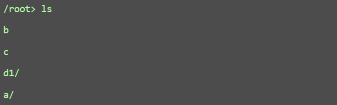

# 《操作系统课程设计》实验报告


## 课程设计题目

操作系统模拟程序的设计与实现。


## 课程设计目标和要求

### 目标

设计并实现一个具有操作系统基本功能的软件，具有操作系统的基本功能：

1.  进程管理功能。进程创建（new）、进程调度（scheduling）、进程阻塞（block）、 进程唤醒（wakeup）、进程同步（synchronous）等； 
2. 内存管理功能。进程存储空间的分配和回收，空闲空间的管理等；
3. 文件系统。目录/文件的创建和删除、空间分配和回收 ；
4. 设备管理。设备的申请、分配、使用、释放等；
5. UI界面；
6. 中断机制。

### 基本要求

要求完成的最小功能集合 ：

1. 进程管理和调度 ；
2. 内存管理（存储分配与回收，进程交换） ；
3. 时钟管理：timer ；
4. 中断处理：中断响应、中断处理 ；
5. GUI，图形界面展示多道程序并发执行的过程（系统快照）。


## 需求分析

xxx


## 开发环境

本操作系统模拟器项目基于 **Java 17 + Spring Boot 3.4.4** 构建，系统前后端分离。

### 后端环境

|                | 工具说明                                                     |
| -------------- | ------------------------------------------------------------ |
| **开发语言**   | Java 17                                                      |
| **框架**       | Spring Boot 3.4.4                                            |
| **构建工具**   | Maven（版本兼容 JDK 17）                                     |
| **主要依赖**   | spring-boot-starter-web、thymeleaf、lombok、javax.annotation |
| **开发工具**   | IntelliJ IDEA                                                |
| **日志输出**   | Server-Sent Events（SSE） 实时推送                           |
| **并发控制**   | 多线程 + BlockingQueue + 自定义调度器                        |
| **热部署支持** | Spring DevTools                                              |

### 前端环境

| 项目         | 配置 / 工具说明                                              |
| ------------ | ------------------------------------------------------------ |
| **页面结构** | HTML5 + 原生 JavaScript                                      |
| **样式框架** | CSS                                                          |
| **交互机制** | SSE（用于日志输出与快照更新）Fetch API（用于命令提交与 vi 编辑） |
| **调试工具** | Chrome 开发者工具、浏览器控制台                              |

### 项目目录结构

```
src/
├── main/
│   ├── java/
│   │   └── org.example.oscdspring/
│   │       ├── controller/         # 控制器
│   │       ├── device_management/
│   │       ├── file_disk_management/
│   │       ├── main/
│   │       ├── memory_management/
│   │       ├── process_management/
│   │       ├── interrupt_management/
│   │       ├── snapshot/           # 系统快照模块
│   │       └── util/               # 日志/快照服务等工具类
│   └── resources/
│       ├── static/                 # 前端 HTML/CSS/JS
│       └── application.properties
└── test/
```


## 二级标题：总体设计详细设计XXX

xxx


## 测试报告

### 测试环境


### 测试计划


### 三级标题：单元测试

这部分是针对某一模块的java代码的某些函数的测试，与整个系统无关，相当于给一个函数搭上脚手架。不需要覆盖很全，意思意思就行。可以让gpt随便跑点。

#### 四级标题：进程管理单元测试

描述被测试的函数，测试代码，执行结果。

#### 四级标题：内存管理单元测试

同上。

#### 四级标题：xxx单元测试……

同上。


### 三级标题：集成测试

####这部分是指在`StartupInitializer.java`中编写测试程序，并在网页运行，在前端观察结果是否符合预期，必要时需要截图，甚至作甘特图等图辅助说明。


#### Shell 测试（包含边界测试与错误测试）

##### 错误命令


能够提示报错，符合预期。


##### `mkdir`

创建目录前：


输入指令创建目录：


创建目录后：


出现名为a的文件夹。


重名目录会报错，符合预期。


##### `mkf`与`cat`

创建文件前：


创建文件：


创建文件后：


文件占用了10个块，符合预期。

创建另一个10字节文件并查看：


文件确实由10个随机的`char`构成，且显示正常。


创建过大文件会提示空间不足。


且磁盘块在创建过大文件失败时，保持原来大小不变，而不是占满。


##### `cd`与`cd..`


功能均正常。


输入错误路径会报错，符合预期。


##### `ls`

在根目录执行：



符合根目录下内容：


#### 四级标题：进程管理集成测试

描述测试程序，展示截图/界面输出，分析正确性。

#### 四级标题：内存管理集成测试

同上。

#### 四级标题：xxx集成测试……

同上。

#### 四级标题：总体测试

可能需要复杂的涉及全模块功能的测试。逻辑和上面一样，只是程序写的复杂一些。准备等上面写好了再做这个。


## 个人总结与体会

### 任泽高


### 安轶东


### 董佳鑫


### 路遥


### 杨皓岚


### 张志鑫


