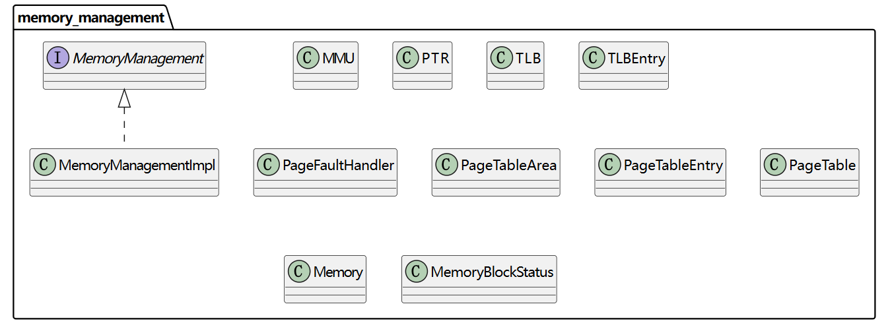
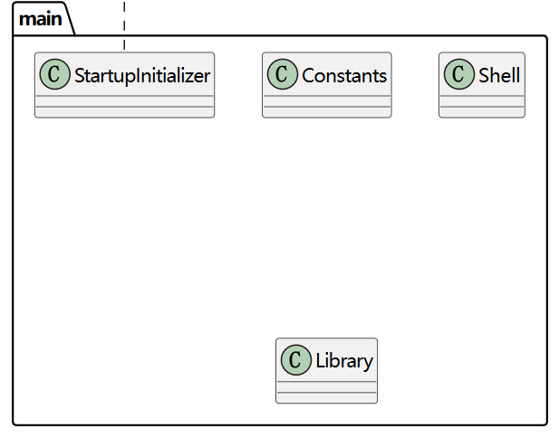
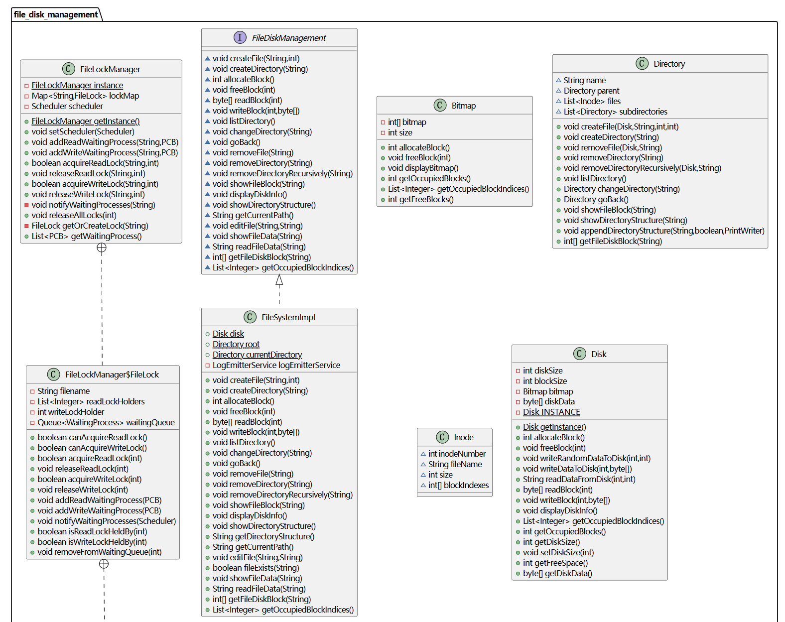
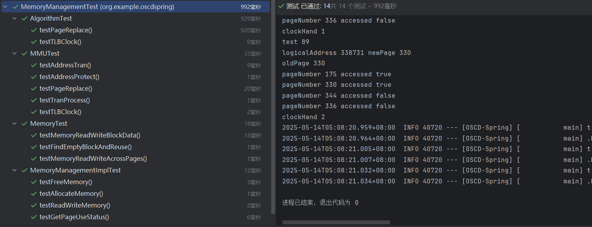

# 《操作系统课程设计》实验报告

目录

[TOC]


------

## 课程设计题目

操作系统模拟程序的设计与实现。


## 课程设计目标和要求

### 目标

设计并实现一个具有操作系统基本功能的软件，具有操作系统的基本功能：

1.  进程管理功能。进程创建（new）、进程调度（scheduling）、进程阻塞（block）、 进程唤醒（wakeup）、进程同步（synchronous）等； 
2.  内存管理功能。进程存储空间的分配和回收，空闲空间的管理等；
3.  文件系统。目录/文件的创建和删除、空间分配和回收 ；
4.  设备管理。设备的申请、分配、使用、释放等；
5.  UI界面；
6.  中断机制。

### 基本要求

要求完成的最小功能集合 ：

1. 进程管理和调度 ；
2. 内存管理（存储分配与回收，进程交换） ；
3. 时钟管理：timer ；
4. 中断处理：中断响应、中断处理 ；
5. GUI，图形界面展示多道程序并发执行的过程（系统快照）。


## 需求分析

### 引言

#### 编写目的

本需求分析文档旨在系统、准确地描述操作系统模拟程序的功能与运行需求，为后续的系统设计、开发、测试与维护提供明确依据。文档面向本项目的开发者、测试人员以及指导教师，作为课程设计过程中的重要技术参考材料，确保系统功能设计满足实验教学目标，系统行为与用户预期保持一致。

#### 项目背景

本项目以“操作系统模拟程序的设计与实现”为课题，模拟实现简化版操作系统内核功能，并通过前端图形界面进行动态展示和交互。系统以多进程调度为核心，集成内存管理、文件操作、设备请求与中断处理机制，帮助我们通过自己动手实践，以可视化方式深入理解操作系统的基本运行原理与模块协作机制。


### 总体描述

#### 系统目标

本项目旨在开发一个基于 Web 的操作系统模拟程序，集成进程管理、内存管理、文件操作、设备请求与中断处理机制等模块。系统通过模拟真实操作系统中的关键组件与行为，达成操作系统内核的仿真实现。

用户可以在浏览器进入操作系统界面，通过界面的Shell与操作系统进行交互，并实时展示系统快照。

操作系统提供丰富广泛的指令可供用户使用。

实现目标如下：

1. 功能完整：实现操作系统核心模块的功能，包括进程状态管理、逻辑地址映射等完整的操作系统功能。

2. 结构清晰：采用模块化架构，后端以 Spring Boot 框架搭建，前端以原生 JavaScript 实现，单元测试通过 JUnit 框架进行，逻辑层次分明。

3. 交互直观：通过图形界面展示系统快照，包括内存、磁盘等实时状态，结合模拟终端进行指令输入与控制。

4. 模拟真实环境：支持多核并发执行等机制，尽可能还原真实操作系统的执行过程。

    

#### 用户特征

本系统面向计算机及相关专业的本科生与教师，主要用于操作系统功能的演示与学生自我实践。用户具有一定的编程基础，能够理解命令行操作、以及操作系统的基本原理。


#### 系统功能概要

系统划分为七个核心功能模块，分别为：

1. Shell交互功能：提供类 Unix 命令行界面，支持文件管理、目录切换、程序执行、进程执行等指令，通过终端与后端交互。
2. 进程管理模块：实现进程的创建、调度、阻塞、唤醒与终止；支持多种调度策略；支持多 CPU 并发模拟执行；支持用户更换调度策略或者更换处理器个数。
3. 内存管理模块：实现页式管理机制，支持逻辑地址到物理地址的转换、缺页中断、TLB缓存、页置换算法等。
4. 文件管理模块：支持目录树结构、文件读写与编辑、磁盘块分配与释放，文件内容映射为进程执行指令集。
5. 设备管理模块：模拟打印机、USB、扫描仪等设备，支持进程发起设备请求，设备完成后触发中断唤醒阻塞进程。
6. 中断管理模块：处理时钟中断、I/O中断、文件锁唤醒等事件。
7. 系统快照展示模块：自动采集系统状态，包括运行进程、内存分配、磁盘使用、目录结构、设备状态等，通过前端页面可视化展示。


#### 运行环境与约束

系统采用前后端分离架构，整体运行环境要求如下：

后端运行环境：

- Java 17，Spring Boot 3.4.4 框架
- 每次启动重置操作系统环境，不依赖数据库

前端环境：

- 原生 HTML + CSS + JavaScript
- 支持现代浏览器（Chrome、Edge）


### 详细功能需求

#### Shell交互功能

Shell 交互模块为用户提供统一的命令输入入口，用于操作系统核心功能的访问与控制。用户可通过模拟终端界面输入指令，与文件系统、进程调度器、内存管理器、设备管理器等模块进行交互。所有操作过程中的提示、反馈与系统状态变化均实时推送至前端终端输出区域。

Shell模块接收用户输入的字符串命令，对其进行语义解析和参数提取（实现一个简易Parser），根据命令类型，调用对应的模块进行功能执行。

Shell支持通过命令 `vi <filename>` 打开图形化文件编辑窗口，前端提供编辑界面，编辑完成后可提交保存。若文件不存在则新建文件且自动提示并创建，已存在文件直接载入编辑内容覆盖原本文件。用户可以通过命令 `vi <filename>` 编写自定义程序并通过 Shell 提交任务使其执行。

Shell支持根据当前所在目录动态更新终端提示符（如 `/root/dir1> instruction xxx`）。

以下是一个简单的顺序图，部分操作可能和实际实现有略微差异，该图仅用来理解数据流向与调用逻辑。


#### 进程管理功能

进程管理模块是操作系统模拟程序的核心，负责实现进程的五状态管理与调度控制。该模块协调多个 CPU、调度策略、时间片、状态转换与中断响应等机制，确保系统能稳定支持多道程序并发执行。

具体功能列表：

1. 进程创建

   1. 系统支持通过模拟指令源文件创建进程。
   2. 每个进程分配一个唯一的进程标识符（PID），并初始化其进程控制块（PCB）。

2. 进程控制块（PCB）管理

   1. 系统为每个进程维护一个 PCB，记录进程的基本属性
   2. PCB 与内存页表、文件资源、设备请求等信息绑定。

3. 调度器策略

   1. 系统调度器支持多种经典调度算法，包括：

      1. FCFS（先来先服务）

      2. SJF（短作业优先）

      3. RR（时间片轮转）

      4. PRIORITY（优先级调度）

      5. PRIORITY_PREEMPTIVE（抢占）

      6. MLFQ（多级反馈队列）

   2. 每种策略对应不同的就绪队列管理方式，用户可以在系统启动前切换调度策略。

4. 多核调度与执行
   1. 系统支持多个模拟 CPU 核心同时执行进程。
   2. 每个 CPU 为一个独立线程，持续从调度器拉取就绪进程并执行其指令。
   3. 指令支持模拟计算、内存访问、设备 I/O、文件读写、进程结束等操作。

5. 进程状态转换
   1. 系统支持标准五态模型：`NEW` → `READY` → `RUNNING` → `WAITING` / `TERMINATED`。
   2. 进程可因阻塞（如设备占用、锁等待）、时间片耗尽、中断等原因发生状态切换。

6. 进程终止与资源回收
   1. 当进程正常结束或被用户终止，系统自动回收资源。


#### 内存管理功能

内存管理模块是操作系统核心组成部分之一，负责为进程提供隔离、高效的主存使用环境。内存管理模块负责管理进程的内存分配、释放、读取和写入操作，它协调 CPU 执行过程中的地址转换与页表映射，支持分页、缺页中断与页面置换机制，并与进程管理、文件系统和中断机制紧密协作。

具体功能列表：

1. 分页内存管理
   1. 系统采用固定分区的页式管理方式，将内存划分为固定大小的页框（页帧），每页大小为 1024 字节。
   2. 系统总共支持 64 个物理内存页，物理页以数组方式管理，每页可供一个进程使用。
   3. 每个进程申请内存时，按页为单位进行分配。

2. 虚拟内存支持
   1. 系统支持虚拟内存，通过逻辑页号访问用户地址空间，并由页表完成地址映射。
   2. 每个进程拥有独立虚拟地址空间，访问的逻辑地址不依赖于实际物理地址。
   3. 未在物理内存中的页将触发缺页中断。

3. 地址转换机制
   1.  MMU（内存管理单元）用于执行逻辑地址到物理地址的转换。
   2.  页未在内存中，将触发缺页中断，由缺页处理器调页。

4. 页表与页表项管理
   1. 系统为每个进程建立独立的页表，并存放在页表区域中以模拟内核空间中的页表寄存区。
   2. 每个页表包含若干个页表项，每个页表项记录该逻辑页的物理块号、有效位、访问位、修改位、磁盘块号等信息。
   3. 页表支持随进程运行动态增长与释放，进程终止时页表一并释放。

5. 快表 TLB 机制

   1. 加速虚拟地址到物理地址的映射。 

   1. 用Clock算法替换快表项。

6. 页面置换算法
   1. 使用二次机会算法选择牺牲页面。
7. 内存读写
   1. 系统支持跨页的逻辑地址访问，在读写过程中自动处理页边界，确保逻辑连续访问正确映射到多个物理块。
   2. 内存读写基于逻辑地址提供数据操作。
   3. 所有进程间的内存空间互相隔离，不支持跨进程访问。
8. 内存可视化支持
   1. 系统支持对所有物理内存页状态进行实时采集和展示，标明每个页所属进程及页号。
9. 内存释放机制
   1. 当进程终止时，系统自动释放其占用的所有物理页和页表。
   2. 所有调出的磁盘页面、页表项、缓存等信息均被清理，确保资源可重用。


#### 文件管理功能

文件管理模块负责模拟操作系统中的树状目录结构、磁盘存储模拟、块读写与分配释放管理、创建删除切换目录、文件创建编辑与读写、文件锁机制等关键功能。该模块与进程管理模块深度集成，支持文件驱动的程序执行，以及设备请求与文件资源同步控制。所有文件数据均存放在模拟磁盘中，通过对模拟磁盘读写进行文件读写，支持动态块分配、文件可视化、并发访问控制等操作。

具体功能列表：

1. 目录结构管理

   1. 支持目录树结构，具有根目录 `/root`。
   2. 支持目录的创建、删除、切换和展示。

2. 文件创建与删除

   1. 支持以给定名称和大小创建文件。
   2. 自动分配磁盘块，在磁盘中分配空间存储文件数据，支持非连续块索引。
   3. 支持删除单个文件或所在目录下所有内容，由操作系统回收空间。

3. 文件编辑与读写

   1. 支持通过图形化编辑界面修改文件内容。
   2. 自定义程序支持文件读写操作指令。
   3. 提供按名称查看文件内容、占用块等信息的功能。

4. 磁盘模拟与空间管理

   1. 提供了1MB的模拟磁盘空间可供使用，磁盘空间可真实存放数据。
   2. 由操作系统管理磁盘块分配状态。
   3. 每个文件由多个块组成，支持分配、回收与读取。
   4. 支持磁盘占用率查看，可视化磁盘块使用情况。

5. 文件锁管理

   | 类型 | 是否支持共享 | 是否互斥 |
   | ---- | ------------ | -------- |
   | 读锁 | 是           | 对写互斥 |
   | 写锁 | 否           | 是       |

   1. 申请读锁  若无写锁 → 立即持有，否则 → 进程阻塞 。
   2. 申请写锁 若无读写锁 → 立即持有，否则 → 进程阻塞 。
   3. 进程终止时释放其持有的所有锁 。


#### 设备管理功能

设备管理模块用于模拟操作系统对外围设备的控制，包括设备的创建、删除、分配、使用、释放、进程阻塞与中断唤醒等全过程管理。模块支持多设备、进程阻塞与设备调度，并与中断机制协同工作，实现设备使用过程的完整生命周期管理。

1. 设备增添与删除管理

   1. 系统支持多种自定义的模拟设备，包括 USB、打印机、扫描仪等。
   2. 每类设备支持多个编号实例（如 USB 0、USB 1），每个设备实例独立运行。
   3. 所有设备信息由设备管理器集中维护，支持运行时用户添加与删除设备。

2. 设备请求机制

   1. 进程在执行 I/O 指令时向设备管理器发起请求。
   2. 如果设备当前空闲，请求立即开始；否则进程被加入设备的等待队列。

3. 设备运行与阻塞管理

   1. 当设备正在服务某一进程时，该进程进入阻塞状态（`WAITING`），CPU 释放。
   2. 被阻塞进程在其设备请求完成后由中断处理器唤醒并返回就绪状态。

4. 设备队列调度与进程唤醒

   1. 每个设备维护一个先进先出（FIFO）等待队列。
   2. 当前设备完成任务后，从队首取出下一个等待请求并开始执行。
   3. 同时通过中断处理器将对应进程状态设为 `READY`，交由调度器重新调度。

5. 设备可视化状态展示

   1. 所有设备运行状态、当前服务进程、等待队列信息将推送至前端快照界面。
   2. 可视化面板展示每个设备实例。

   

#### 中断管理功能

中断管理模块负责协调处理操作系统运行过程中发生的异步事件，包括时钟中断、I/O设备完成中断和文件锁释放中断。通过中断机制，系统能够实现进程抢占、阻塞唤醒、资源释放等动态行为，从而保证多进程系统的实时性与响应性。

1. 中断类型支持

   1. 系统支持三种主要中断类型：

      时钟中断（Timer Interrupt）

      设备完成中断（I/O Interrupt）

      文件锁释放中断（File Lock Wakeup）

   2. 各类中断通过统一的中断处理器（`InterruptHandler`）进行分发与处理。

2. 时钟中断管理

   1. 每个 CPU 在每个时钟周期后自动触发时钟中断，模拟硬件定时器功能。
   2. 该机制保证了如 RR、MLFQ 等策略的时间片调度功能。

3. 设备完成中断

   1. 当进程发起 I/O 请求后，会被挂起并加入目标设备的等待队列。
   2. 设备服务进程运行完成后，自动调用 `InterruptHandler` 触发设备完成中断。
   3. 中断处理器将相关进程状态设置为 `READY`，并通知调度器将其加入就绪队列。

4. 文件锁释放中断

   1. 当某一文件锁（读锁/写锁）被释放后，文件锁管理器会通过中断机制通知中断处理器。
   2. 中断处理器根据等待队列状态，唤醒等待进程并按调度策略将其重新调度。

5. 中断处理流程统一化

   1. 所有中断请求通过统一接口处理，形成统一事件分发机制。

6. 中断影响的状态转换

   - `RUNNING` → `READY`（时间片耗尽）
   - `WAITING` → `READY`（设备完成/锁释放）
   - `READY` → `RUNNING`（进程重新被调度执行）


#### 系统快照展示功能

系统快照展示功能用于实时展示操作系统当前的系统快照，包括进程状态、内存使用情况、设备状态、文件系统等。通过系统快照，用户可以直观地看到操作系统的运行状况、资源分配与使用情况，有助于调试程序和监控系统的运行。

1. **进程状态展示**
   1. 系统展示出每个CPU上的进程状态，便于分析多核调度的正确性。
   2. 系统展示 `RUNNING`、`READY`、`WAITING` 队列的进程内容。
   3. 系统显示每个运行进程的 PID、优先级、指令、剩余时间等信息。
2. **内存状态展示**
   1. 显示所有物理内存页的当前状态，包括是否被占用、属于哪个进程、页号等。
3. **设备状态展示**
   1. 支持实时展示所有设备（如打印机、USB 设备）的当前状态（空闲、正在使用等）。
   2. 展示当前被服务的进程以及等待队列中的进程。
4. **文件系统状态展示**
   1. 展示文件系统中的目录结构信息。
   2. 展示磁盘块的占用情况信息。
5. **实时数据更新**
   1. 快照界面能够实时更新操作系统的状态信息（每100ms刷新一次），确保用户看到的是最新的状态。


## 开发环境

本操作系统模拟器项目基于 **Java 17 + Spring Boot 3.4.4** 构建，系统前后端分离。

### 后端环境

|            | 工具说明                                                     |
| ---------- | ------------------------------------------------------------ |
| 开发语言   | Java 17                                                      |
| 框架       | Spring Boot 3.4.4                                            |
| 构建工具   | Maven（版本兼容 JDK 17）                                     |
| 主要依赖   | spring-boot-starter-web、thymeleaf、lombok、javax.annotation、junit |
| 开发工具   | IntelliJ IDEA                                                |
| 热部署支持 | Spring DevTools                                              |
| 测试框架   | JUnit 5                                                      |

### 前端环境

| 页面结构 | HTML5 + 原生 JavaScript                                      |
| -------- | ------------------------------------------------------------ |
| 项目     | 配置 / 工具说明                                              |
| 样式框架 | CSS                                                          |
| 交互机制 | SSE（用于日志输出与快照更新）Fetch API（用于命令提交与 vi 编辑） |
| 调试工具 | Chrome 开发者工具、浏览器控制台                              |

### 项目目录结构

```elixir
OSCD/
├── pom.xml                               # Maven 项目构建文件
└── src/
    ├── main/
    │   ├── java/
    │   │   └── org/example/oscdspring/
    │   │       ├── controller/              # 控制器
    │   │       ├── device_management/       # 设备管理
    │   │       ├── file_disk_management/    # 文件磁盘管理
    │   │       ├── interrupt_management/    # 中断管理
    │   │       ├── main/                    # 系统全局类与BIOS
    │   │       ├── memory_management/       # 内存管理
    │   │       ├── process_management/      # 进程管理
    │   │       ├── snapshot/                # 系统快照
    │   │       ├── util/                    # 工具类
    │   │       └── OscdSpringApplication.java  # Spring Boot 启动类
    │   └── resources/
    │       ├── application.properties       # Spring 配置文件
    │       ├── static/
    │       │   ├── index.html               # 前端入口页面
    │       │   ├── css/                     # 样式文件目录
    │       │   └── js/                      # JavaScript 脚本目录
    │       └── templates/                   # Thymeleaf 模板目录
    └── test/
        └── java/org/example/oscdspring/     # JUnit 单元测试
```


## 总体设计

### 系统架构设计

#### 技术选型

本项目采用 Java 语言实现后端核心逻辑，基于 Spring Boot 框架构建 Web 服务接口，并使用 HTML+CSS+JavaScript 构建前端界面。

选择 Java 是因为其丰富的多线程支持和较为底层的实现，便于模拟操作系统的并发和内存分页等底层功能。Java 的面向对象特性使得操作系统的各个模块可以被抽象为独立的类，便于扩展和维护。

选择 Spring Boot 因为这是当下最流行的 Web 框架之一，便于实现前后端搭建，Spring Boot提供开箱即用的REST API和SSE支持，方便实现前后端实时通信。前端采用原生HTML/JS，由于我们这次任务较为简单，无需引入额外框架，利用浏览器即可直观呈现操作系统各模块状态。

开发过程中使用 PlantUML 与 Mermaid 辅助设计架构图。

测试采用JUnit，由于JUnit与Maven构建项目能够无缝集成，非常便于使用，于是成为我们单元测试工具的首选。


#### 模块划分

##### 进程管理模块

负责进程的创建、调度与终止，包括进程控制块（PCB）管理、就绪/等待队列、调度算法以及多CPU内核调度等。


##### 内存管理模块

负责内存的分配、回收与地址转换。实现分页存储结构，包含页表、页表项和快表（TLB），以及缺页中断处理算法，实现页面置换。



##### 设备管理模块

模拟外部I/O设备管理。维护设备列表及每个设备的I/O请求队列，支持设备的动态添加移除，并通过设备线程异步处理I/O请求，完成后触发设备中断通知调度器。


##### 文件系统模块

模拟简单的文件系统和磁盘管理。包括目录管理、文件的创建删除、文件内容读写、磁盘空间分配（位图法）、磁盘块读写等。文件以inode结构表示，包含文件名、大小和磁盘块索引列表（索引分配）。同时包含文件锁模块，提供文件读写锁同步功能。对文件I/O操作加锁，支持多个进程对同一文件的读共享和写独占。维护文件锁等待队列，在进程无法获取所需锁时将其阻塞，锁释放时唤醒等待的进程。


##### 中断机制模块

统一处理各种中断事件，包括时钟中断（用于时间片轮转和进程抢占）、设备中断（I/O完成）和缺页中断（页不在内存时）。中断处理程序更新进程状态、执行上下文切换或内存页替换，并唤醒或调度相应的进程继续执行。


##### 快照系统模块

周期性采集系统各模块状态并推送前端。通过定时任务调度，每隔固定时间收集进程列表、CPU占用、内存使用、文件目录结构、磁盘空闲情况、设备运行队列等信息，生成统一的系统状态快照用于前端可视化。


##### 程序主控制模块

`Shell`提供模拟操作系统的命令行接口。解析用户输入命令，调用上述模块执行相应操作。Shell模块将结果通过日志系统反馈给前端。`Constants`提供操作系统的各种常量。`Library`提供了核心模块静态共享注册中心，以单例静态变量形式注册和访问四大核心子系统：FileSystemImpl，MemoryManagement，DeviceManager，Scheduler，为非 Spring 管理类（如 CPU 线程）提供访问依赖模块的全局入口。`StartupInitializer`相当于系统的BIOS，在系统启动时即执行 run() 方法：将四大核心模块注入 Library 中，实现跨线程访问；根据配置文件设定的调度策略（如 FCFS、RR、MLFQ）初始化调度器；启动指定数量的 CPU 内核线程并注册到调度器；初始化测试用的文件目录、设备、测试程序文件；调用 scheduler.start() 启动调度器主线程。



##### 控制器模块

包含Spring Boot提供的REST API和SSE接口，实现与网页前端的通信。包括命令输入接口、VI编辑接口，以及日志和快照的SSE推送接口。前端页面通过JavaScript获取这些接口的数据，实现对各模块状态的实时展示和控制交互。


##### 服务模块

维护所有日志 SSE 连接与快照 SSE 连接，实现系统的日志与状态快照的“实时消息推送”功能，便于用户在前端界面动态查看系统执行过程。


#### 系统架构图


### 用户交互接口设计

交互主要包括两类：REST接口调用和SSE实时接收。REST接口由Spring Boot提供标准HTTP服务。

#### Shell接口

`POST /api/shell/command`，用于把前端输入的指令传给后端，ShellController接收后调用Shell模块处理命令，Shell根据指令内容再调用其他模块。

#### VI接口

`POST /api/shell/vi`，由于vi的需求较为特殊，输入的内容不是Shell指令而是文本内容，因此需要另外一个接口保存前端vi文本编辑器中用户修改的文件内容。

#### 日志SSE接口

`GET /api/shell/stream`，后端各模块执行时调用日志发送方法，将消息广播给所有连接的SSE。前端收到日志事件后，将日志内容追加到终端输出区域。简而言之就是使用日志发送函数代替了之前的标准输出。

#### 系统快照SSE接口

`GET /api/snapshot`，系统快照的发送类，实现和上面的日志一致，只是发送的内容变为系统快照。每当SystemSnapshot定时发送状态更新时，前端根据接口收到包含各模块数据的JSON串，通过js进行各模块展示的内容更新。


### 用户界面设计

系统前端界面采用单页Web布局，界面截图如下所示：


#### 进程管理区

显示所有CPU核心上的当前运行进程及调度队列情况。界面采用表格形式：每个CPU作为一行，列出CPU编号、当前运行进程PID、进程名称、执行指令、剩余运行时间、优先级等动态信息。表格下方用文本列出全局就绪队列和等待队列的进程列表，以及当前采用的调度策略。用户据此可以观察调度算法的运行效果（如进程在就绪/等待队列间移动、时间片倒计时等）。该区域数据来源于快照系统的`processManagement`部分，前端每次收到快照事件即更新表格内容和队列文本，实现对调度状态的实时监控。

#### 内存可视化区

模拟物理内存的使用情况，以8×8网格共64个小格表示固定数量的内存页帧。每个小格对应一个物理帧，颜色和文字标识其分配状态：空闲帧以灰色显示，已占用帧则填充特定进程的颜色并标注该进程PID及对应的页号（通过鼠标悬停可以显示）。当进程分配或释放内存、发生页面换入换出时，此区域相应格子会改变颜色或内容。用户可通过此图直观了解内存分配，以及页面置换时哪些帧被替换。网格支持悬停显示tooltip，提供帧号、所属进程、页号等详细信息。这种可视化有助于理解分页和虚拟内存机制的动态行为。

#### 文件目录区

以树状结构文本显示文件系统当前目录及其子目录、文件列表。采用ASCII绘图风格，如目录前有“`├──`”和“`└──`”符号区分层次结构。根目录`root/`作为起点，列出其中包含的所有文件和子目录，每个子目录下又以缩进方式列出其内容，递归显示整个文件系统层次。前端在每次收到快照中`fileDirectory`字符串后更新此文本区域。用户可以一目了然地看到当前磁盘上的目录结构和文件分布情况。例如，在Shell执行`mkdir`、`rm`等命令后，此区域会刷新体现新建或删除的文件/目录。由于快照频率高，对于文件系统变化用户几乎可以实时看到结果。

#### Shell终端区

界面左侧下方留出一块终端模拟窗口，包含顶部的命令输入行和下方滚动的输出日志区域。用户在命令输入行中键入指令，类似真实终端以“`>`”提示符开头，支持自由编辑和使用退格等。按下回车后，输入的命令行连同当前提示符会追加到下方输出日志区域，模拟命令被提交执行的显示效果。随后，后台处理该命令产生的所有输出（例如`ls`列出的文件名）会逐行添加到日志区域。Shell区还能动态更新当前路径提示符：当用户改变目录后，提示符会相应变为新路径，如`/root/docs>`。此外，Shell区与前端VI编辑器交互：当用户输入`vi file`命令时，如果文件不存在，前端弹出提示（如“文件不存在，将创建新文件”），终端区暂停输出并弹出VI编辑窗口覆盖Shell区，等待用户输入文本。编辑完成保存后，VI窗口关闭，Shell终端继续显示后续日志。Shell区域基本模拟了一个交互式命令行环境。

#### 磁盘状态区

采用小格矩阵表示磁盘块使用情况。设计为16列×64行的网格，总计1024格对应磁盘的1024个块。每个小格代表一个磁盘块，使用颜色区分空闲和已占用状态（白色为空闲，深色为占用）。当有文件创建、扩展或删除时，此区域将有若干格子颜色发生变化，反映磁盘位图的改变情况。前端根据快照中`diskManagement`的occupiedBlocks列表，将对应索引的格子着色为占用，其余为空闲。直观上，用户可看到磁盘空间的分布碎片状况：如果连续创建大文件会有大片格子变色，删除文件会出现空洞。虽然无法精确显示文件内容，但此宏观视图有助于理解文件存储和磁盘分配机制。

#### 设备列表区

显示当前系统中登记的所有模拟设备及其工作状态。界面用表格列出每个设备：包括设备标识符（如“Printer_1”等）、当前正在为哪个进程服务（若空闲则标记“空闲”），以及其等待队列中的进程PID列表。每当有进程请求某设备I/O，该进程PID会出现在对应设备的等待队列栏，并在设备空闲时移至“运行进程”栏；I/O完成后，该进程PID将从设备表中消失并重新出现在就绪队列（由进程区显示）。用户通过此表可以观察设备并行工作的情况和I/O队列积压状况。例如，启动两个进程同时访问Printer_1，则设备列表会显示Printer_1的运行进程为其中一个，等待队列含另一个PID，当第一个完成后等待的进程转为运行。设备添加和移除操作（通过`addevc`/`rmdevc`）会动态更新此表增删行。设备列表区提供了对系统外围设备活动的直观监控。


## 详细设计

### 系统初始化实现

本系统采用 Spring Boot 框架构建，在系统启动时，通过实现 `ApplicationRunner` 接口的 `StartupInitializer` 类自动完成系统的初始化操作，配合 `Library` 类完成模块的全局共享注册与配置。系统初始化的关键目标包括：注入核心模块、配置调度策略、创建 CPU 核心线程、注册模拟设备、构建测试用文件系统、并启动调度器。


#### 类与方法


#### 流程图


#### StartupInitializer 的实现逻辑

`StartupInitializer` 是系统的启动初始化入口类，实现了 `ApplicationRunner` 接口，其 `run()` 方法会在 Spring Boot 应用启动后自动执行。该类主要负责以下几个方面的初始化工作：

1. 核心模块注入与注册

   通过 Spring 的依赖注入机制，系统自动注入 `FileSystemImpl`、`MemoryManagement`、`DeviceManager` 等核心模块对象。随后，将这些模块通过 `Library.setXXX()` 方法注册到全局共享库 `Library` 中，以便其他非 Spring 管理的类（如 `CPU`、`Scheduler`）能访问这些模块。

2. 调度器策略配置

   根据配置文件 `application.properties` 中设定的调度策略（如 FCFS、SJF、RR、MLFQ 等），调用 `scheduler.configure()` 方法配置对应的 `SchedulingPolicy` 枚举值，确保系统以正确的调度算法运行。

3. CPU 核心创建与线程启动

   系统根据配置的 CPU 数量（默认为 4 个），循环创建对应数量的 `CPU` 实例。每个 CPU 实例通过构造函数注入 `Scheduler` 与 `DeviceManager`，随后被加入调度器，并调用 `start()` 方法以启动其工作线程。

4. 模拟设备注册

   使用 `DeviceManager.addDevice()` 方法向系统添加几个预设设备，包括 Printer、Scanner 和 USB。每个设备通过编号和名称唯一标识，并为后续进程中的设备 I/O 模拟操作提供支持。

5. 测试程序初始化

   在文件系统中创建测试用目录 `d1` 并切换进入，在该目录下依次创建多个测试程序文件（如 `t1` ~ `t16`、`m1`、`m2`、`e1` ~ `e3`），每个文件代表一个模拟程序，写入模拟的操作指令串。指令内容涵盖内存分配与访问、进程调度行为、设备请求及文件读写等典型操作，作为系统测试用例来源。

6. 启动调度器主线程

   所有初始化完成后，调用 `scheduler.start()` 启动调度器线程，正式进入系统调度与运行阶段。


#### Library 的设计与作用

`Library` 类作为系统的模块注册中心，采用静态方法与静态字段的形式实现，是一个典型的**全局访问单例类**。其设计目的是为了解决以下问题：

- 非 Spring 管理的类（如多线程类 CPU）无法通过自动注入方式获取核心服务组件；
- 核心模块之间存在跨层访问需求，例如调度器访问设备、CPU 调用内存管理等。

`Library` 提供以下静态方法用于注册与获取模块：

- `setFileSystem()` / `getFileSystem()`
- `setMemoryManagement()` / `getMemoryManagement()`
- `setDeviceManager()` / `getDeviceManager()`
- `setScheduler()` / `getScheduler()`

模块在初始化阶段由 `StartupInitializer` 进行注册，其他模块可在任意位置调用对应的 `getXXX()` 方法来访问这些核心服务实例。


### Shell命令解析实现

计了一个可交互的 Shell 模块，模拟真实操作系统的命令行接口（CLI），允许用户通过前端输入系统命令。

实现Shell的交互主要包含三个部分：

`Shell` 类：负责命令的解析与调度执行（后端核心逻辑）

`ShellController`：REST 接口控制器，连接前端与 Shell 后端

`shell.js`：前端终端交互脚本，实现命令行 UI 与 SSE 实时日志机制

这节我们主要讲Shell类的解析逻辑，前端逻辑在API实现一节中详细探讨。


#### Shell命令集

```cmd
mkdir <directory>		#创建目录
mkf <filename> <size>	#创建指定字节数的随机内容文本文件
cd <directory>		#切换目录（能够实现绝对路径解析）
cd..				#返回上一级
cat <filename>		#展示文件内容
ls					#展示当前目录下文件与目录
rm <filename>		#删除文件
rmdir <directory>		#删除空目录
rmrdir <directory>	#递归删除该目录下所有内容
shf <filename>		#查看该文件的磁盘块占用
vi <filename>		#编辑文件内容，若文件不存在则创建
exec <filename1> <priority1> [<filename2> <priority2> ...]	#运行指定文件并指定优先级
addevc <deviceName> <deviceId>				#增加外设
rmdevc <deviceName> <deviceId>				#删除外设
kill <pid>			#杀死进程
info dir			#查看目录树
info disk			#查看磁盘位图
Info memory			#查看内存
```


#### 类与方法


#### Shell命令解析流程图


#### Shell与前端和控制器交互的流程图


#### processCommand() 实现

```java
public String processCommand(String command)
```

该方法为 Shell 的对外主入口，通常由 `ShellController` 调用。

它首先调用内部 `parseCommand()` 进行命令解析与实际执行。

返回简要处理状态字符串，但核心输出依赖 SSE 实时日志机制（前端并不依赖 return 值，return 值和前端输出的内容无关）。


#### parseCommand() 实现

```java
private void parseCommand(String command)
```

##### 识别命令

该方法是 Shell 的核心处理逻辑，承担了用户命令的解析、分发与模块调用工作。

首先通过空格分割用户输入，识别命令关键字与参数。

使用 `switch-case` 模式匹配命令类型并执行相应操作。

对于参数缺失、类型错误、语法错误等情况，统一通过 `logEmitterService.sendLog()` 返回错误提示。

##### vi 信号

特别地，`vi` 命令中会判断文件是否存在，并发送特殊信号：

- `OPEN_VI:<filename>`：打开现有文件并编辑
- `OPEN_VI_*:<filename>`：新建文件后编辑

##### 前端输出返回

Shell 类中所有执行反馈均不通过返回值，而是使用：

```java
logEmitterService.sendLog("message")
```

来将信息推送至前端终端。

##### 提示符更新信号

除 `vi` 命令外，每条命令执行结束后会发送新的提示符信号如`PROMPT:/root/d1>`前端通过该消息自动更新终端提示符状态。


### 进程管理实现

进程管理模块作为操作系统的核心组件，负责进程的创建、调度、状态管理和资源回收。该模块支持多种调度算法，实现了进程的五状态模型，并与内存管理、设备管理和中断处理等模块紧密协作。

#### 用户指令集

##### C - 计算指令

格式: C 时间值#

说明: 模拟CPU计算过程，参数表示计算需要的时间（毫秒）。

示例: C 5000# - 执行需要5000毫秒的计算操作

##### R - 读取文件指令

格式: R 文件名 读取时间#

说明: 读取指定文件，会尝试获取文件读锁，读取操作耗时由参数指定。

示例: R file1.txt 3000# - 读取file1.txt文件，耗时3000毫秒

##### W - 写入文件指令

格式: W 文件名 写入时间#

说明: 写入指定文件，会尝试获取文件写锁，写入操作耗时由参数指定。

示例: W file1.txt 2000# - 写入file1.txt文件，耗时2000毫秒

##### D - 设备I/O指令

格式: D 设备类型 设备ID I/O时间#

说明: 请求指定设备进行I/O操作，操作耗时由参数指定。

示例: D disk 1 4000# - 请求ID为1的disk设备进行I/O操作，耗时4000毫秒

##### Q - 结束进程指令

格式: Q#

说明: 终止当前进程，释放所有资源。

示例: Q# - 结束当前进程的执行

##### M - 内存分配指令

格式: M 字节数#

说明: 为当前进程分配指定大小的内存空间。

示例: M 1024# - 请求分配1024字节的内存空间

##### MW - 内存写入指令

格式: MW 逻辑地址 字节数#

说明: 向指定的逻辑地址写入随机数据，数据大小由参数指定。

示例: MW 0 512# - 向逻辑地址0写入512字节的随机数据

##### MR - 内存读取指令

格式: MR 逻辑地址 字节数#

说明: 从指定的逻辑地址读取数据，读取的数据大小由参数指定。

示例: MR 0 512# - 从逻辑地址0读取512字节的数据

##### 注意事项

- 所有指令都必须以#结尾

- 执行I/O操作时，进程会进入等待状态，直到操作完成

- 读取和写入文件时需要获取相应的锁，如果无法获取锁，进程会进入等待状态

- 内存操作失败时会有相应的错误日志输出

```cmd
C <time># 								#模拟占用CPU时间，单位ms
R/W <filename> <readtime># 			#不会往里面写真实的内容，重点在于读写互斥性
D <deviceName> <deviceID> <IOtime># 		#外设ID
M <byte># 								#申请使用的内存大小
MW/MR <logicAddress> <Bytes># 			#写入指定长度随机数据或者读取指定长度数据
Q# 									#进程结束，释放资源
```

#### 数据结构

```java
public class PCB {
    private int pid;                    // 进程标识符
    private String processName;         // 进程名称
    private int priority;               // 进程优先级（值越小优先级越高）
    // 进程状态（NEW/READY/RUNNING/WAITING/TERMINATED）
    private ProcessState state;         
    private int pc;                     // 程序计数器
    private PageTable pageTable;        // 页表指针
    private String lastInstruction;     // 最后执行的指令
    private String remainingInstruction; // 未执行完的指令残留片段
    private int timeUsed;               // 已占用的CPU时间
    private int timeLeft;               // 当前时间片剩余时间
    private long arrivalTime;           // 进程创建时间
    private int waitingTime;            // 等待时间
    private List<Integer> allocatedFrames; // 已分配的物理帧列表
    private String waitingReason;       // 进程等待原因（设备、文件等）
    private int MLFQLevel;              // 多级反馈队列的当前队列级别
}
```

#### 模块流程图


#### CPU流程图

##### run()实现

###### 模块调用关系

调用进程管理模块内部的`execute()`函数，用于执行进程。

###### 流程图


#####  InstructionFetch()实现

###### 模块调用关系

被进程管理模块的`execute()`调用，用于取指令。

调用内存管理模块的`Read()`，用于读取指令。

###### 流程图


##### executeInstruction(String instruction)实现

###### 模块调用关系

**进程调度相关**

- 调用 scheduler.getNextProcess() 获取下一个执行进程

- 调用 scheduler.addWaitingProcess() 将进程加入等待队列

- 调用 scheduler.removeWaitingProcess() 将进程从等待队列移除

- 调用 changeProcess() 切换当前执行进程

内存管理相关

- 调用 memoryManagement.Allocate() 为进程分配内存

- 调用 memoryManagement.Write() 向内存写入数据

- 调用 memoryManagement.Read() 从内存读取数据

- 调用 memoryManagement.FreeProcess() 释放进程占用的内存

**文件管理相关**

- 调用 FileLockManager.getInstance().acquireReadLock() 获取文件读锁

- 调用 FileLockManager.getInstance().acquireWriteLock() 获取文件写锁

- 调用 FileLockManager.getInstance().addReadWaitingProcess() 加入读等待队列

- 调用 FileLockManager.getInstance().addWriteWaitingProcess() 加入写等待队列

- 调用 FileLockManager.getInstance().releaseAllLocks() 释放所有锁

设备管理相关

- 调用 deviceManager.deviceExists() 检查设备是否存在

- 调用 deviceManager.requestIO() 请求设备I/O操作

**中断处理相关**

- 调用 InterruptHandler.getInstance().handleClockInterrupt() 处理时钟中断

- 调用 InterruptHandler.getInstance().handleIOInterrupt() 处理I/O中断

**进程ID管理**

- 调用 PIDBitmap.getInstance().freePID() 释放进程ID

###### 流程图


#### Scheduler流程图

##### run()实现

###### 模块调用关系

调用进程管理模块内`schedule()`用于调度进程和`updateWaitingTimeAndAging()`用于MLFQ调度算法的实现。

###### 流程图


##### schedule()实现

###### 模块调用关系

调用进程管理模块内`getNextProcess()`用于获取下一个执行的进程。

调用进程管理模块内`assignProcessToCPU()`用于为CPU分配即将执行的进程。

###### 流程图


##### getNextProcess()实现

###### 流程图


##### assignProcessToCPU()实现

###### 模块调用关系

调用CPU类的`changeProcess()`切换CPU正在执行的进程。

###### 流程图


##### updateWaitingTimeAndAging()实现

###### 流程图


### 内存管理实现

内存管理模块负责管理进程的内存分配、释放、读取、写入和展示操作。它通过接口 `MemoryManagement `对外提供服务，具体实现由 `MemoryManagementImpl `类完成。

#### 接口说明与模块设计

内存管理的实现分为四个模块：接口实现模块，地址转换模块，页表管理模块，物理内存模块。

##### **接口实现模块**

该模块对外提供内存管理的接口。具体提供以下接口：

- 给CPU当前进程分配指虚拟内存空间
- 释放当前CPU进程内存
- 释放指定进程内存
- 从CPU当前进程的内存中读取数据
- 向CPU当前进程的内存中写入数据
- 打印当前物理内存使用情况
- 获取当前物理内存使用位图

##### **地址转换模块**

该模块实现地址转换和缺页中断处理。包括以下类： 

- 地址转换器 MMU
- 页表寄存器 PTR
- 快表 TLB
- TLB条目 TLBEntry
- 缺页中断处理程序 PageFaultHandler

##### **页表管理模块**

该模块进行页表数据管理。包括以下类： 

- 页表区 PageTableArea
- 页表 PageTable
- 页表项 PageTableEntry

##### **物理内存模块**

该模块模拟物理内存，记录内存信息。包括以下类： 

- 物理内存 Memory
- 物理内存块 MemoryBlockStatus

#### 主要数据结构说明

UML类图如下：（仅保留属性与重要的方法）

~~~mermaid
classDiagram
    class MMU {
        -PTR ptr
        -TLB tlb
        +addressTranslation()
    }
    
    class PTR {
        -int pageTableAddress
        -int pageTableSize
        -int codeSize
        -int innerFragmentation
        -int lastPageSize
    }
    
    class TLB {
        -TLBEntry[ ] entries
        -int clockHand
        +getFrameNumber()
        +addEntry()
    }
    
    class TLBEntry {
        -int pageNumber
        -int frameNumber
        -boolean valid
        -boolean dirty
        -boolean accessed
    }
    
    class PageTableArea {
        -Map<Integer, PageTable> pageTables
        +getPageTable()
    }
    
    class PageTable {
        -List~PageTableEntry~ entries
        -int pid
        -int memoryBlockSize
        -int memoryBlockUsed
        -int pointer
        +getEntry()
    }
    
    class PageTableEntry {
        -int frameNumber
        -boolean valid
        -boolean dirty
        -boolean accessed
        -int diskAddress
        -boolean allocatedDisk
    }
    
    class Memory {
        -byte[ ][ ] memoryData
        -MemoryBlockStatus[ ] blockStatus
    }
    
    class MemoryBlockStatus {
        -int frameNumber
        -int pid
        -int pageId
    }

    MMU --> PTR : 组合
    MMU --> TLB : 组合
    TLB --> TLBEntry : 聚合
    PageTableArea --> PageTable : 聚合
    PageTable --> PageTableEntry : 聚合
    Memory --> MemoryBlockStatus : 组合
~~~

##### 地址转换器 MMU

~~~java
public class MMU {
    private final PTR ptr ;//页表寄存器
    private final TLB tlb ;//TLB缓冲区
// 相关方法
}
~~~

- 每个CPU核心独立拥有，负责虚拟地址到物理地址的转换

- 通过PTR获取当前进程页表信息

- 使用TLB缓存加速地址转换

##### 页表寄存器 PTR

~~~java
class PTR {
    private int pageTableAddress;//页表地址
    private int pageTableSize;//页表大小
    private int codeSize;//代码段大小
    private int innerFragmentation;//内部碎片(代码段与数据段之间的碎片)
    private int lastPageSize;//数据段最后一页的大小
}
~~~

- 存储当前运行进程的页表关键信息

##### 快表 TLB

~~~java
class TLB {
    private final TLBEntry[] TLB = new TLBEntry[Constants.TLB_SIZE];
    private int clockHand = 0;//指针，指向下一个要替换的TLB项
}
~~~

- 缓存最近使用的地址转换结果

- 使用Clock算法管理条目替换

##### TLB条目 TLBEntry

~~~java
class TLBEntry {
    private int pageNumber;
    private int frameNumber;
    private boolean valid;//是否有效
    private boolean dirty;//是否被修改过
    private boolean accessed;//用于clock算法，是否被访问过
}
~~~

- 存储单条地址转换记录

- `valid`标识条目是否可用

- `dirty`标记页面修改状态

- `accessed`辅助Clock算法工作

##### 页表区 PageTableArea

~~~java
public class PageTableArea {
    private static final PageTableArea INSTANCE = new PageTableArea();
    Map<Integer, PageTable> pageTables = new HashMap<>();
}
~~~

- 单例模式管理所有进程页表，系统全局唯一页表存储区域

- 通过页表起始地址快速查找（Map键）

##### 页表 PageTable

~~~java
public class PageTable {
    private final List<PageTableEntry> entries; // 页表项
    private final int pid;//进程号
    private final int memoryBlockSize;//实际分配的内存块数
    private int memoryBlockUsed;//内存已使用大小
    private int pointer;// 二次机会算法指针
}
~~~

- 每个进程独立拥有，管理进程的所有页表项

- 记录内存分配和使用情况

- 通过指针实现页面置换算法

##### 页表项 PageTableEntry

~~~java
public class PageTableEntry {

    private int frameNumber; // 物理块号
    private boolean valid;       // 有效位，表示页面是否在内存中
    private boolean dirty;      // 修改位
    private boolean accessed;      // 访问字段，用于页面置换算法
    private int diskAddress;         // 外存地址，-1表示不在外存中。
    private boolean allocatedDisk; // 是否已经分配外存地址
}
~~~

- 存储单个虚拟页的映射信息

- `valid`触发缺页中断的关键标志

- `dirty`决定页面置换时是否需要写回

- `diskAddress`实现虚拟内存的磁盘交换

##### 物理内存 Memory

~~~java
public class Memory {
    byte[][] memoryData = new byte[Constants.MEMORY_PAGE_SIZE][Constants.PAGE_SIZE_BYTES];
    MemoryBlockStatus[] blockStatus = new MemoryBlockStatus[Constants.MEMORY_PAGE_SIZE];
}
~~~

- 模拟物理内存空间，二维数组结构：内存页 × 页大小

- 每个内存页对应一个状态记录

##### 物理内存块 MemoryBlockStatus

~~~java
class MemoryBlockStatus {
    final int frameNumber;//物理页号
    int pid;//被分配的进程的id，
    int pageId;//对应进程虚拟页号
}
~~~

- 跟踪每个物理页的分配情况

- `frameNumber`唯一标识物理页

- `pid`+`pageId`建立与虚拟页的映射

#### 接口实现说明

##### Allocate 内存分配方法

###### 调用方法：

~~~java
/**
 * 给进程分配再分配指定大小的内存空间，
 *
 * @param cpu CPU对象,用于获取当前运行的进程,以及进程的快表，页表等信息
 * @param size 分配的内存大小，byte(实际为虚拟页内存大小)
 * @return 是否成功分配内存空间
 */
public boolean Allocate(CPU cpu, int size);
~~~

###### 流程图


###### 流程说明：

1. 获取当前进程页表
2. 计算需要新增的页数
3. 扩展页表项容量
4. 更新进程控制块内存信息
5. 更新MMU内存管理单元配置

##### FreeProcess/releaseProcess 进程内存释放方法

###### 调用方法：

~~~java
/**
 * 释放指定进程的内存空间。
 *
 * @param cpu 待释放的进程的CPU对象
 * @return 是否成功释放内存空间
 */
public boolean FreeProcess(CPU cpu);

/**
 * 释放指定进程的内存空间。
 *
 * @param pcb 进程控制块
 */
public void releaseProcess(PCB pcb);
~~~

###### 流程图：


###### 流程说明：

1. 遍历进程所有页表项
2. 释放占用的物理内存块
3. 释放关联的磁盘空间
4. 从页表区移除进程页表

##### Read/Write 内存读写方法

###### 调用方法：

~~~java
/**
 * 从指定地址的内存中读取数据。
 *
 * @param cpu CPU对象,用于获取当前运行的进程,以及进程的快表，页表等信息
 * @param logicAddress 进程逻辑地址
 * @param data 实际返回的数据
 * @param length 读取的数据长度
 * @return 是否成功读取内存空间
 */
public boolean Read(CPU cpu, int logicAddress, byte[] data, int length);

/**
 * 向指定地址的内存中写入数据。 注意：根据返回值的不同，data有两种含义
 *
 * @param cpu CPU对象,用于获取当前运行的进程,以及进程的快表，页表等信息
 * @param logicAddress 进程逻辑地址
 * @param data 要写入的数据
 * @param length 写入的数据长度
 * @return 写入是否成功
 */
public boolean Write(CPU cpu, int logicAddress, byte[] data, int length);
~~~

###### 流程图：


###### 流程说明：

1. 逐字节进行地址转换
2. 处理可能的缺页中断
3. 执行物理内存读写
4. 循环直到完成所有操作

##### getPageUse/showPageUse 内存状态获取方法

###### 调用方法：

~~~java
/**
 * 获取内存的页面使用情况
 *
 * @return 内存的页面使用情况位图
 */
public Map<String, Object> getPageUse();

/**
 * 打印内存的页面使用情况位图。
 *
 * @param start 起始页号
 * @param end 结束页号(不包括)
 */
public void showPageUse(int start, int end);
~~~

###### 流程图：


###### 流程说明：

1. 遍历内存块
2. 打印/添加内存块信息
3. 返回成功/内存块数据

#### 主要方法实现说明

##### 地址转换

在具体实现中，调用下面的函数地址转换

~~~java
public int addressTranslation(int logicalAddress, boolean dirty) 
~~~

###### **流程图：**


###### **流程说明：**

1. 验证逻辑地址有效性
2. 计算页号和页内偏移
3. 优先查询TLB快表
4. TLB未命中时查询页表
5. 处理可能的缺页中断
6. 最终组合物理地址

###### **调用方法**：

- `tlb.getFrameNumber()` - 查询TLB
- `PageTableArea.getInstance().getPageTable()` - 获取页表
- `PageFaultHandler.handlePageFault()` - 处理缺页

###### **被调用**：

- 内存管理模块读内存`read()` - 地址转换
- 内存管理模块写内存`write()` - 地址转换

##### 缺页中断处理

在具体实现中，调用下面的函数进行缺页中断处理

~~~java
static public boolean handlePageFault(int pageTableAddress, TLB tlb, int pageNumber) 
~~~

###### 流程图：


###### 流程说明：

1. 同步锁保证线程安全
2. 检查内存状态决定替换策略
3. 处理脏页回写
4. 加载请求页到内存
5. 更新页表和TLB

###### 调用方法：

- `Memory.getInstance().findEmptyBlock()` - 查找空闲帧

- `getFileSystem().writeBlock()` - 磁盘写入

- `tlb.deleteEntry()` - 清除TLB项

###### 被调用：

- 被地址转换调用 - 处理缺页中断

##### clock算法快表更新

在具体实现中，调用下面的函数进行快表更新

~~~java
public void addEntry(int pageNumber, int frameNumber) 
~~~

###### 流程图：


###### 流程说明：

1. 优先使用空闲TLB槽
2. 采用Clock算法选择替换项
3. 访问位为1时给第二次机会
4. 最终替换最不活跃项

###### 调用方法：

- 无特殊调用

###### 被调用：

- 被地址转换调用 - 更新快表

- 被缺页处理流程调用 - 更新快表

##### 二次机会算法找到牺牲页面

在具体实现中，调用下面的函数进行找到牺牲页面

~~~java
public int getReplacePage() 
~~~

###### 流程图：


###### 流程说明：

1. 四轮渐进式扫描策略
2. 优先选择"未访问+未修改"页
3. 其次选择"未访问+已修改"页
4. 其次选择"已访问+未修改"页
5. 最后选择"已访问+已修改"页

######  调用方法：

- `entries.get()` - 访问页表项

###### 被调用：

- 被缺页处理流程调用 - 找到要牺牲的页面

#### 顺序图（以读内存为例）

```mermaid
sequenceDiagram
    participant 其他模块
    participant MemoryManager
    participant MMU
    participant TLB
    participant PageTable
    participant PageFaultHandler
    participant Memory

    其他模块->>MemoryManager: Read(0, buffer, 4)
    MemoryManager->>MMU: addressTranslation(0)
    MMU->>TLB: getFrameNumber(0)
	
	alt  TLB命中
		TLB-->>MMU: 通过快表查询地址
    else TLB未命中
        MMU->>PageTable: getEntry(0)
        PageTable-->>MMU: 通过页表查询地址
        opt 缺页异常
        	MMU->>PageFaultHandler: 触发缺页处理
        	PageFaultHandler-->>PageTable: 更新页表项
        	PageTable-->>MMU: 通过页表查询地址
    	end
    end    
    MMU-->>MemoryManager:返回物理地址
    MemoryManager->>Memory: 访问物理地址
   
    Memory-->>其他模块: 返回数据
```


### 文件管理实现

#### 类与方法



#### 数据结构说明

##### 索引节点 Inode

```java
class Inode {
    int inodeNumber;  // inode编号
    String fileName;  // 文件名
    int size;         // 文件大小，单位字节
    int[] blockIndexes;  // 存储文件的非连续块索引
}
```

用于表示文件的元数据和索引信息。每个文件对应一个 Inode，包含文件的编号（inodeNumber）、名称（fileName）、大小（size）以及一个块指针数组（blockIndexes）。块指针数组记录了该文件存储的所有磁盘块的索引（相当于文件的数据块号集合），起到“索引块”的作用。创建 Inode 时会根据文件大小按块大小（例如1KB）计算所需的数据块数量并初始化块索引数组。


##### 目录项 Directory

```java
class Directory {
    String name;
    Directory parent;  // 父目录
    List<Inode> files;  // 存储目录下的文件
    List<Directory> subdirectories;  // 存储子目录
}
```

采用树形结构组织文件系统。每个目录用一个 Directory 对象表示，包含该目录的名称和指向父目录的引用，以及两个列表用于存储当前目录下的文件 Inode 列表和子目录列表。通过这种方式，目录节点彼此嵌套形成层次树结构：根目录的父指针为 `null`，子目录的 parent 指向其所在的上级目录。文件在目录中的分布由 Directory 的文件列表维护，子目录通过子目录列表链接，实现类似 Unix 的树状目录结构（如 `/root/subdir/...`）。系统维护一个全局的 `currentDirectory` 指针表示当前工作目录，以便进行路径解析和文件查找。


##### 位图 Bitmap

```java
class Bitmap {
    private int[] bitmap;   // 位图，1表示已分配，0表示空闲
    private int size;       // 位图的大小（即磁盘块的总数）
}
```

使用位图管理磁盘块的分配状态。Bitmap内部用一个整数数组表示所有磁盘块的使用情况，每个元素位（0 或 1）对应一个磁盘块：0表示空闲，1表示已分配。分配块时，调用 `allocateBlock()` 顺序扫描位图找到第一个空闲位（值为0）并将其置为1，返回对应的块索引；如果没有空闲块则返回 -1 表示磁盘已满。释放块时，调用 `freeBlock(int index)` 将指定索引的位清0，表示该磁盘块已恢复空闲。


##### 磁盘 Disk

```java
class Disk {
    private int diskSize = Constants.DISK_SIZE;  // 1MB磁盘，块大小为1KB，总共有1024个块
    private int blockSize = Constants.BLOCK_SIZE_BYTES;  // 块大小为1KB
    private Bitmap bitmap;        // 位图管理空闲块
    private byte[] diskData;      // 模拟磁盘的数据数组
}
```

 Disk类模拟了磁盘存储介质，其设计采用固定大小和固定块长度的方式。比如初始化一个大小为1MB、块大小1KB的磁盘，共有1024个块可用。Disk内部使用一个字节数组 (`diskData`) 来表示连续的磁盘存储空间，支持按块读写数据。


####  allocateBlock、freeBlock、 readBlock、writeBlock 实现

```java
int allocateBlock();
void freeBlock(int blockIndex);
byte[] readBlock(int blockAddress);
void writeBlock(int blockAddress, byte[] data);  
```


##### int allocateBlock()

从磁盘的空闲块位图中申请一个可用的磁盘块编号，返回分配成功的块索引（blockIndex），若无可用块则返回 `-1`。

###### 模块调用关系

文件系统模块（FileSystemImpl） 在 `createFile()` 和 `editFile()` 中调用该方法，用于为文件分配实际物理块；

内存管理模块（MemoryManagement） 当发生Page Fault，并需要从磁盘调入页面时，文件系统需要调用 `allocateBlock()` ；

###### 流程图

```mermaid
flowchart TD
    A["调用 allocateBlock()"] --> B["遍历位图 Bitmap"]
    B --> C{"找到空闲位？"}
    C -->|是| D["标记为已分配（置1）"]
    D --> E["返回块索引"]
    C -->|否| F["返回 -1（磁盘满）"]

```


##### void freeBlock(int blockIndex)

释放指定编号的磁盘块，将其标记为空闲块。

###### 模块调用关系

文件系统模块（FileSystemImpl）删除文件（`removeFile()`）时会释放所有块；

内存管理模块（MemoryManagement） 释放进程的时候会相应释放由于页面换出占用的磁盘空间。

###### 流程图

```mermaid
flowchart TD
    A["调用 freeBlock(blockIndex)"] --> B["访问位图 Bitmap"]
    B --> C["将指定位置位清 0"]
    C --> D["释放成功，退出"]

```


##### byte[] readBlock(int blockAddress)

按块编号读取磁盘中对应块的数据内容，并返回其字节数组。

###### 模块调用关系

内存管理模块（MemoryManagement）在缺页中断处理时，从磁盘读取数据，加载到内存。

###### 流程图

```mermaid
flowchart TD
    A["调用 readBlock(blockAddress)"] --> B["计算物理偏移 = blockAddress × BLOCK_SIZE"]
    B --> C["从 diskData 拷贝 BLOCK_SIZE 字节"]
    C --> D["返回 byte[] 数据"]

```


##### void writeBlock(int blockAddress, byte[] data)

将指定数据写入磁盘中某块，覆盖该块原有内容。

###### 模块调用关系

内存管理模块（MemoryManagement）在页面置换中，当脏页（Dirty Page）被置换出内存时，调用该方法将其写回磁盘块。

###### 流程图

```mermaid
flowchart TD
    A["调用 writeBlock(blockAddress, data)"] --> B["计算物理偏移 = blockAddress × BLOCK_SIZE"]
    B --> C["将 data 拷贝进 diskData 对应位置"]
    C --> D["写入完成，退出"]

```


#### void createFile(String filename, int size) 实现

该方法用于在当前目录下创建一个新的文件，分配相应的 inode 和磁盘空间，建立目录项。

下面的流程图展示了文件创建的流程：

```mermaid
flowchart TD
    exists{文件已存在?} 
    exists -- 是 --> dup[已存在同名文件, 日志提示并终止]
    exists -- 否 --> spaceOK{空闲空间足够?}
    spaceOK -- 否 --> noSpace[磁盘空间不足, 日志提示并终止]
    spaceOK -- 是 --> inode["创建Inode(文件名,大小,编号)"]
    inode --> allocBlock(申请一个磁盘块)
    allocBlock --> allocFail[无空闲块, 日志错误并终止]
    allocBlock --> write[写入数据到分配块]
    write --> nextBlock{还有未分配块?}
    nextBlock -- 是 --> allocBlock
    nextBlock -- 否 --> addToDir["在当前目录添加目录项(Inode)"]
    addToDir --> done[文件创建成功, 日志记录]

```

检查当前目录中是否已存在同名文件。若发现重复文件名，则不创建新文件，直接返回并记录错误日志提示文件已存在。

使用 Disk 提供的空闲空间查询 `disk.getFreeSpace()`确认磁盘剩余空间是否足够容纳新文件的大小。如果可用空间不足，则终止创建并报告“空间不足，无法创建文件”。

为新文件创建一个 Inode 节点，指定一个新的 inode 编号（按照当前目录已有文件数+1生成）以及文件名和文件大小等信息。此时 Inode 内部会初始化块索引数组，但尚未填充具体块号。

计算新文件所需的磁盘块数量（ `ceil(size / BLOCK_SIZE)`）。然后循环请求分配所需数量的磁盘块：每次调用 Disk 的 `allocateBlock()` 从位图找到一个空闲块，并取得块索引。如果磁盘块成功分配，则将该块索引记录到文件 Inode 的 blockIndexes 数组相应位置；同时生成该块要写入的数据（写入随机数据以模拟占位）。在本实现中，采用 `writeRandomDataToDisk()` 方法向分配的块写入随机内容以模拟文件数据写入，并减少剩余待写字节数。如果在分配过程中出现没有空闲块（allocateBlock返回 -1）的情况，则停止分配并记录“磁盘空间不足”错误。

当所有所需块成功分配并写入后，将新建的 Inode 添加到当前目录的文件列表中，表示该目录下新增了此文件的目录项。随后，通过日志服务输出文件创建成功的消息（包括文件名和大小）以反馈结果。


#### void editFile(String filename, String content) 实现

该方法用于编辑（修改）现有文件的内容，将文件重新写入新的数据。

下面的流程图展示了文件编辑的流程：

```mermaid
flowchart TD
    Start["开始：editFile(filename, content)"] --> FindInode["查找 Inode（当前目录搜索文件名）"]
    FindInode -->|未找到| ErrorNotFound["日志输出：File not found，退出"]
    FindInode -->|找到| Convert["将 content 转换为 byte[] 数组"]

    Convert --> CalcBlocks["计算所需块数 = ceil(content.length / BLOCK_SIZE)"]
    CalcBlocks --> CheckSpace["检查磁盘剩余空间是否足够"]
    CheckSpace -->|不足| ErrorNoSpace["日志输出：磁盘空间不足，退出"]
    CheckSpace -->|足够| FreeOld["释放原有块（调用 freeBlock）"]

    FreeOld --> AllocLoopStart["分配新块并写入数据（循环）"]
    AllocLoopStart -->|每块| AllocateBlock["调用 allocateBlock() 获取空闲块"]
    AllocateBlock --> WriteBlock["写入数据至磁盘块（writeDataToDisk）"]
    WriteBlock --> CheckDone{"是否写完全部内容？"}
    CheckDone -->|否| AllocLoopStart
    CheckDone -->|是| UpdateMeta["更新 Inode：blockIndexes 和 size"]

    UpdateMeta --> LogSuccess["日志输出：文件内容更新成功"]
    LogSuccess --> End["结束"]

```

在当前目录的文件列表中查找名称匹配的文件 Inode。如果找不到对应文件，则输出“File not found”错误日志并返回。不存在目标文件时无法进行编辑操作。

将传入的新的文件内容（content字符串）转换为字节数组，并计算新内容所需的磁盘块数量（同样采用 `ceil(newContentLength / BLOCK_SIZE)` 的方式确定需要多少块）。同时，检查磁盘剩余空间是否足够容纳新内容。

在写入新内容之前，先释放掉文件当前占用的所有磁盘块，以腾出空间。通过遍历该文件 Inode 原有的 blockIndexes 数组，逐一调用 `Disk.freeBlock()` 来释放块。Bitmap 相应位置会被清0，之前存放旧文件内容的数据块变为空闲。这一步相当于清空文件旧内容。

根据新内容大小重新分配足够的磁盘块。为文件 Inode 创建新的块索引数组（长度为新内容所需块数），然后循环调用 `Disk.allocateBlock` 分配块，将返回的块号填入新的 blockIndexes。对于每一个成功分配的块，从新内容字节数组中依次取出最多1KB的数据片段写入该块（利用 `Disk.writeDataToDisk` 按偏移写入）。如果 allocateBlock 返回 -1 意味着磁盘已无空闲块，则应停止并报告错误。写入过程中使用一个索引累计已写字节数，确保遍历完整个新内容。

新内容全部写入后，更新文件 Inode 的文件大小字段为新内容的字节长度，并保持 Inode 的块索引列表已经更新为新分配的块集合。最后输出日志提示文件内容已更新成功。


#### String readFileData(String filename) 实现

该方法用于读取指定文件的完整内容并以字符串形式返回，其实现流程如下：

在当前目录的文件列表中定位名称为 filename 的文件对应的 Inode。如果找不到则返回特殊标识（例如返回字符串 "-1" 表示文件未找到）以提示错误。

找到文件后，遍历该文件 Inode 的块索引数组 blockIndexes，将文件的数据从磁盘逐块读出。对于每一个块索引，调用 `Disk.readDataFromDisk(块号 * 块大小, 要读取的字节数)` 来读取该块上的数据。需要注意最后一个块可能只部分使用（文件大小不是块大小整数倍），因此对于最后一个块只读取文件大小余下的那部分字节（例如字节数 = inode.size mod 1024），而对其他完整块则读取1KB数据。每块读取到的字节数据都会转换成对应的文本（字符）并追加到一个 StringBuilder中。

当所有块数据读取完毕后，将累积的完整文件内容字符串返回。这样调用者获得文件的所有文本内容。若中途发现文件不存在，则直接返回 "-1" 或相应标识，不进行后续读取。


#### void removeFile(String filename) 实现

该方法用于删除当前目录中的单个文件，释放其占用的资源。实现逻辑如下：

在当前目录的文件列表中查找名称匹配的文件 Inode。如果找不到，则输出错误日志“文件未找到”，并结束操作。

若找到目标文件，则获取其 Inode 中记录的所有数据块索引。通过遍历这些块号，调用 `Disk.freeBlock(块号)` 将每个块释放。这将把相应块位置的位图标志置0，使这些块重新变为空闲可用状态，从而回收文件所占用的磁盘空间。

在释放完所有数据块后，将该 Inode 从当前目录的文件列表中移除，意味着在逻辑目录结构中删除了对该文件的引用。随后记录日志提示文件已删除成功。


#### void createDirectory(String name)、void changeDirectory(String path)、void goBack() 实现

**createDirectory(String name)**： 在当前目录下创建一个新的子目录。

首先检查当前目录的子目录列表，确保没有同名目录冲突；如果已存在同名子目录，则记录错误日志并不创建新目录。如果名称可用，则实例化一个新的 Directory 对象，指定目录名称并将其父目录设为当前目录（this），然后将该对象加入当前目录的 subdirectories 列表。这样就在当前层级下新增了一个子目录节点。最后输出日志确认目录创建成功。该方法不涉及磁盘块分配（因为目录信息在本实现中主要存在于内存结构中，这里是对实际操作系统的一个简化），只是更新了目录树的结构。上层模块（Shell 中的 `mkdir` 命令）调用此方法以在文件系统中新增目录节点。

**changeDirectory(String path)**： 切换当前工作目录。

支持相对路径和绝对路径两种情况：如果传入的路径为 "/"，则直接将当前目录设为根目录；如果是以 "/" 开头的绝对路径，则先将 currentDirectory 重置为根目录，再按路径逐层解析。如果是相对路径（不以斜杠开头），则从当前目录出发解析。实现时，将路径按 "/" 分隔成各级名称，然后逐级查找：对于每个路径组件，调用当前 Directory 对象的 `changeDirectory(String name)` 方法在其子目录列表中查找匹配名称的目录并返回之。该功能对应上层 Shell 的 `cd` 命令，用户通过路径导航文件系统。

**goBack()**： 返回上一级目录，即实现 `cd ..` 的功能。

该方法依赖 Directory 对象的父引用：通过 `currentDirectory.parent` 获取父目录并将 currentDirectory 设置为此父目录。如果当前目录没有父（说明已在根目录），则保持不变或返回根目录本身。该方法相当简单，主要利用了在 Directory 对象构造时保存的 parent 指针。Shell 调用 goBack 实现返回上层的导航命令。当用户在目录树中深入若干层后，调用 goBack 可以逐步回到上级目录。


#### void removeDirectory(String name)、void removeDirectoryRecursively(String name) 实现

**非递归删除 (`removeDirectory`)：** 只能删除空目录。若目录确实为空，则将其从当前目录的 subdirectories 列表中移除，释放对该 Directory 对象的引用。

```mermaid
flowchart TD
    A["调用 removeDirectory(name)"] --> B["在当前目录查找子目录 name"]
    B --> C{"是否找到？"}
    C -->|否| D["输出错误：目录未找到"]
    C -->|是| E{"目录是否为空？<br/>（无文件 & 无子目录）"}
    E -->|否| F["输出错误：目录非空，提示使用递归删除"]
    E -->|是| G["从 subdirectories 中移除目录"]
    G --> H["日志输出：目录删除成功"]

```


**递归删除 (`removeDirectoryRecursively`)：** 能够删除目录及其所有内部的文件和子目录，实现采用深度优先遍历与栈结构来递归删除。

```mermaid
flowchart TD
    A["调用 removeDirectoryRecursively(name)"] --> B["查找目标子目录"]
    B --> C{"是否找到？"}
    C -->|否| D["输出错误：目录未找到"]
    C -->|是| E["创建栈并将目标目录入栈"]

    E --> F["开始循环处理栈"]
    F --> G["弹出一个目录 currDir"]
    G --> H["释放 currDir 中所有文件占用的磁盘块"]
    H --> I["将子目录入栈等待处理"]

    I --> J["从父目录中移除 currDir"]
    J --> K{"栈是否为空？"}
    K -->|否| F
    K -->|是| L["递归删除完成，日志输出"]

```

#### 文件锁实现

FileLockManager文件锁管理器采用读者-写者模型，主要运作机制如下：

**锁类型与规则**

- 读锁：多个进程可同时持有，无写锁存在时可获取

- 写锁：独占式，无任何读锁和写锁存在时可获取

**资源管理**

- 每个文件对应一个FileLock对象

- 读锁使用列表追踪持有进程

- 写锁记录单一持有进程ID

**等待队列**

- 统一的FIFO队列存储等待锁的进程

- 定期清理已终止的等待进程

**唤醒机制**

- 锁释放后，优先检查队首进程类型

- 若队首为写进程且可获取写锁，唤醒该进程

- 若队首为读进程且可获取读锁，唤醒所有连续的读进程

**资源回收**

- 进程终止时，自动释放所有持有的锁

- 从各文件的等待队列中移除该进程

整体遵循互斥访问原则，保证数据一致性，同时通过批量唤醒读进程提高系统吞吐量。

```mermaid
graph TD
    A[进程请求文件锁] --> B{锁类型}
    B -->|读锁| C{是否可获取?<br>无写锁时可获取}
    B -->|写锁| D{是否可获取?<br>无读锁且无写锁时可获取}
    
    C -->|可获取| E[获取读锁<br>readLockHolders.add]
    C -->|不可获取| F[加入等待队列<br>waitingQueue]
    
    D -->|可获取| G[获取写锁<br>writeLockHolder = pid]
    D -->|不可获取| F
    
    H[进程释放锁] --> I{锁类型}
    I -->|读锁| J[释放读锁<br>readLockHolders.remove]
    I -->|写锁| K[释放写锁<br>writeLockHolder = -1]
    
    J --> L[通知等待进程]
    K --> L
    
    L --> M{队首是写进程?}
    M -->|是| N{能获取写锁?}
    M -->|否| O{能获取读锁?}
    
    N -->|能| P[唤醒等待写锁的进程]
    O -->|能| Q[唤醒所有连续等待读锁的进程]
    
    R[进程终止] --> S[释放所有持有的锁]
```


### 设备管理实现

设备管理模块负责系统中 I/O 设备的统一注册、注销、I/O 请求分发与调度。核心组件包括：

- **DeviceManager**：设备注册与管理中心，维护全局设备列表；
- **IODevice**：设备线程，执行 I/O 请求并触发中断；
- **IORequest**：I/O 请求封装，保存请求来源（PCB）、处理时长及目标设备信息。

#### 数据结构

```java
// DeviceManager 中维护的全局设备映射
private static Map<String, IODevice> devices = new HashMap<>();

// IODevice 中的请求队列，按先进先出处理
private BlockingQueue<IORequest> requests = new LinkedBlockingQueue<>();

// IORequest 核心字段
private PCB pcb;               // 发起 I/O 请求的进程控制块
private int processingTime;    // 处理时长（ms）
private String deviceName;     // 设备名称
private int deviceId;          // 设备 ID

```

#### DeviceManager 类

##### addDevice(deviceId, deviceName)实现

```mermaid
flowchart LR
    A[调用 addDevice] --> B[生成设备键]
    B --> C{设备是否已存在?}
    C -- yes --> D[记录添加失败日志]
    C -- no --> E[创建 IODevice 实例]
    E --> F[将设备加入映射]
    F --> G[启动设备线程]
    G --> H[记录添加成功日志]


```

##### 流程描述

1. 生成设备唯一键（`deviceName + "_" + deviceId`）；
2. 判断该键是否已存在于 `devices`；
3. 若存在，则记录失败日志并返回；
4. 否则构建 `IODevice`，将其加入 `devices`，启动线程并记录成功日志。

##### 调用方与被调用方法

- **调用方**：系统初始化或上层模块检测到新设备时；
- **被调用**：`generateDeviceKey(...)`、`IODevice.start()`、`LogEmitterService.sendLog(...)`。


##### removeDevice(deviceId, deviceName)实现

```mermaid
flowchart LR
    A[调用 removeDevice] --> B[生成设备键]
    B --> C{设备是否存在?}
    C -- no --> D[记录设备不存在日志]
    C -- yes --> E[调用IODEVICE.SHUTDOUWN]
    E --> F[从映射中移除设备]
    F --> G[记录移除成功日志]
```

##### 流程描述

1. 生成设备键；
2. 若映射中无此键，记录“设备不存在”日志并返回；
3. 否则调用 `shutdown()` 停止线程，移除映射，记录移除日志。

##### 调用方与被调用方法

- **调用方**：系统卸载或管理员界面；
- **被调用**：`IODevice.shutdown()`、`LogEmitterService.sendLog(...)`。


##### requestIO(pcb, processingTime, deviceName, deviceId)实现

```mermaid
flowchart LR
    A[调用 requestIO] --> B[生成设备键]
    B --> C{设备是否存在?}
    C -- no --> D[记录设备不存在日志]
    C -- yes --> E[设置 PCB 状态为 WAITING]
    E --> F[加入等待队列]
    F --> G[添加 IORequest 至设备请求队列]
```

##### 流程描述

1. 根据设备 ID 与名称生成键；
2. 若设备不存在，则记录日志并返回；
3. 设置 PCB 状态为 `WAITING`，加入调度器等待队列；
4. 构造 `IORequest` 并添加到对应 `IODevice.requests` 队列。

##### 调用方与被调用方法

- **调用方**：进程管理模块在执行 I/O 系统调用时；
- **被调用**：`pcb.setState(...)`、`Scheduler.addWaitingProcess(...)`、`IODevice.addRequest(...)`。


#### IODevice 类

##### run() 主处理循环

```mermaid
flowchart TD
    A[线程启动后循环运行] --> B[从队列中取请求]
    B --> C[设置 runningRequest]
    C --> D{PCB 是否已 TERMINATED?}
    D -- yes --> E[跳过并清理]
    D -- no --> F[分段模拟处理]
    F --> G[触发设备中断通知]
    G --> H[清空 runningRequest]
    H --> A
```

##### 流程描述

1. 阻塞获取请求，检查对应 PCB 是否已终止；
2. 若终止则清理；否则分段模拟执行并触发中断。

##### 清理线程逻辑

```mermaid
flowchart TD
    A[每隔 100ms 扫描队列] --> B{发现 TERMINATED 的 PCB?}
    B -- yes --> C[从队列移除请求]
    B -- no --> D[继续]
    C --> A
    D --> A
```


### 中断管理实现

本模块基于单例模式设计 `InterruptHandler`，提供了对时钟中断、设备中断和 I/O 中断的统一管理。模块核心在于通过调度器（`Scheduler`）与 CPU、PCB（进程控制块）协作，实现对进程状态的切换与调度。

#### handleClockInterrupt(CPU cpu, PCB currentPCB, Scheduler scheduler)实现

```mermaid
flowchart TD
    A["时钟中断触发"] --> B{"currentPCB == null"}
    B -- "是" --> C["CPU 设置空闲，记录日志"]
    B -- "否" --> D["解析 originalInstruction 与 remainInstruction"]
    D --> E["计算 usedTime = originalTime - remainTime"]
    E --> F{"调度策略 == PRIORITY_Preemptive"}
    F -- "是" --> G["调用 scheduler.getNextProcess() 获取 nextProcess"]
    G --> H{"nextProcess != null 且 优先级更高"}
    H -- "是" --> I["调用 cpu.changeProcess(nextProcess)"]
    I --> J["修改 currentPCB 与 nextProcess 状态，记录抢占日志"]
    H -- "否" --> K["调用 scheduler.putPCBback(nextProcess)"]
    F -- "否" --> L["记录时间片使用日志"]
    L --> M{"timeUsed >= timeSlice"}
    M -- "否" --> N["继续执行当前进程"]
    M -- "是" --> O["重置 currentPCB.timeUsed，可能降级"]
    O --> P["调用 scheduler.addReadyProcess(currentPCB)"]
    P --> Q["调用 scheduler.getNextProcess()"]
    Q --> R{"nextProcess != null"}
    R -- "是" --> S["调用 cpu.changeProcess(nextProcess)，设置 RUNNING"]
    R -- "否" --> T["调用 cpu.setCurrentPCB(null)，CPU 空闲，记录日志"]
```


**流程描述**：

1. 时钟中断到达后，首先检查是否有当前运行进程 (`currentPCB`)。
2. 若无，则置 CPU 空闲并记录日志。
3. 若有，则解析指令以计算已使用时间片。
4. 若当前调度策略为可抢占优先级，尝试获取更高优先级进程并进行抢占；否则，仅记录日志。
5. 在非抢占场景下，如时间片用尽则重置、可能降级并加入就绪队列，并调度下一个进程。

**调用方法**：

- 调用 `scheduler.getTimeSlice(int)` 计算时间片
- 调用 `scheduler.getNextProcess()` 获取候选进程
- 调用 `cpu.changeProcess(PCB)` 切换进程
- 调用 `scheduler.putPCBback(PCB)` 将进程放回队列
- 调用 `scheduler.addReadyProcess(PCB)` 加入就绪队列
- 调用 `cpu.setCurrentPCB(null)` 在无可调度进程时空闲 CPU

**被调用方法**：

- 由系统中断服务例程在每个时钟周期触发时调用


#### handleDeviceInterrupt(PCB pcb, Scheduler scheduler)实现

```mermaid
flowchart LR
    A['设备中断触发'] --> B['removeWaitingProcess pcb']
    B --> C['setState READY']
    C --> D['addReadyProcess pcb']
    D --> E['sendLog IO 完成']
```

**流程描述**：

1. I/O 设备完成操作后触发中断。
2. 调用调度器移除等待队列中的 PCB。
3. 将 PCB 状态置为 READY 并加入就绪队列。
4. 输出日志记录。

**调用方法**：

- `Library.getScheduler().removeWaitingProcess`
- `scheduler.addReadyProcess`
- `LogEmitterService.sendLog`

**被调用方法**：

- 由底层设备驱动在 I/O 完成时自动调用。


#### handleIOInterrupt(PCB pcb, String fileName, Scheduler scheduler, boolean isReadOperation)实现

```mermaid
flowchart LR
    A['文件 I/O 完成'] --> B{'isReadOperation?'}
    B -- '读' --> C['releaseReadLock']
    B -- '写' --> D['releaseWriteLock']
    C --> E['sendLog: 读取完成']
    D --> E
    E --> F['removeWaitingProcess pcb']
    F --> G['setState READY']
    G --> H['addReadyProcess pcb']
```

**流程描述**：

1. 文件读写操作完成后触发中断。
2. 判断是读操作还是写操作，释放对应锁。
3. 输出日志记录完成情况。
4. 从等待队列移除 PCB，置为 READY 并加入就绪队列。

**调用方法**：

- `FileLockManager.releaseReadLock` 或 `releaseWriteLock`
- `LogEmitterService.sendLog`
- `Library.getScheduler().removeWaitingProcess`
- `scheduler.addReadyProcess`

**被调用方法**：

- 由文件系统或驱动在文件 I/O 完成时调用。


### 系统快照展示与API实现

#### 界面展示图


#### 系统快照展示流程图

```mermaid
flowchart TD
    subgraph "后端 Backend"
        SS["SystemSnapshot<br/>@Scheduled(100ms)"] -->|采集各模块状态| SNAPSHOT["组装 Snapshot JSON<br/>包含进程、内存、文件、磁盘、设备"]
        SNAPSHOT -->|"调用 sendSnapshot(json)"| Emitter["SnapshotEmitterService<br/>(SSE事件“snapshot”)"]
    end
    subgraph "前端 Frontend"
        ES["EventSource 连接 /api/snapshot"] -->|"收到“snapshot”事件<br/>解析 JSON"| Dispatch["dispatch<br/>\snapshot-update事件"]
        Dispatch --> UI1["process.js 刷新<br/>进程状态面板"]
        Dispatch --> UI2["memory.js 刷新<br/>内存分页视图"]
        Dispatch --> UI3["disk.js 刷新<br/>磁盘占用图"]
        Dispatch --> UI4["filesystem.js 刷新<br/>目录树展示"]
        Dispatch --> UI5["device.js 刷新<br/>设备状态表"]
        Dispatch --> UI6["shell.js 监听日志<br/>（不处理snapshot）"]
    end
    Emitter --SSE--> ES

```


#### 系统快照类实现（SystemSnapshot.java）


SystemSnapshot 类负责定时采集操作系统各模块状态并通过 SSE 推送快照数据。它被 `@Scheduled(fixedRate = 100)` 注解设定为每100毫秒运行一次（设置了初始延迟500毫秒，这是为了等待系统初始化完毕）。在定时任务方法 `updateSnapshot()` 中，系统从各模块获取当前状态，组装成一个包含多个部分的快照 JSON 对象，并通过 SnapshotEmitterService 推送给前端。

**进程管理状态：** 从Library中，调用调度器（Scheduler）单例 `Library.getScheduler()` 获取当前正在运行的进程（cpuRunning）、就绪队列（readyQueue）和等待队列（waitingQueue）的列表。此外，还记录CPU数量和当前调度策略。对于每个CPU核心，如果有进程在运行，则收集该进程的详细信息（如PID、程序名、当前指令、剩余时间、优先级），构造成列表 cpuDetails。这些数据最终封装在一个`processManagement`中。

**内存管理状态：** 从内存管理模块（MemoryManagement）获取物理内存使用情况，即调用 `getPageUse()` 方法。该方法返回包括总页框数和已使用页框信息的结构：`totalFrames` 表示内存总页框数，`frameInfo` 列表包含每个已分配页框的详情（所属进程PID、该进程的页号page、物理帧号frameId）。

**目录结构：** 调用文件系统模块（FileSystemImpl）的 `getDirectoryStructure()` 方法获取当前文件目录结构的字符串表示。该字符串描绘了文件系统中目录和文件的层次关系，用于前端以树状格式展示。

**磁盘使用状态：** 构建磁盘管理快照数据，包括磁盘总块数 `totalBlocks`（例如常量Disk Size）和已占用的磁盘块索引列表 `occupiedBlocks`。这些数据源自文件系统模块，通过 `getOccupiedBlockIndices()` 获取当前占用的磁盘块号。

**设备管理状态：** 遍历设备管理器（DeviceManager）维护的所有模拟设备，收集每个设备的状态。对每个设备，获取设备名称（例如组合类型名和ID）、当前正在服务的进程（runningProcess，如果无则标记为“空闲”），以及该设备的等待队列进程列表（waitingQueue）。同时记录设备总数 deviceCount。这些信息组装在`deviceManagement`中并加入快照。

**快照发送机制：** 将上述所有部分放入一个快照 Map 后，利用 Jackson 的 ObjectMapper 将其序列化为 JSON 字符串 jsonSnapshot，然后调用 `snapshotEmitterService.sendSnapshot(jsonSnapshot)` 通过 Server-Sent Events 推送。SnapshotEmitterService 会将快照字符串封装为名为“snapshot”的SSE事件并广播给所有已注册的前端监听器。这样，每当后端采集到新状态，前端都会实时收到更新的系统快照数据。


#### Snapshot JSON 格式

```json
{
  "processManagement": {
    "cpuRunning": [1, 3],
    "readyQueue": [4, 5],
    "waitingQueue": [6],
    "cpuCount": 2,
    "schedulingPolicy": "RR",
    "cpuDetails": [
      {
        "cpuId": 1,
        "pid": 1,
        "name": "t1",
        "instruction": "C 2000",
        "remainingTime": 1200,
        "priority": 2
      },
      {
        "cpuId": 2,
        "pid": 3,
        "name": "t3",
        "instruction": "M 4096",
        "remainingTime": 5000,
        "priority": 1
      }
    ]
  },

  "memoryManagement": {
    "totalFrames": 256,
    "frameInfo": [
      {
        "frameId": 0,
        "pid": 1,
        "page": 0
      },
      {
        "frameId": 1,
        "pid": 1,
        "page": 1
      },
      {
        "frameId": 5,
        "pid": 3,
        "page": 0
      }
    ]
  },

  "fileDirectory": "/root\n└── d1\n    ├── t1\n    ├── t2\n    └── t3",

  "diskManagement": {
    "totalBlocks": 512,
    "occupiedBlocks": [0, 1, 2, 3, 4, 7, 8]
  },

  "deviceManagement": {
    "deviceCount": 2,
    "deviceList": [
      {
        "deviceName": "Printer_1",
        "runningProcess": 2,
        "waitingQueue": [4, 5]
      },
      {
        "deviceName": "USB_3",
        "runningProcess": 6,
        "waitingQueue": []
      }
    ]
  }
}
```


#### Shell指令解析API实现 

`POST /api/shell/command`，请求体是纯文本命令字符串，ShellController接收后调用Shell模块处理命令。该接口在前端由终端输入事件触发：当用户在Shell输入行按回车，JS使用`fetch`发送请求，命令执行结果由日志SSE推送。

#### VI文件编辑API实现

`POST /api/shell/vi`，请求体为JSON（`{"fileName": "...", "content": "..."}`），用于保存前端VI文本编辑器中用户修改的文件内容。Controller调用文件系统的`editFile`更新文件，返回操作结果字符串。前端在VI对话框点“OK”时发送此请求。保存成功后，并不会立即在终端输出内容，只在控制台打印确认，用于调试。文件内容实际更新后，可由用户再执行`cat`命令查看。

#### 日志SSE API实现

`GET /api/shell/stream`，用于建立服务器推送日志的EventSource连接。后端通过`LogEmitterService.addEmitter()`创建SSE通道。前端Shell.js在页面加载时即创建`eventSource = new EventSource("/api/shell/stream")`监听。后端各模块执行时调用`LogEmitterService.sendLog(msg)`，将消息广播给所有连接的SSE。前端收到日志事件后，将日志内容追加到终端输出区域。除了普通日志，还定义了若干特殊消息：以`PROMPT:`开头的消息用于更新Shell提示符，前端检测到后提取路径并修改最后一行提示符显示，用于实时更新用户所在的文件路径；以`OPEN_VI:`开头的消息用于触发前端打开VI编辑窗口，当用户执行`vi <文件>`命令时，Shell模块不会阻塞等待，而是通过日志先行发送此指令，前端据此弹出编辑窗口并暂停终端交互。这种机制利用SSE的单向推送能力，实现了后端对前端界面的主动控制。

#### 系统快照SSE API实现

`GET /api/snapshot`，建立系统状态快照推送的EventSource连接。后端`SnapshotController`调用`SnapshotEmitterService.addEmitter()`生成连接。前端snapshotManager.js脚本打开该连接并监听`snapshot`事件。每当SystemSnapshot定时发送状态更新时，前端收到包含各模块数据的JSON串，解析后分发为自定义事件`snapshot-update`。各UI模块的JS监听该事件并更新界面元素。例如，process.js监听snapshot-update，从数据中提取进程管理部分刷新进程表格、就绪/等待队列和调度策略显示；memory.js获取内存快照，重新绘制64格内存方格，每个已占用帧用颜色和标签标明所属进程及页号；disk.js据快照中occupiedBlocks数组高亮磁盘栅格中占用的块（实现类似于内存，可视化磁盘1KB块的使用分布）；filesystem.js读取文件目录字符串，在文件目录面板以预格式文本呈现（带缩进的树结构)；device.js根据设备列表重绘设备表格，包括每个设备名、正在服务的进程以及等待队列进程列表。通过快照SSE，前端实现了对后端状态变化的被动拉取（实为服务端推送）更新。

#### 系统快照的接收与广播 snapshotManager.js

它的作用是在页面加载完成后建立与后端 `/api/snapshot` 接口的 SSE 连接，实时接收后端推送的系统快照数据，并将其广播为一个自定义事件，供页面中其他模块监听和使用。

代码注册了一个 DOMContentLoaded 事件监听器，确保当整个 HTML 文档加载完成后再执行快照监听逻辑。在回调函数中，通过 `new EventSource("/api/snapshot")` 建立了与后端的 SSE 连接。这个连接持续开放，服务器可以不断地向前端推送事件。

当服务器通过该连接发送一个名为 `"snapshot"` 的事件时，前端的 `eventSource.addEventListener("snapshot", ...)` 会捕获这个事件。事件中包含的数据是一个 JSON 字符串，代表当前系统的状态快照。代码通过 `JSON.parse(event.data)` 将其解析为 JavaScript 对象，这个快照对象被封装成一个自定义事件 `"snapshot-update"`，并通过 `document.dispatchEvent()` 广播出去。

页面上的其他脚本（如 `process.js`, `memory.js`, `disk.js`, `device.js` 等）会监听这个 `"snapshot-update"` 事件，并从 `event.detail` 中获取快照数据，以更新自己的显示内容。

#### 进程管理展示实现 process.js

进程管理界面的脚本监听 `"snapshot-update"`事件，从中提取快照的 `processManagement` 部分。然后按照快照内容刷新进程状态面板：

- **CPU运行信息表：** 脚本获取页面中用于显示CPU信息的表格容器。每次收到新快照时先清空该表格，然后遍历快照中的 `cpuDetails` 列表，为每个CPU核心创建一行，填入该核心ID以及其上运行的进程信息。如果某项数据不存在则以`--`标示空白。这样多个CPU核心的当前执行情况（运行进程PID、程序名称、当前指令、剩余运行时间、优先级等）都会在表格中实时更新。
- **队列和策略显示：** 脚本更新界面上显示当前运行进程、就绪队列、等待队列和调度策略的元素文本。将 `processManagement.cpuRunning`（当前运行进程）直接显示，如果为空则显示`--`；将 `readyQueue` 和 `waitingQueue` 列表转换为逗号分隔的字符串显示（若队列为空则显示`--`）；以及显示当前使用的CPU调度算法名称（如先来先服务FCFS、时间片轮转RR等）。通过这些动态更新，前端“进程状态”面板即可反映内核调度器的实时队列变化和当前执行的进程。

#### 内存管理展示实现 memory.js

内存管理界面的脚本同样监听 `snapshot-update` 事件，从快照中获取 `memoryManagement` 数据。该数据包括物理内存总页框数以及已分配页框的信息列表。前端据此以图形化网格方式展示内存使用情况：

- **准备数据结构：** 脚本先读取 `memory.totalFrames` 确定总页框数量，并取出 `frameInfo` 列表。`frameInfo` 中每个元素包含一个已占用页框的详情（例如 `{pid: 2, page: 3, frameId: 10}` 表示帧号10被PID为2的进程的第3页占用）。为了方便绘制，脚本创建一个 `frameMap` 将每个 frameId 映射到对应信息，并为不同PID分配不同的颜色类，以便直观区分。
- **绘制内存帧网格：** 清空显示区域后，前端按索引0到`totalFrames-1`迭代每个页框号，创建一个方块元素代表该页框。如果当前帧号在已使用的映射中，则表示该帧被占用：给方块添加对应PID的颜色样式，文本内容显示该PID号，并设置鼠标悬停提示 来显示帧号、所属进程PID及页号。若当前帧号不在已用映射中，则将方块标记为空闲颜色，文本留空，提示内容标明“空闲”。最后将方块加入页面网格容器。通过这一方式，内存面板呈现出总内存页框的使用分布图：不同颜色代表不同进程，占用的块上标注进程ID，悬停可见详细信息，而空闲块则无标注。

#### 目录展示实现 filesystem.js

该模块监听 `snapshot-update` 事件并读取快照中的 `fileDirectory` 字符串。`fileDirectory` 是后端生成的当前目录树结构文本，例如包含根目录和子目录、文件的层次缩进格式。前端获取到此字符串后，直接将其设置为页面中表示文件系统树的元素的文本内容（innerText）。

#### Shell模块界面交互实现 shell.js

Shell 模块提供一个模拟终端界面，允许用户输入命令并显示执行结果日志。它与快照推送同样使用 SSE 机制，但处理的内容不同。前端脚本（`shell.js`）建立到后端 `/api/shell/stream` 的 EventSource 连接，以接收日志输出和提示符更新等事件。该模块并不处理系统快照JSON，而是通过监听特定的日志事件来更新终端界面：

- **实时日志输出：** 后端通过 LogEmitterService 将命令执行过程中的日志行以名为“log”的事件推送给前端。Shell 前端监听到`log`事件后，获取其中的日志消息字符串。如果消息以特定前缀开头，则执行特殊处理；否则将消息作为普通输出追加到终端显示区域。例如，若收到 `"OPEN_VI:filename"` 则表示需要打开一个文件编辑器，此时Shell脚本会弹出VI编辑窗口以编辑指定文件。再如，收到 `"PROMPT:/root/dir"` 则表示后端更新了当前提示符（当前工作目录路径变化），Shell 脚本会提取新提示符并更新终端输入行前的提示符显示。
- **命令输入处理：** 用户在终端输入命令并按下回车时，Shell脚本通过`fetch("/api/shell/command")`将命令发送给后端执行，并立即在本地先打印回显（将用户输入的命令连同当前提示符显示出来）。随后，后端执行该命令产生的任何输出都会再次通过上述 SSE 日志机制发送回来，前端即时将其显示在终端区域。对于改变当前目录的命令（如`cd`），Shell 脚本会特殊处理：先移除旧的提示符显示，等待后端推送新的PROMPT事件以更新提示符，从而保持终端提示符与实际工作目录同步。
- **SSE 通道共用情况：** Shell 模块和系统快照模块都采用了服务器推送（SSE）来实现前端实时更新，但二者在后端通过不同的Service管理各自的事件流（一个发送`snapshot`事件，一个发送`log`事件）。前端也使用不同的EventSource连接或事件名加以区分。因此，Shell界面不参与快照 JSON 的处理，而是通过SSE获得日志/提示符信息，实现命令行交互界面的刷新。
- 总结来说，Shell模块共享了类似的SSE实时推送机制，但其关注的数据流（日志输出）与系统快照数据独立。

#### 磁盘占用展示实现 disk.js

该脚本监听 `snapshot-update` 事件，从中读取 `diskManagement` 数据结构。其中包含磁盘总块数 (`totalBlocks`) 和已占用块列表 (`occupiedBlocks`)。界面以网格或列表形式展示磁盘块的占用状态。

收到快照后，脚本首先清空之前的磁盘显示区域，然后按照块编号从0一直迭代到 `totalBlocks - 1`，为每个磁盘块创建一个小方格元素。若当前块号存在于 `occupiedBlocks` 列表中，表示该块已被占用，则将方格标记为占用状态，并在方格内显示块号。如果块号不在占用列表，则表示为空闲块，此时方格添加空闲样式（`color-empty`），内容留空。

#### 设备管理展示实现 device.js

快照中的 `deviceManagement` 包含设备总数和设备列表。前端脚本获取该数据后，主要利用其中的 `deviceList` 数组更新设备状态表格。

流程是先清空现有设备表的内容，然后遍历 `deviceList`，对每个设备生成一行表格：每行包括：设备名称、当前运行进程、等待队列三列。

`deviceName` 直接显示设备标识，`runningProcess`显示该设备正在服务的进程的PID（如果为“空闲”则前端会显示此汉字或用`-`表示无进程），`waitingQueue`则将等待该设备的所有进程PID列表拼接成字符串（若列表为空则显示`-`）。


## 程序清单

### 代码结构

```elixir
OSCD/
├── pom.xml
└── src/
    ├── main/
    │   ├── java/
    │   │   └── org/example/oscdspring/
    │   │       ├── controller/                    # 控制器
    │   │       │   ├── ShellController.java
    │   │       │   ├── ShellSseController.java
    │   │       │   └── SnapshotController.java
    │   │       ├── device_management/             # 设备管理
    │   │       │   ├── DeviceManager.java
    │   │       │   ├── IODevice.java
    │   │       │   └── IORequest.java
    │   │       ├── file_disk_management/          # 文件磁盘管理
    │   │       │   ├── Bitmap.java
    │   │       │   ├── Directory.java
    │   │       │   ├── Disk.java
    │   │       │   ├── FileDiskManagement.java
    │   │       │   ├── FileLockManager.java
    │   │       │   ├── FileSystemImpl.java
    │   │       │   └── Inode.java
    │   │       ├── interrupt_management/          # 中断管理
    │   │       │   └── InterruptHandler.java
    │   │       ├── main/                          # 主要类
    │   │       │   ├── Constants.java
    │   │       │   ├── Library.java
    │   │       │   ├── Shell.java
    │   │       │   └── StartupInitializer.java
    │   │       ├── memory_management/             # 内存管理
    │   │       │   ├── Memory.java
    │   │       │   ├── MemoryManagement.java
    │   │       │   ├── MemoryManagementImpl.java
    │   │       │   ├── MMU.java
    │   │       │   ├── PageTable.java
    │   │       │   ├── PageTableArea.java
    │   │       │   └── PageTableEntry.java
    │   │       ├── process_management/            # 进程管理
    │   │       │   ├── CPU.java
    │   │       │   ├── PCB.java
    │   │       │   ├── PIDBitmap.java
    │   │       │   ├── ProcessState.java
    │   │       │   └── Scheduler.java
    │   │       ├── snapshot/                      # 系统快照
    │   │       │   └── SystemSnapshot.java
    │   │       ├── util/                          # 工具类
    │   │       │   ├── LogEmitterService.java
    │   │       │   └── SnapshotEmitterService.java
    │   │       └── OscdSpringApplication.java     # 应用程序入口
    │   └── resources/
    │       ├── application.properties
    │       ├── static/
    │       │   ├── index.html
    │       │   ├── css/
    │       │   │   └── style.css
    │       │   └── js/
    │       │       ├── device.js
    │       │       ├── disk.js
    │       │       ├── filesystem.js
    │       │       ├── memory.js
    │       │       ├── process.js
    │       │       ├── shell.js
    │       │       └── snapshotManager.js
    │       └── templates/
    └── test/
        └── java/org/example/oscdspring/
            ├── CPUTest.java                     
            ├── DeviceManagementTest.java        
            ├── FileManagementTest.java          
            ├── MemoryManagementTest.java        
            └── ProcessManagementTest.java       
```

代码结构为常见的 Spring 项目结构，程序从 `OscdSpringApplication.java` 为入口启动。

操作系统核心逻辑按照功能划分为多个模块。每个模块负责不同的操作系统功能，并通过类和接口实现。

控制器模块负责处理前端发出的请求；快照模块用于从各个模块采集操作系统的状态快照，填充展示给前端的json，并调用工具类把信息推送给前端；工具类负责消息与快照的前端推送服务。

前端文件位于 `src/main/resources/static/` 目录下，用于动态展示系统的运行状态。

`application.properties` 用于配置 Spring 属性，以及操作系统的部分属性（CPU数，调度算法）。

JUnit 单元测试代码位于 `test/java/org/example/oscdspring/` 目录下。


### 代码说明

```coffeescript
pom.xml
# Maven 配置文件

src/main/java/org/example/oscdspring/OscdSpringApplication.java
# Spring Boot 应用的入口类

src/main/java/org/example/oscdspring/controller/ShellController.java
# Spring 控制器，处理前端 Shell 提交的命令。它接收命令并通过 `Shell` 类处理，返回处理结果。包含解析普通shell指令和vi操作的接口

src/main/java/org/example/oscdspring/controller/ShellSseController.java
# 通过 SSE 推送实时消息给前端。包括 Shell 的输出和各模块运行时输出

src/main/java/org/example/oscdspring/controller/SnapshotController.java
# 提供一个 API 接口，允许前端通过 SSE 通道接收操作系统状态的实时快照

src/main/java/org/example/oscdspring/device_management/DeviceManager.java
# 设备管理类

src/main/java/org/example/oscdspring/device_management/IODevice.java
# I/O 设备类

src/main/java/org/example/oscdspring/device_management/IORequest.java
# I/O 请求类

src/main/java/org/example/oscdspring/file_disk_management/Bitmap.java
# 位图类

src/main/java/org/example/oscdspring/file_disk_management/Directory.java
# 目录类

src/main/java/org/example/oscdspring/file_disk_management/Disk.java
# 模拟磁盘类

src/main/java/org/example/oscdspring/file_disk_management/FileDiskManagement.java
# 文件管理的接口类，供其他模块调用基本方法

src/main/java/org/example/oscdspring/file_disk_management/FileLockManager.java
# 文件锁管理类

src/main/java/org/example/oscdspring/file_disk_management/FileSystemImpl.java
# 文件管理接口类的实现

src/main/java/org/example/oscdspring/file_disk_management/Inode.java
# 文件索引节点类

src/main/java/org/example/oscdspring/interrupt_management/InterruptHandler.java
# 中断处理类

src/main/java/org/example/oscdspring/main/Constants.java
# 常数

src/main/java/org/example/oscdspring/main/Library.java
# 管理各模块Manager对象的访问

src/main/java/org/example/oscdspring/main/Shell.java
# Shell命令解析类

src/main/java/org/example/oscdspring/main/StartupInitializer.java
# BIOS类，初始化系统

src/main/java/org/example/oscdspring/memory_management/Memory.java
# 模拟内存类

src/main/java/org/example/oscdspring/memory_management/MemoryManagement.java
# 内存管理接口

src/main/java/org/example/oscdspring/memory_management/MemoryManagementImpl.java
# 内存管理接口的具体实现

src/main/java/org/example/oscdspring/memory_management/MMU.java
# 内存管理单元

src/main/java/org/example/oscdspring/memory_management/PageTable.java
# 页表类

src/main/java/org/example/oscdspring/memory_management/PageTableArea.java
# 单例类，用于模拟内存系统区中存储页表的区域

src/main/java/org/example/oscdspring/memory_management/PageTableEntry.java
# 页表项类

src/main/java/org/example/oscdspring/process_management/CPU.java
# 模拟 CPU，负责执行指令

src/main/java/org/example/oscdspring/process_management/PCB.java
# 进程控制块类

src/main/java/org/example/oscdspring/process_management/PIDBitmap.java
#管理进程 ID 的分配

src/main/java/org/example/oscdspring/process_management/ProcessState.java
# 定义进程五种状态

src/main/java/org/example/oscdspring/process_management/Scheduler.java
# 进程调度器类

src/main/java/org/example/oscdspring/snapshot/SystemSnapshot.java
# 负责采集操作系统的实时状态并生成快照

src/main/java/org/example/oscdspring/util/LogEmitterService.java
# 日志发射服务

src/main/java/org/example/oscdspring/util/SnapshotEmitterService.java
# 快照发射服务

src/main/resources/application.properties
# Spring Boot 应用配置文件，定义系统的基本参数，以及调度算法，CPU数量

src/main/resources/static/index.html
# 前端首页

src/main/resources/static/css/style.css
# 样式

src/main/resources/static/js/device.js
# 设备管理前端交互与展示

src/main/resources/static/js/disk.js
# 磁盘占用前端交互与展示

src/main/resources/static/js/filesystem.js
# 目录结构展示

src/main/resources/static/js/memory.js
# 内存管理前端交互和显示

src/main/resources/static/js/process.js
# 进程管理前端交互和显示

src/main/resources/static/js/shell.js
# Shell前端交互逻辑

src/main/resources/static/js/snapshotManager.js
# 实时接收来自服务器的操作系统状态快照

src/test/java/org/example/oscdspring/CPUTest.java
# CPU单元测试

src/test/java/org/example/oscdspring/DeviceManagementTest.java
# 设备管理单元测试

src/test/java/org/example/oscdspring/FileManagementTest.java
# 文件系统单元测试

src/test/java/org/example/oscdspring/MemoryManagementTest.java
# 内存单元测试

src/test/java/org/example/oscdspring/ProcessManagementTest.java
# 进程管理单元测试
```


### 源代码

源代码见提交。


## 测试报告

### 测试环境

为保证各模块在模拟环境下的正确性与稳定性，测试工作在以下软硬件和开发配置下进行：

- 操作系统：Windows 11 
- 开发语言：Java 17
- 构建工具：Maven
- 开发环境：IntelliJ IDEA
- 框架平台：Spring Boot 3.4.4
- 单元测试框架：JUnit 5
- 浏览器环境：Chrome / Edge


### 测试计划

在实际开发过程中，我们针对操作系统模拟系统制定了分阶段的测试计划，以确保各模块功能和系统整体的可靠性。测试分为单元测试和集成测试两个主要阶段：先在后端模块完成且 Web 前端开发之前进行单元测试，随后在系统集成并提供前端界面后进行集成测试。

1. 单元测试阶段：
   - 测试环境与工具：所有单元测试均在 Web 前端搭建之前完成，并通过 IntelliJ IDEA 提供的 JUnit 5 运行器在命令行环境下执行。这样保证在引入界面之前，各后端模块已经过充分验证。
   - 覆盖范围：单元测试覆盖了系统的核心模块，包括进程管理、内存管理（含内存管理单元 MMU）、设备管理、文件系统以及 CPU 模块（指令获取与执行部分）。针对每个模块的主要功能编写了独立的测试用例，确保模块功能按照设计正常工作。
   - 异常路径验证：除了验证正常功能外，单元测试特别关注各模块的边界条件和异常处理。测试用例设计涵盖了例如非法内存地址访问、内存越界写入、设备资源锁冲突等异常场景，确保代码对错误输入或极端情况具有适当的处理（如抛出异常或返回错误码），从而验证模块的健壮程度。
2. 集成测试阶段：
   - 测试环境与工具：在完成所有模块集成并开发出前端界面后，进行系统级的集成测试。测试者通过前端界面输入指令流，并执行测试程序，以触发系统各模块协同工作，验证整体逻辑的正确性。
   - 覆盖范围：集成测试涵盖了操作系统模拟的典型使用场景和复杂情况，包括Shell、进程调度、设备调度、文件互斥读写、内存管理。通过这些场景，验证各模块在实际工作流中能够正确配合，确保数据的一致性和系统状态的正确转换。
   - 异常路径验证：在集成测试中也设计了异常的测试用例。例如，当通过前端指令触发非法操作时，检查系统是否能够正确捕获并处理该错误等。


### 单元测试

#### 进程管理单元测试


- **测试功能**：验证进程管理核心功能，包括 PID 分配与回收以及多种调度算法（先来先服务、优先级调度、多级反馈队列、时间片轮转）的正确性。
- **测试用例**：包括 PID 分配与重用测试（分配两个 PID 后释放一个验证其可重用）；多种调度策略测试：先来先服务 (FCFS) 调度按进入顺序返回进程，优先级调度确保高优先级进程优先执行，多级反馈队列 (MLFQ) 测试按队列优先级选择下一个进程并校验不同队列的时间片长度，时间片轮转 (RR) 策略下验证为进程分配了默认的时间片长度。
- **预期结果**：PID 分配调用应返回非 -1 的唯一 PID，且释放后再次分配能获得先前释放的 PID；FCFS 调度应按进程进入就绪队列的先后顺序依次返回进程，当队列为空时返回空；优先级调度应总是优先选择优先级数值更小（优先级更高）的进程运行；MLFQ 调度应优先调度高优先级队列的进程，然后再调度低优先级队列进程，各级队列分配的时间片长度（如队列0为500ms、队列2为2000ms）符合系统设定；RR 调度下新进入的进程应获得配置的100ms默认时间片。
- **结果分析**：测试结果均与预期一致：所分配 PID 值均唯一有效，释放后的 PID 成功被新进程重用；调度算法在各场景下均按照设计返回了正确的进程顺序并赋予正确的时间片。特别地，FCFS 测试验证了当就绪队列为空时调度器返回空值的边界情况；优先级调度测试覆盖了“后加入但优先级更高”的进程抢占先加入的低优先级进程的典型路径；MLFQ 测试确认了跨多个队列的调度次序及时间片分配符合设计策略。所有测试均通过，证明进程管理模块的功能实现满足预期要求。


#### 内存管理单元测试



- **测试功能**：测试内存管理模块，包括物理内存使用统计、动态内存分配及页表扩展、内存读写一致性、进程内存释放，以及地址转换单元 (MMU) 的页表更新、地址转换正确性与越界保护、TLB 快表替换策略和页面置换算法。
- **测试用例**：涵盖多个方面：首先获取物理内存使用状态，验证系统保留的内存帧数量及新分配帧是否正确登记；然后为进程追加一段随机大小的内存以扩展页表，并在新分配区域写入随机数据再读出，检查读出内容与写入内容一致；接着释放该进程占用的内存，再次查询内存使用信息，确认物理内存占用恢复至释放前状态。针对 MMU，测试了进程切换时调用 MMU.update() 更新页表指针、页表大小、代码段长度等信息并清空 TLB；对一系列逻辑地址逐一进行地址转换，将得到的物理地址与根据页表计算的结果比对验证转换正确；对超出进程地址空间范围的逻辑地址进行转换，确认返回错误码表示越界；最后在两个方面测试了两类替换算法：第一个方面是使用连续访问多个不同页的地址以触发 TLB 替换和页面置换机制，检查首次访问新页面时 TLB 内容更新，而重复访问已缓存的页面时 TLB 保持不变。第二个方面是在测试代码中重新实现两类替换算法，随机访问页面比较结果是否相同。
- **预期结果**：内存管理功能方面，初始的内存使用信息应准确给出总帧数及系统已用帧数；为进程分配内存后，其页表大小增加的页数应等于请求分配字节数按页面大小向上取整的结果；在新分配内存区域读出的数据应与先前写入的数据完全一致；释放进程内存后，再次查询内存使用应发现总占用帧数恢复到释放前水平。MMU 方面，进程切换后 MMU 内保存的页表基址、页表大小、代码段长度等应更新为新进程对应的值，且 TLB 快表应被清空；逻辑地址到物理地址的转换结果应与直接查页表计算所得的物理地址相符，对越界的逻辑地址转换应返回预定义的错误标识；多页连续访问时，预期首次访问新页会导致 TLB 内容更新（加入新条目或替换掉旧条目），而对同一页的重复访问不会反复更换已缓存的 TLB 项，页面置换算法在需要时会正确地分配/替换物理页帧。随机访问页面时，测试中的算法所产生的结果应与源代码结果是相同。
- **结果分析**：测试结果表明内存管理模块各功能行为都符合预期：初始内存使用统计正确，新增内存分配后页表扩展的页数与所需页数计算结果一致，内存读写测试中读出内容与写入内容完全吻合，释放内存后物理内存占用状况恢复如初。MMU 及内存保护方面的测试也全部通过：进程切换时 MMU 成功更新了页表相关信息并清空了 TLB，逻辑地址转换对进程可访问范围内的地址均返回了正确的物理地址，而对越界地址返回了错误码；连续多页访问过程中，TLB 表现出正确的替换策略——首次访问新页面时快表内容发生更新，而对同一页面的重复访问未改变已缓存的条目；此外，整个过程中页面置换机制正常工作。


#### CPU 单元测试


- **测试功能**：验证 CPU 模块中取指过程和指令执行逻辑的正确性。
- **测试用例**：模拟从内存逐字节读取指令直到遇到终止符（`#`）的取指操作，验证组装出的指令字符串正确且程序计数器 PC 随读取进度递增；测试带有剩余指令片段的情况，预先在进程控制块 PCB 中设置未执行完的残留指令，调用取指应直接返回该残留指令串且不访问内存；模拟执行一条计算指令（例如 “C 200”），验证 CPU 执行后将对应进程的已用CPU时间累加指定的计算时长，并清除已执行的指令残留。
- **预期结果**：当没有残留指令时，CPU 的取指过程应连续从内存读取字节直到遇到终止符为止，返回正确的指令字符串（不包含终止符本身），同时 PC 寄存器增加读取的字节数；如果当前 PCB 中有残留指令未执行完，则取指操作应直接返回该指令串且不会进行任何内存读取；执行计算指令后，相应 PCB 记录的累计 CPU 时间 (`timeUsed`) 应增加指令所消耗的时间（例如增加200单位），并且该指令应从 PCB 的残留指令字段中移除（清空）。
- **结果分析**：测试结果与预期完全一致：取指流程能够正确读取并组装指令，在内存提供字符到终止符的过程中 PC 得到了相应递增；当存在残留指令时，CPU 跳过内存读取直接返回了该指令字符串，验证了利用缓存指令优化取指的逻辑。计算指令执行测试则确认了 CPU 能根据指令内容正确更新进程的 CPU 时间累加值，并清除已执行指令的残留。


#### 设备管理单元测试


- **测试功能**：验证设备管理模块的设备注册与移除，以及 I/O 请求处理过程中的队列管理和进程状态切换机制。
- **测试用例**：首先添加一个新设备（指定设备ID和名称），确认设备成功注册后再将其移除，检查设备列表更新情况；然后模拟一个 I/O 设备（例如磁盘），创建两个进程向该设备发起 I/O 请求，用于测试 I/O 请求的排队和进程等待。两个 I/O 请求按先后次序提交后，检查这两个进程的状态是否切换为 WAITING，并验证设备的内部请求队列按FIFO顺序包含了这两条请求。最后模拟 I/O 完成，调用调度器接口将等待中的进程移出等待队列（相当于I/O中断完成后恢复进程），确保进程能够从 WAITING 状态被移除（在实际系统中会重新进入就绪队列）。
- **预期结果**：调用 `addDevice` 后，新设备应能通过查询存在；执行 `removeDevice` 后，该设备应不再存在于设备管理器的登记列表中。进程提交 I/O 请求后，其进程状态应变为 WAITING 等待I/O完成，对应的设备对象应将请求加入内部等待队列且按进入顺序排列；当模拟的I/O处理结束并将进程从等待队列移除后，这些进程将不再标记为等待状态（实际系统中它们此时会重新变为就绪等待调度运行）。
- **结果分析**：测试结果表明设备管理功能正常：新添加的设备可以正确查询到，移除操作后设备确实从管理器中消失；I/O 请求提交后进程状态成功从运行转为等待，设备队列按照请求提交顺序保存了各等待请求。通过模拟I/O完成将进程移出等待队列，验证了进程能够从等待状态恢复，这表明设备管理模块与调度器协同正确地处理了I/O等待和完成流程。


#### 文件系统单元测试


- **测试功能**：测试文件系统模块，包括文件创建与删除、目录创建导航及删除，以及文件锁管理（读写锁机制）的正确实现。
- **测试用例**：文件操作方面，创建一个指定大小的新文件，验证文件出现在当前目录且分配了相应数量的磁盘块；然后删除该文件，确认目录中已无此文件且释放了原先占用的磁盘块。目录操作方面，创建一个新目录并切换进入，在该目录下创建子目录和文件后返回上级目录；尝试直接删除这个非空目录应失败（目录仍存在），随后调用递归删除方法移除该目录及其所有子内容，验证目标目录被删除且其中文件占用的磁盘块已释放。文件锁方面，模拟多个进程同时获取同一文件的读锁（均应成功），随后另一个进程请求写锁（在前述读锁未全部释放前应获取失败）；释放其中一个读锁后再次请求写锁依然不得成功，直至释放所有读锁后该写锁请求才应成功获得；在写锁持有期间，再有其他进程请求读锁应被阻塞，释放写锁后新的读锁请求可正常获得。
- **预期结果**：文件创建后应返回所分配的磁盘块索引数组，其长度与文件大小按块大小划分的块数相符，且该文件能通过目录查询到；删除文件后，再查询应找不到该文件，磁盘被占用块数相应减少（释放了文件占用的块）。目录导航进入新创建的目录后，当前路径应更新为对应目录路径；对包含内容的目录直接执行删除操作应无效，目录仍应存在；递归删除目录操作完成后，目标目录及其内部所有文件、子目录都应被移除，尝试再次进入该目录应失败且原先占用的磁盘块已全部释放。文件锁方面，应允许多个进程同时持有同一文件的读锁而不互相阻塞；在任一读锁保持期间，请求写锁应被拒绝；只有当所有读锁都释放后，写锁请求才能成功获得；在写锁持有期间，任何新的读锁请求应被阻塞等待，待写锁释放后才能获取成功。
- **结果分析**：测试结果与预期完全吻合：文件创建后目录列表新增了目标文件，分配的磁盘块数量准确满足文件大小需求；删除文件后目录中相应条目消失，磁盘占用块数恢复到创建前水平，说明文件的分配与回收机制运作正常。目录导航及删除测试验证了路径切换功能有效，系统成功阻止了对非空目录的直接删除，而递归删除功能正确地清除了该目录及其所有内容并释放了存储空间。文件锁测试结果表明读写锁机制按设计工作：多个读锁可并行存在且互不影响；有读锁存在时写锁请求被正确阻塞，待所有读锁释放后写锁才能独占获取；写锁持有期间新的读锁申请被挂起，写锁释放后读锁申请才恢复成功。以上测试覆盖了文件系统操作的典型流程和关键边界情况（例如非空目录删除限制、读写锁互斥），所有测试均通过，表明文件系统模块的功能实现满足预期。


### 集成测试

#### Shell 测试

##### 错误命令


能够提示报错，符合预期。


##### `mkdir`

创建目录前：


输入指令创建目录：


创建目录后：


出现名为a的文件夹。


重名目录会报错，符合预期。


##### `mkf`与`cat`

创建文件前：


创建文件：


创建文件后：


文件占用了10个块，符合预期。

创建另一个10字节文件并查看：


文件确实由10个随机的`char`构成，且显示正常。


创建过大文件会提示空间不足。


且磁盘块在创建过大文件失败时，保持原来大小不变，而不是占满。


##### `cd`与`cd..`


功能均正常。


输入错误路径会报错，符合预期。


##### `ls`

在根目录执行：


符合根目录下内容：


##### `rm`

删除b：


相应的回收其空间，符合预期：


这时如果再创建文件：


文件系统会遍历位图找到合适空间分配：


删除不存在的文件会报错，符合预期：


##### `rmdir`

删除空文件夹a：


a被删除：


##### `rmrdir`

递归删除文件夹d1：


空间被回收：


目录中全部内容被删除：


 

##### `shf`

创建一个40960字节的文件。


创建前磁盘情况：


创建后磁盘情况：


符合上面shf的输出结果。


##### `vi`

输入vi指令：


若文件不存在，系统会自动为我们新建：


输入文件内容：


查看文件内容与磁盘块占用，符合预期：


##### `exec`

创建一个文件，输入一段简易示例程序：


输入指令开始执行：


##### `addevc`与`rmdevc`


##### `kill`

###### kill 运行态进程

kill执行前状态：


kill 1，杀死正在执行的t1进程，可见其运行被终止，且占用的内存资源被释放。


###### kill 就绪态进程

kill执行前状态：


kill 3，杀死在Ready队列的t3，结果如下所示：


t3从Ready队列移除，转为Terminate态，释放资源。


###### kill IO进程

kill执行前状态：


t1正在进行设备IO：


这个时候执行kill操作：


设备释放，程序终止。


###### kill 内存读写进程

执行t8，读内存：


执行kill：


资源释放，读锁释放。


##### `info`


#### 单CPU进程调度测试

测试程序：

```yaml
t9:
C 2000#Q#
t10:
C 3000#Q#
t11:
C 4000#Q#
t12:
C 1000#C 2000#Q#
t13:
C 10000#Q#
t14:
C 2000#Q#
t15:
C 2000#Q#
t16:
C 2000#Q#
```


##### FCFS

测试命令：`exec t9 0 t10 0 t11 0`

结果甘特图：

```mermaid
gantt
    title Gantt Chart for t9, t10, t11
    dateFormat  HH:mm
    axisFormat  %H:%M
    section t9
    C 2000: 00:00, 00:02
    section t10
    C 3000: 00:02, 00:05
    section t11
    C 4000: 00:05, 00:09
```

结果截图：


##### SJF

说明：本程序SJF调度算法按程序代码段大小对程序进行排序

测试命令:`exec t9 0 t12 0 t11 0`

结果甘特图：

t9先到达，由于没有抢占，t9会先执行完毕。此后t12虽然比t11先到达，但是t11的代码段比t12小，所以t11先执行。

```mermaid
gantt
    title Gantt Chart for t9, t11, t12
    dateFormat  HH:mm
    axisFormat  %H:%M
    section t9
    C 2000: 00:00, 00:02
    section t11
    C 4000: 00:02, 00:06
    section t12
    C 1000: 00:06, 00:07
    C 2000: 00:07, 00:09
```

结果截图：


##### RR

测试命令：`exec t9 0 t10 0`

测试结果：CPU交替运行t9、t10。

##### PRIORITY

测试命令：`exec t9 3 t10 2 t11 1`

结果甘特图：

由于此模式不支持抢占，最先到达t9会最先被执行。执行期间t10和t11都已到达完毕，按照优先级执行。

```mermaid
gantt
    title Gantt Chart for t9, t10, t11
    dateFormat  HH:mm
    axisFormat  %H:%M
    section t9
    C 2000: 00:00, 00:02
    section t10
    C 3000: 00:06, 00:09
    section t11
    C 4000: 00:02, 00:06
```

结果截图：


##### MLFQ

测试命令：`exec t13 0 t14 1 t15 2 t16 3`

测试结果：CPU按t13, t14, t13, t15, t14, t13, t16, t15, t13, t16, t13的顺序依次执行完毕，符合MLFQ调度算法的预期。

结果甘特图：

t13优先级为0，运行500ms，优先级降为1

t14优先级为1，运行1000ms，优先级降为2

t13优先级为1，运行1000ms，优先级降为2

t15优先级为2，运行2000ms，优先级降为3

t14优先级为2，运行1000ms后执行Q指令结束进程，期间t16由于等待时间过长优先级从3被提升到2

t13优先级为2，运行2000ms，优先级降为3

t16优先级为2，运行2000ms，优先级降为3

t15优先级为3，运行Q指令结束进程

t13优先级为3，运行4000ms，优先级不变

t16优先级为3，运行Q指令结束进程

t13优先级为3，运行2500ms后执行Q指令结束进程

```mermaid
gantt
    title Gantt Chart for t13, t14, t15, t16
    dateFormat  ss:SSS
    axisFormat  %S:%L
    section t13
    C 10000: 00:000, 00:500
    C 10000: 01:500, 02:500
    C 10000: 05:500, 07:500
    C 10000: 09:500, 13:500
    C 10000: 13:500, 16:000
    Q: 16:000, 16:000
    section t14
    C 2000: 00:500, 01:500
    C 2000: 04:500, 05:500
    Q: 05:500, 05:500
    section t15
    C 2000: 02:500, 04:500
    Q: 09:500, 09:500
    section t16
    C 2000: 07:500, 09:500
    Q: 13:500, 13:500
   
```


##### PRIORITY_Preemptive

测试命令：`exec t14 3 t15 2 t16 1`

结果甘特图：

t14最先到达，先执行一个时间片，在此期间，t15和t16均到达，于是t16会抢占t14，此后按优先级执行。

```mermaid
gantt
    title Gantt Chart for t14, t15, t16
    dateFormat  ss:SSS
    axisFormat  %S:%L
    section t14
    C 2000: 00:000, 00:100
    C 2000: 04:100, 06:000
    section t15
    C 2000: 02:100, 04:100
    section t16
    C 2000: 00:100, 02:100
   
```

结果截图：


#### 多CPU进程调度测试

本测试使用2个CPU。

##### FCFS

测试命令：`exec t9 0 t10 0 t11 0`

结果甘特图：

```mermaid
gantt
    title Gantt Chart for t9, t10, t11
    dateFormat  HH:mm
    axisFormat  %H:%M
    section t9
    C 2000: 00:00, 00:02
    section t10
    C 3000: 00:00, 00:03
    section t11
    C 4000: 00:02, 00:06
```

结果截图：


##### SJF

说明：本程序SJF调度算法按程序代码段大小对程序进行排序

测试命令:`exec t9 0 t9 0 t12 0 t11 0 t11 0`

结果甘特图：

```mermaid
gantt
    title Gantt Chart for t9-1, t9-2, t11-1, t11-2, t12
    dateFormat  HH:mm
    axisFormat  %H:%M
    section t9-1
    C 2000: 00:00, 00:02
    section t9-2
    C 2000: 00:00, 00:02
    section t12
    C 1000: 00:06, 00:07
    C 2000: 00:07, 00:09
    section t11-1
    C 4000: 00:02, 00:06
    section t11-2
    C 4000: 00:02, 00:06
    
```

结果截图：


##### RR

测试命令：`exec t9 0 t10 0 t11 0`

测试结果：CPU交替运行t9、t10、t11。

##### PRIORITY

测试命令：`exec t9 3 t9 3 t10 2 t11 1 t12 0`

结果甘特图：

由于此模式不支持抢占，t9会最先被执行。执行期间t10和t11和t12都已到达完毕，按照优先级执行。

```mermaid
gantt
    title Gantt Chart for t9, t10, t11, t12
    dateFormat  HH:mm
    axisFormat  %H:%M
    section t9-1
    C 2000: 00:00, 00:02
    section t9-2
    C 2000: 00:00, 00:02
    section t10
    C 3000: 00:05, 00:08
    section t11
    C 4000: 00:02, 00:06
    section t12
    C 1000: 00:02, 00:03
    C 2000: 00:03, 00:05
```

结果截图：


##### MLFQ

测试命令：`exec t13 0 t14 1 t15 2 t16 3`

测试结果：CPU按t13, t14, t13, t15, t14, t13, t16, t15, t13, t13的顺序依次执行完毕，符合MLFQ调度算法的预期。

结果甘特图：

t13优先级为0，运行500ms，优先级降为1

t14优先级为1，运行1000ms，优先级降为2

t13优先级为1，运行1000ms，优先级降为2

t15优先级为2，运行2000ms，优先级降为3

t14优先级为2，运行1000ms后执行Q指令结束进程

t13优先级为2，运行2000ms，优先级降为3

t16优先级为3，运行2000ms后执行Q指令结束进程

t15优先级为3，运行Q指令结束进程

t13优先级为3，运行4000ms，优先级不变

t13优先级为3，运行2500ms后执行Q指令结束进程

```mermaid
gantt
    title Gantt Chart for t13, t14, t15, t16
    dateFormat  ss:SSS
    axisFormat  %S:%L
    section t13
    C 10000: 00:000, 00:500
    C 10000: 00:500, 01:500
    C 10000: 02:500, 04:500
    C 10000: 04:500, 08:500
    C 10000: 08:500, 11:000
    Q: 11:000, 11:000
    section t14
    C 2000: 00:000, 01:000
    C 2000: 01:500, 02:500
    Q: 02:500, 02:500
    section t15
    C 2000: 01:000, 03:000
    Q: 04:500, 04:500
    section t16
    C 2000: 03:000, 05:000
    Q: 05:000, 05:000
   
```

##### PRIORITY_Preemptive

测试命令：`exec t14 3 t15 2 t16 1 t16 0`

结果甘特图：

t14和t15先到达，各先执行一个时间片，在此期间，两个t16到达，于是t16会抢占t14和t15，此后按优先级执行。

```mermaid
gantt
    title Gantt Chart for t14, t15, t16
    dateFormat  ss:SSS
    axisFormat  %S:%L
    section t14
    C 2000: 00:000, 00:100
    C 2000: 02:100, 04:000
    section t15
    C 2000: 00:000, 00:100
    C 2000: 02:100, 04:000
    section t16-1
    C 2000: 00:100, 02:100
    section t16-2
    C 2000: 00:100, 02:100
```

结果截图：


#### 设备调度测试

测试程序：

```yaml
t1:
M 4096#C 5000#C 10000#D Printer 1 10000#Q#
t2:
M 4096#C 10000#C 2000#D Printer 1 10000#Q#
t3:
M 10240#C 5000#C 10000#D USB 3 10000#Q#
```

测试命令：`exec t1 0 t2 0 t3 0`

测试环境：4个CPU，调度算法FCFS。

结果甘特图：

```mermaid
gantt
    title Gantt Chart for t1, t2, t3
    dateFormat  HH:mm
    axisFormat  %H:%M
    section t1
    M 4096: 00:00, 00:00
    C 5000: 00:00, 00:05
    C 10000: 00:05, 00:15
    D Printer 1 10000: 00:22, 00:32
    Q: 00:32, 00:32
    section t2
    M 4096: 00:00, 00:00
    C 10000: 00:00, 00:10
    C 2000: 00:10, 00:12
    D Printer 1 10000: 00:12, 00:22
    Q: 00:22, 00:22
    section t3
    M 10240: 00:00, 00:00
    C 5000: 00:00, 00:05
    C 10000: 00:05, 00:15
    D USB 3 10000: 00:15, 00:25
    Q: 00:25, 00:25


```

结果截图：


符合甘特图的描述。


#### 文件系统测试

基本功能（文件创建删除修改，目录创建删除切换，磁盘块管理，磁盘空间分配等）已在Shell测试部分完成测试，下面仅测试文件读写互斥性。

测试程序：

```yaml
t4:
（被读写文件）
t5:
M 4096#W t4 2000#Q#
t6:
M 4096#W t4 2000#Q#
t7:
M 4096#R t4 2000#Q#
t8:
M 4096#R t4 2000#Q#
```

测试命令：`exec t5 0 t6 0 t7 0 t8 0`

测试环境：4个CPU，调度算法FCFS。

结果甘特图：

```mermaid
gantt
    title Gantt Chart for t5, t6, t7, t8
    dateFormat  HH:mm
    axisFormat  %H:%M
    section t5
    M 4096: 00:00, 00:00
    W t4 2000: 00:00, 00:02
    Q: 00:02, 00:02
    section t6
    M 4096: 00:00, 00:00
    W t4 2000: 00:02, 00:04
    Q: 00:04, 00:04
    section t7
    M 4096: 00:00, 00:00
    R t4 2000: 00:04, 00:06
    Q: 00:06, 00:06
    section t8
    M 4096: 00:00, 00:00
    R t4 2000: 00:04, 00:06
    Q: 00:06, 00:06


```

结果截图：

首先执行写进程t5：


t5完成后执行写进程t6，图中t5内存块已被释放，代表t5进程已结束执行：


t6执行后，t7和t8同时进行读操作：


t7和t8读之后同时释放：


#### 内存管理测试

##### 测试程序

```yaml
m1:
C 3000#M 10000#C 3000#MR 0 10000#C 3000#MW 100 9000#C 3000#MR 0 10000#C 3000#Q#
m2:
C 2000#M 100000#C 2000#MW 100 101000#Q#
```

测试命令：`exec m1 1`， `exec m2 1`

测试环境：4个CPU，调度算法FCFS。


##### 测试说明

文件`m1` 测试正常读写：

先分配10000字节内存，然后MR 0 10000读取内存0\~10000，再MW 100 9000在100~9000的内存部分随机写入字符，再MR 0 10000读取内存0\~10000，最后退出。

文件`m2` 测试读写越界：

先分配100000字节内存，然后MW 100 101000写内存100\~101100，最后退出。


##### 预期结果

`m1`:

第一次`MR`时，读取内容前面的部分应为文件内容：`C 3000#M 10000#C 3000#MR 0 10000#C 3000#MW 100 9000#C 3000#MR 0 10000#C 3000#Q#`，后面的结果为随机数据。且进程所占内存从1页变为4页，然后四个页面不断变换。

第一次`WR`时，成功写入，进程所占内存保持4页不变，且运行时四个页面不断变换，磁盘块不断写入数据（用于虚拟内存调入调出）。

第二次`MR`时，读取内容前面的部分应为文件内容：`C 3000#M 10000#C 3000#MR 0 10000#C 3000#MW 100 9000#C 3000#MR 0 10000#C 3000#Q#`，后面的结果应该为不同的随机数据。

运行完成后，用于虚拟内存调入调出的磁盘块和内存页面应该全部释放。

`m2`:

在shell界面报错，不执行`MW`指令，且程序可以正常释放。


##### 测试结果

`m1`:

运行前：


刚加载程序时：


第一次运行MR后：


第一次读取的结果：


第一次运行WR后：


第二次运行MR后：


读取结果：


程序释放后：


`m2`:

运行前：


刚加载程序时：


运行M时报错并正常释放：


##### 结果分析

测试结果与预期结果相符


## 个人总结与体会

### 任泽高

我是本次大作业的组长。这次大作业出现了很多问题。

首先是成员配合方面，我觉得我们的分工没有达到效率最大化，这是因为在项目初期，设计不够清晰，模块划分比较模糊，大家都是以“试着写写”的目标开始自己的任务的，所以每个功能模块的功能实现都相对简单，不过好在最后大家的部分还是很容易合在一起的。

其次是沟通，我们的团队在沟通方面比较频繁，这次大作业更让我知道沟通的重要性，不仅仅是沟通，还需要当面地沟通，这样才能更好的讲明白问题，明确目标。同时，沟通的记录也非常重要，每次开会都会总结出会议草稿，会议笔记，方便下一阶段的开发。

然后是项目管理方面，在项目初期，我们的项目管理非常混乱，大家同时推进，但是git使用又不熟悉，造成了很多问题。在项目后期时候，大家逐渐熟悉git使用，项目开发逐渐变得规范。

具体到代码与项目实现中的问题，由于我负责的内容比较简单，在开发过程中并没有遇到什么显著的bug。

主要收获就是通过实践加深了对文件系统的理解，同时也明白了怎么团队合作。

改进建议方面，我觉得我们的实现并非一个真实的操作系统，更多的是一个展示界面，或者说只是把我们做期末考试题目的逻辑变成了代码，和真实操作系统的差别较大，无论是指令的执行，还是中断的实现，都和真实操作系统实现差别很大。我们的自制操作系统完全没有体现到中断驱动这一特点，而且并不存在用户态和内核态。我觉得可以适当调整课程的重点，不把重点放在可视化和交互上面，更多的实现一些底层的机制，这样可能更加接近操作系统的实质。


### 安轶东

在本次大作业中，我主要负责进程管理模块，在早期，我查阅了大量资料，在模仿现代操作系统实际实现的基础上有取舍地搭建了作业中进程管理模块的基础框架。中期，我和队友紧密配合，协力完成了进程管理的细节部分。后期，我主要进行测试工作，辅以查找和修复bug。

这次大作业的过程中，我深刻体会到了项目管理的重要性。整个项目的早期需求分析和程序设计的完善程度决定了整个项目的完成质量以及实现过程中的合作效率。在技术的选择方面，我们大多使用了比较简单的数据结构，在后期测试的环节才发现某些调度算法下会有较大的性能问题。组员之间的沟通也很重要，沟通可以交流各自的进度，规划下一步的行动，是推进项目进度重要的一环，熟练掌握协作工具（git）也是必不可少的。

代码质量方面，本次的程序设计在高内聚-低耦合的标准面前还有所欠缺，导致了功能修改，debug上的不必要的困难，未来我会着重关注代码的可维护性。关于测试，本次大作业将其放在最后进行，我认为没有完全利用到这个环节所有的优点，在开发过程中进行测试程序的编写能够让编程目标更加清晰明确，同时也会让程序员更加注意到模块的独立性。

从各方面来说，本次大作业都为我带来了非常宝贵的实践经验，也非常感谢积极负责的各位组员，让这次的项目能够顺利完成。


### 董佳鑫

在本次操作系统模拟系统的开发过程中，我主要负责了前端部分的设计与实现。前端采用了单页 Web 应用的形式，通过与后端提供的 REST 接口和 SSE 接口进行交互，完成了对操作系统多个核心模块运行状态的可视化展示，包括进程调度、内存分页、文件系统、磁盘管理、设备管理以及 Shell 交互等。
通过此次开发，我深入掌握了前端与后端交互的两种主要方式：一方面，利用标准 REST API（如 /api/shell/command 和 /api/shell/vi）完成了命令传递和文件编辑功能；另一方面，通过 Server-Sent Events（SSE）技术实现了前端对后端实时日志输出和系统快照的接收与展示，尤其在处理 /api/shell/stream 和 /api/snapshot 接口时，体会到了前端事件监听机制在实时系统监控中的重要作用。
此外，在页面可视化方面，我采用了动态弥散风UI，同时使用了表格、网格布局、树结构、颜色编码等多种手段，对内存页帧、磁盘块、进程状态和设备队列等进行了动态直观展示，这些设计大大增强了界面的可读性与交互性，提升了用户对操作系统底层运行机制的感知和理解。
通过本次项目，我不仅意识到前端可视化的重要性，同时在调测过程中也对操作系统的核心概念有了更深入的理解。例如，进程调度算法如何影响就绪队列变化，页面置换策略如何影响内存帧分布，设备请求与释放如何反映在等待队列上，这些原本抽象的理论知识通过可视化变得具象清晰。
最后，此次经历为我今后的系统类项目开发和多模块协作打下了坚实基础。在项目开发过程中，我们在老师和组长的指导管理下，首先明确了项目需求，将操作系统划分为多个模块，并先制定阶段性目标，有序推进项目的进行；每次项目汇报也让我意识到ppt展示的重要性，如何向老师简洁有效地展示我们所做的工作也是作为工程师很重要的一项技能；我们还使用了git管理项目，规范了提交日志和分支管理习惯，在多人协作中保证了代码的可维护性和回滚安全性；我也更加深刻体会到团队合作的力量，正是与后端同学的密切沟通确保了接口稳定性与数据一致性，感谢大家的相互配合、积极沟通，推动了整个项目的顺利进行。


### 路遥


### 杨皓岚

本次操作系统大作业中，本人主要负责cpu、PCB、进程调度 、设备管理部分相关部分的内容，前期负责部分关于进程执行和设备管理的shell指令的实现（例如exec、addevc，rmdevc，kill），同时完善并且补充了对应机器指令的底层逻辑（比如C,R/W,Q 新增M，MW/MR），同时完善了初版的中断功能。之后同时完成了相关进程调度功能的完善，完善了时间片轮询调度的初版逻辑。同时本次也负责了自己负责部分内容的测试环节，以及后期的相关bug修复，比如kill进程后前端界面显示异常相关的问题。

总的来说，本次实验收获颇丰。通过亲自实现仿真操作系统，我深入思考了进程调度、设备管理以及中断管理的实现细节。通过实践、测试和修复bug，我对操作系统课程中的相关理论知识有了更加深刻的理解。很多以前认为学得很透彻的知识，在真正动手实践时才意识到其中的复杂性，比如中断管理等方面。

此外，本次大作业的团队合作过程也提升了我的协作编程能力，并加深了我对GitHub项目维护的理解。在积极负责的组长和团队成员的共同努力下，我们顺利完成了这次大作业。


### 张志鑫


