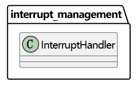
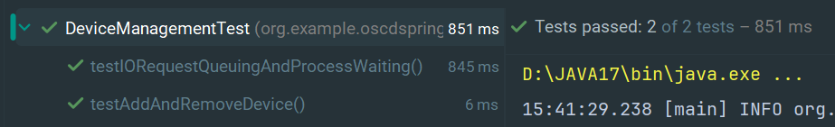
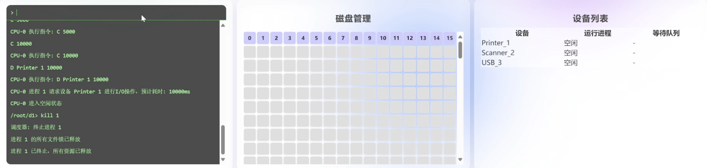

# 《操作系统课程设计》实验报告

[TOC]


------

## 课程设计题目

操作系统模拟程序的设计与实现。


## 课程设计目标和要求

### 目标

设计并实现一个具有操作系统基本功能的软件，具有操作系统的基本功能：

1.  进程管理功能。进程创建（new）、进程调度（scheduling）、进程阻塞（block）、 进程唤醒（wakeup）、进程同步（synchronous）等； 
2. 内存管理功能。进程存储空间的分配和回收，空闲空间的管理等；
3. 文件系统。目录/文件的创建和删除、空间分配和回收 ；
4. 设备管理。设备的申请、分配、使用、释放等；
5. UI界面；
6. 中断机制。

### 基本要求

要求完成的最小功能集合 ：

1. 进程管理和调度 ；
2. 内存管理（存储分配与回收，进程交换） ；
3. 时钟管理：timer ；
4. 中断处理：中断响应、中断处理 ；
5. GUI，图形界面展示多道程序并发执行的过程（系统快照）。


## 需求分析

### 引言

#### 编写目的

本需求分析文档旨在系统、准确地描述操作系统模拟程序的功能与运行需求，为后续的系统设计、开发、测试与维护提供明确依据。文档面向本项目的开发者、测试人员以及指导教师，作为课程设计过程中的重要技术参考材料，确保系统功能设计满足实验教学目标，系统行为与用户预期保持一致。

#### 项目背景

本项目以“操作系统模拟程序的设计与实现”为课题，模拟实现简化版操作系统内核功能，并通过前端图形界面进行动态展示和交互。系统以多进程调度为核心，集成内存管理、文件操作、设备请求与中断处理机制，帮助我们通过自己动手实践，以可视化方式深入理解操作系统的基本运行原理与模块协作机制。


### 总体描述

#### 系统目标

本项目旨在开发一个基于 Web 的操作系统模拟程序，集成进程管理、内存管理、文件操作、设备请求与中断处理机制等模块。系统通过模拟真实操作系统中的关键组件与行为，达成操作系统内核的仿真实现。

用户可以在浏览器进入操作系统界面，通过界面的Shell与操作系统进行交互，并实时展示系统快照。

操作系统提供丰富广泛的指令可供用户使用。

实现目标如下：

1. 功能完整：实现操作系统核心模块的功能，包括进程状态管理、逻辑地址映射等完整的操作系统功能。

2. 结构清晰：采用模块化架构，后端以 Spring Boot 框架搭建，前端以原生 JavaScript 实现，单元测试通过 JUnit 框架进行，逻辑层次分明。

3. 交互直观：通过图形界面展示系统快照，包括内存、磁盘等实时状态，结合模拟终端进行指令输入与控制。

4. 模拟真实环境：支持多核并发执行等机制，尽可能还原真实操作系统的执行过程。

    

#### 用户特征

本系统面向计算机及相关专业的本科生与教师，主要用于操作系统功能的演示与学生自我实践。用户具有一定的编程基础，能够理解命令行操作、以及操作系统的基本原理。


#### 系统功能概要

系统划分为七个核心功能模块，分别为：

1. Shell交互功能：提供类 Unix 命令行界面，支持文件管理、目录切换、程序执行、进程执行等指令，通过终端与后端交互。
2. 进程管理模块：实现进程的创建、调度、阻塞、唤醒与终止；支持多种调度策略；支持多 CPU 并发模拟执行；支持用户更换调度策略或者更换处理器个数。
3. 内存管理模块：实现页式管理机制，支持逻辑地址到物理地址的转换、缺页中断、TLB缓存、页置换算法等。
4. 文件管理模块：支持目录树结构、文件读写与编辑、磁盘块分配与释放，文件内容映射为进程执行指令集。
5. 设备管理模块：模拟打印机、USB、扫描仪等设备，支持进程发起设备请求，设备完成后触发中断唤醒阻塞进程。
6. 中断管理模块：处理时钟中断、I/O中断、文件锁唤醒等事件。
7. 系统快照展示模块：自动采集系统状态，包括运行进程、内存分配、磁盘使用、目录结构、设备状态等，通过前端页面可视化展示。


#### 运行环境与约束

系统采用前后端分离架构，整体运行环境要求如下：

后端运行环境：

- Java 17，Spring Boot 3.4.4 框架
- 每次启动重置操作系统环境，不依赖数据库

前端环境：

- 原生 HTML + CSS + JavaScript
- 支持现代浏览器（Chrome、Edge）


### 详细功能需求

#### Shell交互功能

Shell 交互模块为用户提供统一的命令输入入口，用于操作系统核心功能的访问与控制。用户可通过模拟终端界面输入指令，与文件系统、进程调度器、内存管理器、设备管理器等模块进行交互。所有操作过程中的提示、反馈与系统状态变化均实时推送至前端终端输出区域。

Shell模块接收用户输入的字符串命令，对其进行语义解析和参数提取（实现一个简易Parser），根据命令类型，调用对应的模块进行功能执行。

Shell支持通过命令 `vi <filename>` 打开图形化文件编辑窗口，前端提供编辑界面，编辑完成后可提交保存。若文件不存在则新建文件且自动提示并创建，已存在文件直接载入编辑内容覆盖原本文件。用户可以通过命令 `vi <filename>` 编写自定义程序并通过 Shell 提交任务使其执行。

Shell支持根据当前所在目录动态更新终端提示符（如 `/root/dir1> instruction xxx`）。

以下是一个简单的顺序图，部分操作可能和实际实现有略微差异，该图仅用来理解数据流向与调用逻辑。


#### 进程管理功能

进程管理模块是操作系统模拟程序的核心，负责实现进程的五状态管理与调度控制。该模块协调多个 CPU、调度策略、时间片、状态转换与中断响应等机制，确保系统能稳定支持多道程序并发执行。

具体功能列表：

1. 进程创建

    1. 系统支持通过模拟指令源文件创建进程。
    2. 每个进程分配一个唯一的进程标识符（PID），并初始化其进程控制块（PCB）。

2. 进程控制块（PCB）管理

    1. 系统为每个进程维护一个 PCB，记录进程的基本属性
    2. PCB 与内存页表、文件资源、设备请求等信息绑定。

3. 调度器策略

    1. 系统调度器支持多种经典调度算法，包括：

        1. FCFS（先来先服务）

        2. SJF（短作业优先）

        3. RR（时间片轮转）

        4. PRIORITY（优先级调度）

        5. 
            PRIORITY_PREEMPTIVE（抢占）

        6. MLFQ（多级反馈队列）

    2. 每种策略对应不同的就绪队列管理方式，用户可以在系统启动前切换调度策略。

4. 多核调度与执行
   1. 系统支持多个模拟 CPU 核心同时执行进程。
   2. 每个 CPU 为一个独立线程，持续从调度器拉取就绪进程并执行其指令。
   3. 指令支持模拟计算、内存访问、设备 I/O、文件读写、进程结束等操作。

5. 进程状态转换
   1. 系统支持标准五态模型：`NEW` → `READY` → `RUNNING` → `WAITING` / `TERMINATED`。
   2. 进程可因阻塞（如设备占用、锁等待）、时间片耗尽、中断等原因发生状态切换。

6. 进程终止与资源回收
   1. 当进程正常结束或被用户终止，系统自动回收资源。


#### 内存管理功能

内存管理模块是操作系统核心组成部分之一，负责为进程提供隔离、高效的主存使用环境。内存管理模块负责管理进程的内存分配、释放、读取和写入操作，它协调 CPU 执行过程中的地址转换与页表映射，支持分页、缺页中断与页面置换机制，并与进程管理、文件系统和中断机制紧密协作。

具体功能列表：

1. 分页内存管理
    1. 系统采用固定分区的页式管理方式，将内存划分为固定大小的页框（页帧），每页大小为 1024 字节。
    2. 系统总共支持 64 个物理内存页，物理页以数组方式管理，每页可供一个进程使用。
    3. 每个进程申请内存时，按页为单位进行分配。

2. 虚拟内存支持
    1. 系统支持虚拟内存，通过逻辑页号访问用户地址空间，并由页表完成地址映射。
    2. 每个进程拥有独立虚拟地址空间，访问的逻辑地址不依赖于实际物理地址。
    3. 未在物理内存中的页将触发缺页中断。

3. 地址转换机制
    1.  MMU（内存管理单元）用于执行逻辑地址到物理地址的转换。
    2. 页未在内存中，将触发缺页中断，由缺页处理器调页。

4. 页表与页表项管理
    1. 系统为每个进程建立独立的页表，并存放在页表区域中以模拟内核空间中的页表寄存区。
    2. 每个页表包含若干个页表项，每个页表项记录该逻辑页的物理块号、有效位、访问位、修改位、磁盘块号等信息。
    3. 页表支持随进程运行动态增长与释放，进程终止时页表一并释放。

5. 快表 TLB 机制

    1. 加速虚拟地址到物理地址的映射。 

    1. 用Clock算法替换快表项。

6. 页面置换算法
    1. 使用二次机会算法选择牺牲页面。
2. 内存读写
    1. 系统支持跨页的逻辑地址访问，在读写过程中自动处理页边界，确保逻辑连续访问正确映射到多个物理块。
    2. 内存读写基于逻辑地址提供数据操作。
    3. 所有进程间的内存空间互相隔离，不支持跨进程访问。
3. 内存可视化支持
    1. 系统支持对所有物理内存页状态进行实时采集和展示，标明每个页所属进程及页号。
4. 内存释放机制
    1. 当进程终止时，系统自动释放其占用的所有物理页和页表。
    2. 所有调出的磁盘页面、页表项、缓存等信息均被清理，确保资源可重用。


#### 文件管理功能

文件管理模块负责模拟操作系统中的树状目录结构、磁盘存储模拟、块读写与分配释放管理、创建删除切换目录、文件创建编辑与读写、文件锁机制等关键功能。该模块与进程管理模块深度集成，支持文件驱动的程序执行，以及设备请求与文件资源同步控制。所有文件数据均存放在模拟磁盘中，通过对模拟磁盘读写进行文件读写，支持动态块分配、文件可视化、并发访问控制等操作。

具体功能列表：

1. 目录结构管理

    1. 支持目录树结构，具有根目录 `/root`。
    2. 支持目录的创建、删除、切换和展示。

2. 文件创建与删除

    1. 支持以给定名称和大小创建文件。
    2. 自动分配磁盘块，在磁盘中分配空间存储文件数据，支持非连续块索引。
    3. 支持删除单个文件或所在目录下所有内容，由操作系统回收空间。

3. 文件编辑与读写

    1. 支持通过图形化编辑界面修改文件内容。
    2. 自定义程序支持文件读写操作指令。
    3. 提供按名称查看文件内容、占用块等信息的功能。

4. 磁盘模拟与空间管理

    1. 提供了1MB的模拟磁盘空间可供使用，磁盘空间可真实存放数据。
    2. 由操作系统管理磁盘块分配状态。
    3. 每个文件由多个块组成，支持分配、回收与读取。
    4. 支持磁盘占用率查看，可视化磁盘块使用情况。

5. 文件锁管理

    | 类型 | 是否支持共享 | 是否互斥 |
    | ---- | ------------ | -------- |
    | 读锁 | 是           | 对写互斥 |
    | 写锁 | 否           | 是       |

    1. 申请读锁  若无写锁 → 立即持有，否则 → 进程阻塞 。
    2. 申请写锁 若无读写锁 → 立即持有，否则 → 进程阻塞 。
    4. 进程终止时释放其持有的所有锁 。


#### 设备管理功能

设备管理模块用于模拟操作系统对外围设备的控制，包括设备的创建、删除、分配、使用、释放、进程阻塞与中断唤醒等全过程管理。模块支持多设备、进程阻塞与设备调度，并与中断机制协同工作，实现设备使用过程的完整生命周期管理。

1. 设备增添与删除管理

    1. 系统支持多种自定义的模拟设备，包括 USB、打印机、扫描仪等。
    2. 每类设备支持多个编号实例（如 USB 0、USB 1），每个设备实例独立运行。
    3. 所有设备信息由设备管理器集中维护，支持运行时用户添加与删除设备。

2. 设备请求机制

    1. 进程在执行 I/O 指令时向设备管理器发起请求。
    2. 如果设备当前空闲，请求立即开始；否则进程被加入设备的等待队列。

3. 设备运行与阻塞管理

    1. 当设备正在服务某一进程时，该进程进入阻塞状态（`WAITING`），CPU 释放。
    2. 被阻塞进程在其设备请求完成后由中断处理器唤醒并返回就绪状态。

4. 设备队列调度与进程唤醒

    1. 每个设备维护一个先进先出（FIFO）等待队列。
    2. 当前设备完成任务后，从队首取出下一个等待请求并开始执行。
    3. 同时通过中断处理器将对应进程状态设为 `READY`，交由调度器重新调度。

5. 设备可视化状态展示

    1. 所有设备运行状态、当前服务进程、等待队列信息将推送至前端快照界面。
    2. 可视化面板展示每个设备实例。

    

#### 中断管理功能

中断管理模块负责协调处理操作系统运行过程中发生的异步事件，包括时钟中断、I/O设备完成中断和文件锁释放中断。通过中断机制，系统能够实现进程抢占、阻塞唤醒、资源释放等动态行为，从而保证多进程系统的实时性与响应性。

1. 中断类型支持

    1. 系统支持三种主要中断类型：

        时钟中断（Timer Interrupt）

        设备完成中断（I/O Interrupt）

        文件锁释放中断（File Lock Wakeup）

    2. 各类中断通过统一的中断处理器（`InterruptHandler`）进行分发与处理。

2. 时钟中断管理

    1. 每个 CPU 在每个时钟周期后自动触发时钟中断，模拟硬件定时器功能。
    2. 该机制保证了如 RR、MLFQ 等策略的时间片调度功能。

3. 设备完成中断

    1. 当进程发起 I/O 请求后，会被挂起并加入目标设备的等待队列。
    2. 设备服务进程运行完成后，自动调用 `InterruptHandler` 触发设备完成中断。
    3. 中断处理器将相关进程状态设置为 `READY`，并通知调度器将其加入就绪队列。

4. 文件锁释放中断

    1. 当某一文件锁（读锁/写锁）被释放后，文件锁管理器会通过中断机制通知中断处理器。
    2. 中断处理器根据等待队列状态，唤醒等待进程并按调度策略将其重新调度。

5. 中断处理流程统一化

    1. 所有中断请求通过统一接口处理，形成统一事件分发机制。
    
6. 中断影响的状态转换

    - `RUNNING` → `READY`（时间片耗尽）
    - `WAITING` → `READY`（设备完成/锁释放）
    - `READY` → `RUNNING`（进程重新被调度执行）


#### 系统快照展示功能

系统快照展示功能用于实时展示操作系统当前的系统快照，包括进程状态、内存使用情况、设备状态、文件系统等。通过系统快照，用户可以直观地看到操作系统的运行状况、资源分配与使用情况，有助于调试程序和监控系统的运行。

1. **进程状态展示**
    1. 系统展示出每个CPU上的进程状态，便于分析多核调度的正确性。
    2. 系统展示 `RUNNING`、`READY`、`WAITING` 队列的进程内容。
    3. 系统显示每个运行进程的 PID、优先级、指令、剩余时间等信息。
2. **内存状态展示**
    1. 显示所有物理内存页的当前状态，包括是否被占用、属于哪个进程、页号等。
3. **设备状态展示**
    1. 支持实时展示所有设备（如打印机、USB 设备）的当前状态（空闲、正在使用等）。
    2. 展示当前被服务的进程以及等待队列中的进程。
4. **文件系统状态展示**
    1. 展示文件系统中的目录结构信息。
    2. 展示磁盘块的占用情况信息。
5. **实时数据更新**
    1. 快照界面能够实时更新操作系统的状态信息（每100ms刷新一次），确保用户看到的是最新的状态。


## 开发环境

本操作系统模拟器项目基于 **Java 17 + Spring Boot 3.4.4** 构建，系统前后端分离。

### 后端环境

|            | 工具说明                                                     |
| ---------- | ------------------------------------------------------------ |
| 开发语言   | Java 17                                                      |
| 框架       | Spring Boot 3.4.4                                            |
| 构建工具   | Maven（版本兼容 JDK 17）                                     |
| 主要依赖   | spring-boot-starter-web、thymeleaf、lombok、javax.annotation、junit |
| 开发工具   | IntelliJ IDEA                                                |
| 热部署支持 | Spring DevTools                                              |
| 测试框架   | JUnit 5                                                      |

### 前端环境

| 项目     | 配置 / 工具说明                                              |
| -------- | ------------------------------------------------------------ |
| 页面结构 | HTML5 + 原生 JavaScript                                      |
| 样式框架 | CSS                                                          |
| 交互机制 | SSE（用于日志输出与快照更新）Fetch API（用于命令提交与 vi 编辑） |
| 调试工具 | Chrome 开发者工具、浏览器控制台                              |

### 项目目录结构

```elixir
OSCD/
├── pom.xml                               # Maven 项目构建文件
└── src/
    ├── main/
    │   ├── java/
    │   │   └── org/example/oscdspring/
    │   │       ├── controller/              # 控制器
    │   │       ├── device_management/       # 设备管理
    │   │       ├── file_disk_management/    # 文件磁盘管理
    │   │       ├── interrupt_management/    # 中断管理
    │   │       ├── main/                    # 系统全局类与BIOS
    │   │       ├── memory_management/       # 内存管理
    │   │       ├── process_management/      # 进程管理
    │   │       ├── snapshot/                # 系统快照
    │   │       ├── util/                    # 工具类
    │   │       └── OscdSpringApplication.java  # Spring Boot 启动类
    │   └── resources/
    │       ├── application.properties       # Spring 配置文件
    │       ├── static/
    │       │   ├── index.html               # 前端入口页面
    │       │   ├── css/                     # 样式文件目录
    │       │   └── js/                      # JavaScript 脚本目录
    │       └── templates/                   # Thymeleaf 模板目录
    └── test/
        └── java/org/example/oscdspring/     # JUnit 单元测试
```


## 总体设计

### 系统架构设计

#### 技术选型

本项目采用 Java 语言实现后端核心逻辑，基于 Spring Boot 框架构建 Web 服务接口，并使用 HTML+CSS+JavaScript 构建前端界面。

选择 Java 是因为其丰富的多线程支持和较为底层的实现，便于模拟操作系统的并发和内存分页等底层功能。Java 的面向对象特性使得操作系统的各个模块可以被抽象为独立的类，便于扩展和维护。

选择 Spring Boot 因为这是当下最流行的 Web 框架之一，便于实现前后端搭建，Spring Boot提供开箱即用的REST API和SSE支持，方便实现前后端实时通信。前端采用原生HTML/JS，由于我们这次任务较为简单，无需引入额外框架，利用浏览器即可直观呈现操作系统各模块状态。

开发过程中使用 PlantUML 与 Mermaid 辅助设计架构图。

测试采用JUnit，由于JUnit与Maven构建项目能够无缝集成，非常便于使用，于是成为我们单元测试工具的首选。


#### 模块划分

##### 进程管理模块

负责进程的创建、调度与终止，包括进程控制块（PCB）管理、就绪/等待队列、调度算法以及多CPU内核调度等。


##### 内存管理模块

负责内存的分配、回收与地址转换。实现分页存储结构，包含页表、页表项和快表（TLB），以及缺页中断处理算法，实现页面置换。


##### 设备管理模块

模拟外部I/O设备管理。维护设备列表及每个设备的I/O请求队列，支持设备的动态添加移除，并通过设备线程异步处理I/O请求，完成后触发设备中断通知调度器。


##### 文件系统模块

模拟简单的文件系统和磁盘管理。包括目录管理、文件的创建删除、文件内容读写、磁盘空间分配（位图法）、磁盘块读写等。文件以inode结构表示，包含文件名、大小和磁盘块索引列表（索引分配）。同时包含文件锁模块，提供文件读写锁同步功能。对文件I/O操作加锁，支持多个进程对同一文件的读共享和写独占。维护文件锁等待队列，在进程无法获取所需锁时将其阻塞，锁释放时唤醒等待的进程。


##### 中断机制模块

统一处理各种中断事件，包括时钟中断（用于时间片轮转和进程抢占）、设备中断（I/O完成）和缺页中断（页不在内存时）。中断处理程序更新进程状态、执行上下文切换或内存页替换，并唤醒或调度相应的进程继续执行。



##### 快照系统模块

周期性采集系统各模块状态并推送前端。通过定时任务调度，每隔固定时间收集进程列表、CPU占用、内存使用、文件目录结构、磁盘空闲情况、设备运行队列等信息，生成统一的系统状态快照用于前端可视化。


##### 程序主控制模块

`Shell`提供模拟操作系统的命令行接口。解析用户输入命令，调用上述模块执行相应操作。Shell模块将结果通过日志系统反馈给前端。`Constants`提供操作系统的各种常量。`Library`提供了核心模块静态共享注册中心，以单例静态变量形式注册和访问四大核心子系统：FileSystemImpl，MemoryManagement，DeviceManager，Scheduler，为非 Spring 管理类（如 CPU 线程）提供访问依赖模块的全局入口。`StartupInitializer`相当于系统的BIOS，在系统启动时即执行 run() 方法：将四大核心模块注入 Library 中，实现跨线程访问；根据配置文件设定的调度策略（如 FCFS、RR、MLFQ）初始化调度器；启动指定数量的 CPU 内核线程并注册到调度器；初始化测试用的文件目录、设备、测试程序文件；调用 scheduler.start() 启动调度器主线程。


##### 控制器模块

包含Spring Boot提供的REST API和SSE接口，实现与网页前端的通信。包括命令输入接口、VI编辑接口，以及日志和快照的SSE推送接口。前端页面通过JavaScript获取这些接口的数据，实现对各模块状态的实时展示和控制交互。


##### 服务模块

维护所有日志 SSE 连接与快照 SSE 连接，实现系统的日志与状态快照的“实时消息推送”功能，便于用户在前端界面动态查看系统执行过程。


#### 系统架构图


### 用户交互接口设计

交互主要包括两类：REST接口调用和SSE实时接收。REST接口由Spring Boot提供标准HTTP服务。

#### Shell接口

`POST /api/shell/command`，用于把前端输入的指令传给后端，ShellController接收后调用Shell模块处理命令，Shell根据指令内容再调用其他模块。

#### VI接口

`POST /api/shell/vi`，由于vi的需求较为特殊，输入的内容不是Shell指令而是文本内容，因此需要另外一个接口保存前端vi文本编辑器中用户修改的文件内容。

#### 日志SSE接口

`GET /api/shell/stream`，后端各模块执行时调用日志发送方法，将消息广播给所有连接的SSE。前端收到日志事件后，将日志内容追加到终端输出区域。简而言之就是使用日志发送函数代替了之前的标准输出。

#### 系统快照SSE接口

`GET /api/snapshot`，系统快照的发送类，实现和上面的日志一致，只是发送的内容变为系统快照。每当SystemSnapshot定时发送状态更新时，前端根据接口收到包含各模块数据的JSON串，通过js进行各模块展示的内容更新。


### 用户界面设计

系统前端界面采用单页Web布局，界面截图如下所示：


#### 进程管理区

显示所有CPU核心上的当前运行进程及调度队列情况。界面采用表格形式：每个CPU作为一行，列出CPU编号、当前运行进程PID、进程名称、执行指令、剩余运行时间、优先级等动态信息。表格下方用文本列出全局就绪队列和等待队列的进程列表，以及当前采用的调度策略。用户据此可以观察调度算法的运行效果（如进程在就绪/等待队列间移动、时间片倒计时等）。该区域数据来源于快照系统的`processManagement`部分，前端每次收到快照事件即更新表格内容和队列文本，实现对调度状态的实时监控。

#### 内存可视化区

模拟物理内存的使用情况，以8×8网格共64个小格表示固定数量的内存页帧。每个小格对应一个物理帧，颜色和文字标识其分配状态：空闲帧以灰色显示，已占用帧则填充特定进程的颜色并标注该进程PID及对应的页号（通过鼠标悬停可以显示）。当进程分配或释放内存、发生页面换入换出时，此区域相应格子会改变颜色或内容。用户可通过此图直观了解内存分配，以及页面置换时哪些帧被替换。网格支持悬停显示tooltip，提供帧号、所属进程、页号等详细信息。这种可视化有助于理解分页和虚拟内存机制的动态行为。

#### 文件目录区

以树状结构文本显示文件系统当前目录及其子目录、文件列表。采用ASCII绘图风格，如目录前有“`├──`”和“`└──`”符号区分层次结构。根目录`root/`作为起点，列出其中包含的所有文件和子目录，每个子目录下又以缩进方式列出其内容，递归显示整个文件系统层次。前端在每次收到快照中`fileDirectory`字符串后更新此文本区域。用户可以一目了然地看到当前磁盘上的目录结构和文件分布情况。例如，在Shell执行`mkdir`、`rm`等命令后，此区域会刷新体现新建或删除的文件/目录。由于快照频率高，对于文件系统变化用户几乎可以实时看到结果。

#### Shell终端区

界面左侧下方留出一块终端模拟窗口，包含顶部的命令输入行和下方滚动的输出日志区域。用户在命令输入行中键入指令，类似真实终端以“`>`”提示符开头，支持自由编辑和使用退格等。按下回车后，输入的命令行连同当前提示符会追加到下方输出日志区域，模拟命令被提交执行的显示效果。随后，后台处理该命令产生的所有输出（例如`ls`列出的文件名）会逐行添加到日志区域。Shell区还能动态更新当前路径提示符：当用户改变目录后，提示符会相应变为新路径，如`/root/docs>`。此外，Shell区与前端VI编辑器交互：当用户输入`vi file`命令时，如果文件不存在，前端弹出提示（如“文件不存在，将创建新文件”），终端区暂停输出并弹出VI编辑窗口覆盖Shell区，等待用户输入文本。编辑完成保存后，VI窗口关闭，Shell终端继续显示后续日志。Shell区域基本模拟了一个交互式命令行环境。

#### 磁盘状态区

采用小格矩阵表示磁盘块使用情况。设计为16列×64行的网格，总计1024格对应磁盘的1024个块。每个小格代表一个磁盘块，使用颜色区分空闲和已占用状态（白色为空闲，深色为占用）。当有文件创建、扩展或删除时，此区域将有若干格子颜色发生变化，反映磁盘位图的改变情况。前端根据快照中`diskManagement`的occupiedBlocks列表，将对应索引的格子着色为占用，其余为空闲。直观上，用户可看到磁盘空间的分布碎片状况：如果连续创建大文件会有大片格子变色，删除文件会出现空洞。虽然无法精确显示文件内容，但此宏观视图有助于理解文件存储和磁盘分配机制。

#### 设备列表区

显示当前系统中登记的所有模拟设备及其工作状态。界面用表格列出每个设备：包括设备标识符（如“Printer_1”等）、当前正在为哪个进程服务（若空闲则标记“空闲”），以及其等待队列中的进程PID列表。每当有进程请求某设备I/O，该进程PID会出现在对应设备的等待队列栏，并在设备空闲时移至“运行进程”栏；I/O完成后，该进程PID将从设备表中消失并重新出现在就绪队列（由进程区显示）。用户通过此表可以观察设备并行工作的情况和I/O队列积压状况。例如，启动两个进程同时访问Printer_1，则设备列表会显示Printer_1的运行进程为其中一个，等待队列含另一个PID，当第一个完成后等待的进程转为运行。设备添加和移除操作（通过`addevc`/`rmdevc`）会动态更新此表增删行。设备列表区提供了对系统外围设备活动的直观监控。


## 详细设计

### Shell交互实现

（待完成）

```cmd
mkdir <directory>		#创建目录
mkf <filename> <size>	#创建指定字节数的随机内容文本文件
cd <directory>		#切换目录（能够实现绝对路径解析）
cd..				#返回上一级
cat <filename>		#展示文件内容
ls					#展示当前目录下文件与目录
rm <filename>		#删除文件
rmdir <directory>		#删除空目录
rmrdir <directory>	#递归删除该目录下所有内容
shf <filename>		#查看该文件的磁盘块占用
vi <filename>		#编辑文件内容，若文件不存在则创建
exec <filename1> <priority1> [<filename2> <priority2> ...]	#运行指定文件并指定优先级
addevc <deviceName> <deviceId>				#增加外设
rmdevc <deviceName> <deviceId>				#删除外设
kill <pid>			#杀死进程
info dir			#查看目录树
info disk			#查看磁盘位图
Info memory			#查看内存
```


### 进程管理实现

（可以写一点你想说的）

#### 用户指令集

（介绍一下用户指令的格式）

```cmd
C <time># 								#模拟占用CPU时间，单位ms
R/W <filename> <readtime># 			#不会往里面写真实的内容，重点在于读写互斥性
D <deviceName> <deviceID> <IOtime># 		#外设ID
M <byte># 								#申请使用的内存大小
MW/MR <logicAddress> <Bytes># 			#写入指定长度随机数据或者读取指定长度数据
Q# 									#进程结束，释放资源
```

#### 数据结构

（描述PCB的数据结构即可，如果有别的重要的数据结构可以补充）

#### 方法1实现（如run()实现）

##### 流程图+流程描述

##### 调用方法（这个方法调用了谁，何时）

##### 被调用方法（这个方法被谁调用，何时）

#### 方法2实现（）

##### 流程图+流程描述

##### 调用方法（这个方法调用了谁，何时）

##### 被调用方法（这个方法被谁调用，何时）

……


### 内存管理实现

（可以写一点你想说的）

#### 数据结构

（介绍TLB，页表等关键数据结构）

#### 方法1实现（如handlePageFault()实现）

##### 流程图+流程描述

##### 调用方法（这个方法调用了谁，何时）

##### 被调用方法（这个方法被谁调用，何时）

#### 方法2实现（）

##### 流程图+流程描述

##### 调用方法（这个方法调用了谁，何时）

##### 被调用方法（这个方法被谁调用，何时）

……


### 文件管理实现

（文件锁需要ayd来写，其他部分我来写）


### 设备管理实现

（可以写一点你想说的）

#### 数据结构

（介绍IO请求的数据结构等）

#### 方法1实现（如handlePageFault()实现）

##### 流程图+流程描述

##### 调用方法（这个方法调用了谁，何时）

##### 被调用方法（这个方法被谁调用，何时）


### 中断管理实现

（可以写一点你想说的）

#### 方法1实现（如handleClockInterrupt()实现）

##### 流程图+流程描述

##### 调用方法（这个方法调用了谁，何时）

##### 被调用方法（这个方法被谁调用，何时）

……


### 系统快照展示与API实现


#### 系统快照类实现（SystemSnapshot.java）

（写系统快照类的逻辑）

#### Shell指令解析API实现 

`POST /api/shell/command`，请求体是纯文本命令字符串，ShellController接收后调用Shell模块处理命令。该接口在前端由终端输入事件触发：当用户在Shell输入行按回车，JS使用`fetch`发送请求，命令执行结果由日志SSE推送。

#### VI文件编辑API实现

`POST /api/shell/vi`，请求体为JSON（`{"fileName": "...", "content": "..."}`），用于保存前端VI文本编辑器中用户修改的文件内容。Controller调用文件系统的`editFile`更新文件，返回操作结果字符串。前端在VI对话框点“OK”时发送此请求。保存成功后，并不会立即在终端输出内容，只在控制台打印确认，用于调试。文件内容实际更新后，可由用户再执行`cat`命令查看。

#### 日志SSE API实现

`GET /api/shell/stream`，用于建立服务器推送日志的EventSource连接。后端通过`LogEmitterService.addEmitter()`创建SSE通道。前端Shell.js在页面加载时即创建`eventSource = new EventSource("/api/shell/stream")`监听。后端各模块执行时调用`LogEmitterService.sendLog(msg)`，将消息广播给所有连接的SSE。前端收到日志事件后，将日志内容追加到终端输出区域。除了普通日志，还定义了若干特殊消息：以`PROMPT:`开头的消息用于更新Shell提示符，前端检测到后提取路径并修改最后一行提示符显示，用于实时更新用户所在的文件路径；以`OPEN_VI:`开头的消息用于触发前端打开VI编辑窗口，当用户执行`vi <文件>`命令时，Shell模块不会阻塞等待，而是通过日志先行发送此指令，前端据此弹出编辑窗口并暂停终端交互。这种机制利用SSE的单向推送能力，实现了后端对前端界面的主动控制。

#### 系统快照SSE API实现

`GET /api/snapshot`，建立系统状态快照推送的EventSource连接。后端`SnapshotController`调用`SnapshotEmitterService.addEmitter()`生成连接。前端snapshotManager.js脚本打开该连接并监听`snapshot`事件。每当SystemSnapshot定时发送状态更新时，前端收到包含各模块数据的JSON串，解析后分发为自定义事件`snapshot-update`。各UI模块的JS监听该事件并更新界面元素。例如，process.js监听snapshot-update，从数据中提取进程管理部分刷新进程表格、就绪/等待队列和调度策略显示；memory.js获取内存快照，重新绘制64格内存方格，每个已占用帧用颜色和标签标明所属进程及页号；disk.js据快照中occupiedBlocks数组高亮磁盘栅格中占用的块（实现类似于内存，可视化磁盘1KB块的使用分布）；filesystem.js读取文件目录字符串，在文件目录面板以预格式文本呈现（带缩进的树结构)；device.js根据设备列表重绘设备表格，包括每个设备名、正在服务的进程以及等待队列进程列表。通过快照SSE，前端实现了对后端状态变化的被动拉取（实为服务端推送）更新。

#### 进程管理展示实现

（写各js的逻辑）

#### 内存管理展示实现

#### 目录展示实现

#### Shell模块界面交互实现

#### 磁盘占用展示实现

#### 设备管理展示实现


## 程序清单

### 代码结构

```elixir
OSCD/
├── pom.xml
└── src/
    ├── main/
    │   ├── java/
    │   │   └── org/example/oscdspring/
    │   │       ├── controller/                    # 控制器
    │   │       │   ├── ShellController.java
    │   │       │   ├── ShellSseController.java
    │   │       │   └── SnapshotController.java
    │   │       ├── device_management/             # 设备管理
    │   │       │   ├── DeviceManager.java
    │   │       │   ├── IODevice.java
    │   │       │   └── IORequest.java
    │   │       ├── file_disk_management/          # 文件磁盘管理
    │   │       │   ├── Bitmap.java
    │   │       │   ├── Directory.java
    │   │       │   ├── Disk.java
    │   │       │   ├── FileDiskManagement.java
    │   │       │   ├── FileLockManager.java
    │   │       │   ├── FileSystemImpl.java
    │   │       │   └── Inode.java
    │   │       ├── interrupt_management/          # 中断管理
    │   │       │   └── InterruptHandler.java
    │   │       ├── main/                          # 主要类
    │   │       │   ├── Constants.java
    │   │       │   ├── Library.java
    │   │       │   ├── Shell.java
    │   │       │   └── StartupInitializer.java
    │   │       ├── memory_management/             # 内存管理
    │   │       │   ├── Memory.java
    │   │       │   ├── MemoryManagement.java
    │   │       │   ├── MemoryManagementImpl.java
    │   │       │   ├── MMU.java
    │   │       │   ├── PageTable.java
    │   │       │   ├── PageTableArea.java
    │   │       │   └── PageTableEntry.java
    │   │       ├── process_management/            # 进程管理
    │   │       │   ├── CPU.java
    │   │       │   ├── PCB.java
    │   │       │   ├── PIDBitmap.java
    │   │       │   ├── ProcessState.java
    │   │       │   └── Scheduler.java
    │   │       ├── snapshot/                      # 系统快照
    │   │       │   └── SystemSnapshot.java
    │   │       ├── util/                          # 工具类
    │   │       │   ├── LogEmitterService.java
    │   │       │   └── SnapshotEmitterService.java
    │   │       └── OscdSpringApplication.java     # 应用程序入口
    │   └── resources/
    │       ├── application.properties
    │       ├── static/
    │       │   ├── index.html
    │       │   ├── css/
    │       │   │   └── style.css
    │       │   └── js/
    │       │       ├── device.js
    │       │       ├── disk.js
    │       │       ├── filesystem.js
    │       │       ├── memory.js
    │       │       ├── process.js
    │       │       ├── shell.js
    │       │       └── snapshotManager.js
    │       └── templates/
    └── test/
        └── java/org/example/oscdspring/
            ├── CPUTest.java                     
            ├── DeviceManagementTest.java        
            ├── FileManagementTest.java          
            ├── MemoryManagementTest.java        
            └── ProcessManagementTest.java       
```

代码结构为常见的 Spring 项目结构，程序从 `OscdSpringApplication.java` 为入口启动。

操作系统核心逻辑按照功能划分为多个模块。每个模块负责不同的操作系统功能，并通过类和接口实现。

控制器模块负责处理前端发出的请求；快照模块用于从各个模块采集操作系统的状态快照，填充展示给前端的json，并调用工具类把信息推送给前端；工具类负责消息与快照的前端推送服务。

前端文件位于 `src/main/resources/static/` 目录下，用于动态展示系统的运行状态。

`application.properties` 用于配置 Spring 属性，以及操作系统的部分属性（CPU数，调度算法）。

JUnit 单元测试代码位于 `test/java/org/example/oscdspring/` 目录下。


### 代码说明

```coffeescript
pom.xml
# Maven 配置文件

src/main/java/org/example/oscdspring/OscdSpringApplication.java
# Spring Boot 应用的入口类

src/main/java/org/example/oscdspring/controller/ShellController.java
# Spring 控制器，处理前端 Shell 提交的命令。它接收命令并通过 `Shell` 类处理，返回处理结果。包含解析普通shell指令和vi操作的接口

src/main/java/org/example/oscdspring/controller/ShellSseController.java
# 通过 SSE 推送实时消息给前端。包括 Shell 的输出和各模块运行时输出

src/main/java/org/example/oscdspring/controller/SnapshotController.java
# 提供一个 API 接口，允许前端通过 SSE 通道接收操作系统状态的实时快照

src/main/java/org/example/oscdspring/device_management/DeviceManager.java
# 设备管理类

src/main/java/org/example/oscdspring/device_management/IODevice.java
# I/O 设备类

src/main/java/org/example/oscdspring/device_management/IORequest.java
# I/O 请求类

src/main/java/org/example/oscdspring/file_disk_management/Bitmap.java
# 位图类

src/main/java/org/example/oscdspring/file_disk_management/Directory.java
# 目录类

src/main/java/org/example/oscdspring/file_disk_management/Disk.java
# 模拟磁盘类

src/main/java/org/example/oscdspring/file_disk_management/FileDiskManagement.java
# 文件管理的接口类，供其他模块调用基本方法

src/main/java/org/example/oscdspring/file_disk_management/FileLockManager.java
# 文件锁管理类

src/main/java/org/example/oscdspring/file_disk_management/FileSystemImpl.java
# 文件管理接口类的实现

src/main/java/org/example/oscdspring/file_disk_management/Inode.java
# 文件索引节点类

src/main/java/org/example/oscdspring/interrupt_management/InterruptHandler.java
# 中断处理类

src/main/java/org/example/oscdspring/main/Constants.java
# 常数

src/main/java/org/example/oscdspring/main/Library.java
# 管理各模块Manager对象的访问

src/main/java/org/example/oscdspring/main/Shell.java
# Shell命令解析类

src/main/java/org/example/oscdspring/main/StartupInitializer.java
# BIOS类，初始化系统

src/main/java/org/example/oscdspring/memory_management/Memory.java
# 模拟内存类

src/main/java/org/example/oscdspring/memory_management/MemoryManagement.java
# 内存管理接口

src/main/java/org/example/oscdspring/memory_management/MemoryManagementImpl.java
# 内存管理接口的具体实现

src/main/java/org/example/oscdspring/memory_management/MMU.java
# 内存管理单元

src/main/java/org/example/oscdspring/memory_management/PageTable.java
# 页表类

src/main/java/org/example/oscdspring/memory_management/PageTableArea.java
# 单例类，用于模拟内存系统区中存储页表的区域

src/main/java/org/example/oscdspring/memory_management/PageTableEntry.java
# 页表项类

src/main/java/org/example/oscdspring/process_management/CPU.java
# 模拟 CPU，负责执行指令

src/main/java/org/example/oscdspring/process_management/PCB.java
# 进程控制块类

src/main/java/org/example/oscdspring/process_management/PIDBitmap.java
#管理进程 ID 的分配

src/main/java/org/example/oscdspring/process_management/ProcessState.java
# 定义进程五种状态

src/main/java/org/example/oscdspring/process_management/Scheduler.java
# 进程调度器类

src/main/java/org/example/oscdspring/snapshot/SystemSnapshot.java
# 负责采集操作系统的实时状态并生成快照

src/main/java/org/example/oscdspring/util/LogEmitterService.java
# 日志发射服务

src/main/java/org/example/oscdspring/util/SnapshotEmitterService.java
# 快照发射服务

src/main/resources/application.properties
# Spring Boot 应用配置文件，定义系统的基本参数，以及调度算法，CPU数量

src/main/resources/static/index.html
# 前端首页

src/main/resources/static/css/style.css
# 样式

src/main/resources/static/js/device.js
# 设备管理前端交互与展示

src/main/resources/static/js/disk.js
# 磁盘占用前端交互与展示

src/main/resources/static/js/filesystem.js
# 目录结构展示

src/main/resources/static/js/memory.js
# 内存管理前端交互和显示

src/main/resources/static/js/process.js
# 进程管理前端交互和显示

src/main/resources/static/js/shell.js
# Shell前端交互逻辑

src/main/resources/static/js/snapshotManager.js
# 实时接收来自服务器的操作系统状态快照

src/test/java/org/example/oscdspring/CPUTest.java
# CPU单元测试

src/test/java/org/example/oscdspring/DeviceManagementTest.java
# 设备管理单元测试

src/test/java/org/example/oscdspring/FileManagementTest.java
# 文件系统单元测试

src/test/java/org/example/oscdspring/MemoryManagementTest.java
# 内存单元测试

src/test/java/org/example/oscdspring/ProcessManagementTest.java
# 进程管理单元测试
```


### 源代码

源代码见提交。


## 测试报告

### 测试环境

为保证各模块在模拟环境下的正确性与稳定性，测试工作在以下软硬件和开发配置下进行：

- 操作系统：Windows 11 
- 开发语言：Java 17
- 构建工具：Maven
- 开发环境：IntelliJ IDEA
- 框架平台：Spring Boot 3.4.4
- 单元测试框架：JUnit 5
- 浏览器环境：Chrome / Edge


### 测试计划

在实际开发过程中，我们针对操作系统模拟系统制定了分阶段的测试计划，以确保各模块功能和系统整体的可靠性。测试分为单元测试和集成测试两个主要阶段：先在后端模块完成且 Web 前端开发之前进行单元测试，随后在系统集成并提供前端界面后进行集成测试。

1. 单元测试阶段：
    - 测试环境与工具：所有单元测试均在 Web 前端搭建之前完成，并通过 IntelliJ IDEA 提供的 JUnit 5 运行器在命令行环境下执行。这样保证在引入界面之前，各后端模块已经过充分验证。
    - 覆盖范围：单元测试覆盖了系统的核心模块，包括进程管理、内存管理（含内存管理单元 MMU）、设备管理、文件系统以及 CPU 模块（指令获取与执行部分）。针对每个模块的主要功能编写了独立的测试用例，确保模块功能按照设计正常工作。
    - 异常路径验证：除了验证正常功能外，单元测试特别关注各模块的边界条件和异常处理。测试用例设计涵盖了例如非法内存地址访问、内存越界写入、设备资源锁冲突等异常场景，确保代码对错误输入或极端情况具有适当的处理（如抛出异常或返回错误码），从而验证模块的健壮程度。
2. 集成测试阶段：
    - 测试环境与工具：在完成所有模块集成并开发出前端界面后，进行系统级的集成测试。测试者通过前端界面输入指令流，并执行测试程序，以触发系统各模块协同工作，验证整体逻辑的正确性。
    - 覆盖范围：集成测试涵盖了操作系统模拟的典型使用场景和复杂情况，包括Shell、进程调度、设备调度、文件互斥读写、内存管理。通过这些场景，验证各模块在实际工作流中能够正确配合，确保数据的一致性和系统状态的正确转换。
    - 异常路径验证：在集成测试中也设计了异常的测试用例。例如，当通过前端指令触发非法操作时，检查系统是否能够正确捕获并处理该错误等。


### 单元测试

#### 进程管理单元测试


- **测试功能**：验证进程管理核心功能，包括 PID 分配与回收以及多种调度算法（先来先服务、优先级调度、多级反馈队列、时间片轮转）的正确性。
- **测试用例**：包括 PID 分配与重用测试（分配两个 PID 后释放一个验证其可重用）；多种调度策略测试：先来先服务 (FCFS) 调度按进入顺序返回进程，优先级调度确保高优先级进程优先执行，多级反馈队列 (MLFQ) 测试按队列优先级选择下一个进程并校验不同队列的时间片长度，时间片轮转 (RR) 策略下验证为进程分配了默认的时间片长度。
- **预期结果**：PID 分配调用应返回非 -1 的唯一 PID，且释放后再次分配能获得先前释放的 PID；FCFS 调度应按进程进入就绪队列的先后顺序依次返回进程，当队列为空时返回空；优先级调度应总是优先选择优先级数值更小（优先级更高）的进程运行；MLFQ 调度应优先调度高优先级队列的进程，然后再调度低优先级队列进程，各级队列分配的时间片长度（如队列0为500ms、队列2为2000ms）符合系统设定；RR 调度下新进入的进程应获得配置的100ms默认时间片。
- **结果分析**：测试结果均与预期一致：所分配 PID 值均唯一有效，释放后的 PID 成功被新进程重用；调度算法在各场景下均按照设计返回了正确的进程顺序并赋予正确的时间片。特别地，FCFS 测试验证了当就绪队列为空时调度器返回空值的边界情况；优先级调度测试覆盖了“后加入但优先级更高”的进程抢占先加入的低优先级进程的典型路径；MLFQ 测试确认了跨多个队列的调度次序及时间片分配符合设计策略。所有测试均通过，证明进程管理模块的功能实现满足预期要求。


#### 内存管理单元测试


- **测试功能**：测试内存管理模块，包括物理内存使用统计、动态内存分配及页表扩展、内存读写一致性、进程内存释放，以及地址转换单元 (MMU) 的页表更新、地址转换正确性与越界保护、TLB 快表替换策略和页面置换算法。
- **测试用例**：涵盖多个方面：首先获取物理内存使用状态，验证系统保留的内存帧数量及新分配帧是否正确登记；然后为进程追加一段随机大小的内存以扩展页表，并在新分配区域写入随机数据再读出，检查读出内容与写入内容一致；接着释放该进程占用的内存，再次查询内存使用信息，确认物理内存占用恢复至释放前状态。针对 MMU，测试了进程切换时调用 MMU.update() 更新页表指针、页表大小、代码段长度等信息并清空 TLB；对一系列逻辑地址逐一进行地址转换，将得到的物理地址与根据页表计算的结果比对验证转换正确；对超出进程地址空间范围的逻辑地址进行转换，确认返回错误码表示越界；最后连续访问多个不同页的地址以触发 TLB 替换和页面置换机制，检查首次访问新页面时 TLB 内容更新，而重复访问已缓存的页面时 TLB 保持不变。
- **预期结果**：内存管理功能方面，初始的内存使用信息应准确给出总帧数及系统已用帧数；为进程分配内存后，其页表大小增加的页数应等于请求分配字节数按页面大小向上取整的结果；在新分配内存区域读出的数据应与先前写入的数据完全一致；释放进程内存后，再次查询内存使用应发现总占用帧数恢复到释放前水平。MMU 方面，进程切换后 MMU 内保存的页表基址、页表大小、代码段长度等应更新为新进程对应的值，且 TLB 快表应被清空；逻辑地址到物理地址的转换结果应与直接查页表计算所得的物理地址相符，对越界的逻辑地址转换应返回预定义的错误标识；多页连续访问时，预期首次访问新页会导致 TLB 内容更新（加入新条目或替换掉旧条目），而对同一页的重复访问不会反复更换已缓存的 TLB 项，页面置换算法在需要时会正确地分配/替换物理页帧。
- **结果分析**：测试结果表明内存管理模块各功能行为都符合预期：初始内存使用统计正确，新增内存分配后页表扩展的页数与所需页数计算结果一致，内存读写测试中读出内容与写入内容完全吻合，释放内存后物理内存占用状况恢复如初。MMU 及内存保护方面的测试也全部通过：进程切换时 MMU 成功更新了页表相关信息并清空了 TLB，逻辑地址转换对进程可访问范围内的地址均返回了正确的物理地址，而对越界地址返回了错误码；连续多页访问过程中，TLB 表现出正确的替换策略——首次访问新页面时快表内容发生更新，而对同一页面的重复访问未改变已缓存的条目；整个过程中页面置换机制正常工作。


#### CPU 单元测试


- **测试功能**：验证 CPU 模块中取指过程和指令执行逻辑的正确性。
- **测试用例**：模拟从内存逐字节读取指令直到遇到终止符（`#`）的取指操作，验证组装出的指令字符串正确且程序计数器 PC 随读取进度递增；测试带有剩余指令片段的情况，预先在进程控制块 PCB 中设置未执行完的残留指令，调用取指应直接返回该残留指令串且不访问内存；模拟执行一条计算指令（例如 “C 200”），验证 CPU 执行后将对应进程的已用CPU时间累加指定的计算时长，并清除已执行的指令残留。
- **预期结果**：当没有残留指令时，CPU 的取指过程应连续从内存读取字节直到遇到终止符为止，返回正确的指令字符串（不包含终止符本身），同时 PC 寄存器增加读取的字节数；如果当前 PCB 中有残留指令未执行完，则取指操作应直接返回该指令串且不会进行任何内存读取；执行计算指令后，相应 PCB 记录的累计 CPU 时间 (`timeUsed`) 应增加指令所消耗的时间（例如增加200单位），并且该指令应从 PCB 的残留指令字段中移除（清空）。
- **结果分析**：测试结果与预期完全一致：取指流程能够正确读取并组装指令，在内存提供字符到终止符的过程中 PC 得到了相应递增；当存在残留指令时，CPU 跳过内存读取直接返回了该指令字符串，验证了利用缓存指令优化取指的逻辑。计算指令执行测试则确认了 CPU 能根据指令内容正确更新进程的 CPU 时间累加值，并清除已执行指令的残留。


#### 设备管理单元测试



- **测试功能**：验证设备管理模块的设备注册与移除，以及 I/O 请求处理过程中的队列管理和进程状态切换机制。
- **测试用例**：首先添加一个新设备（指定设备ID和名称），确认设备成功注册后再将其移除，检查设备列表更新情况；然后模拟一个 I/O 设备（例如磁盘），创建两个进程向该设备发起 I/O 请求，用于测试 I/O 请求的排队和进程等待。两个 I/O 请求按先后次序提交后，检查这两个进程的状态是否切换为 WAITING，并验证设备的内部请求队列按FIFO顺序包含了这两条请求。最后模拟 I/O 完成，调用调度器接口将等待中的进程移出等待队列（相当于I/O中断完成后恢复进程），确保进程能够从 WAITING 状态被移除（在实际系统中会重新进入就绪队列）。
- **预期结果**：调用 `addDevice` 后，新设备应能通过查询存在；执行 `removeDevice` 后，该设备应不再存在于设备管理器的登记列表中。进程提交 I/O 请求后，其进程状态应变为 WAITING 等待I/O完成，对应的设备对象应将请求加入内部等待队列且按进入顺序排列；当模拟的I/O处理结束并将进程从等待队列移除后，这些进程将不再标记为等待状态（实际系统中它们此时会重新变为就绪等待调度运行）。
- **结果分析**：测试结果表明设备管理功能正常：新添加的设备可以正确查询到，移除操作后设备确实从管理器中消失；I/O 请求提交后进程状态成功从运行转为等待，设备队列按照请求提交顺序保存了各等待请求。通过模拟I/O完成将进程移出等待队列，验证了进程能够从等待状态恢复，这表明设备管理模块与调度器协同正确地处理了I/O等待和完成流程。


#### 文件系统单元测试


- **测试功能**：测试文件系统模块，包括文件创建与删除、目录创建导航及删除，以及文件锁管理（读写锁机制）的正确实现。
- **测试用例**：文件操作方面，创建一个指定大小的新文件，验证文件出现在当前目录且分配了相应数量的磁盘块；然后删除该文件，确认目录中已无此文件且释放了原先占用的磁盘块。目录操作方面，创建一个新目录并切换进入，在该目录下创建子目录和文件后返回上级目录；尝试直接删除这个非空目录应失败（目录仍存在），随后调用递归删除方法移除该目录及其所有子内容，验证目标目录被删除且其中文件占用的磁盘块已释放。文件锁方面，模拟多个进程同时获取同一文件的读锁（均应成功），随后另一个进程请求写锁（在前述读锁未全部释放前应获取失败）；释放其中一个读锁后再次请求写锁依然不得成功，直至释放所有读锁后该写锁请求才应成功获得；在写锁持有期间，再有其他进程请求读锁应被阻塞，释放写锁后新的读锁请求可正常获得。
- **预期结果**：文件创建后应返回所分配的磁盘块索引数组，其长度与文件大小按块大小划分的块数相符，且该文件能通过目录查询到；删除文件后，再查询应找不到该文件，磁盘被占用块数相应减少（释放了文件占用的块）。目录导航进入新创建的目录后，当前路径应更新为对应目录路径；对包含内容的目录直接执行删除操作应无效，目录仍应存在；递归删除目录操作完成后，目标目录及其内部所有文件、子目录都应被移除，尝试再次进入该目录应失败且原先占用的磁盘块已全部释放。文件锁方面，应允许多个进程同时持有同一文件的读锁而不互相阻塞；在任一读锁保持期间，请求写锁应被拒绝；只有当所有读锁都释放后，写锁请求才能成功获得；在写锁持有期间，任何新的读锁请求应被阻塞等待，待写锁释放后才能获取成功。
- **结果分析**：测试结果与预期完全吻合：文件创建后目录列表新增了目标文件，分配的磁盘块数量准确满足文件大小需求；删除文件后目录中相应条目消失，磁盘占用块数恢复到创建前水平，说明文件的分配与回收机制运作正常。目录导航及删除测试验证了路径切换功能有效，系统成功阻止了对非空目录的直接删除，而递归删除功能正确地清除了该目录及其所有内容并释放了存储空间。文件锁测试结果表明读写锁机制按设计工作：多个读锁可并行存在且互不影响；有读锁存在时写锁请求被正确阻塞，待所有读锁释放后写锁才能独占获取；写锁持有期间新的读锁申请被挂起，写锁释放后读锁申请才恢复成功。以上测试覆盖了文件系统操作的典型流程和关键边界情况（例如非空目录删除限制、读写锁互斥），所有测试均通过，表明文件系统模块的功能实现满足预期。


### 集成测试

#### Shell 测试

##### 错误命令


能够提示报错，符合预期。


##### `mkdir`

创建目录前：


输入指令创建目录：


创建目录后：


出现名为a的文件夹。


重名目录会报错，符合预期。


##### `mkf`与`cat`

创建文件前：


创建文件：


创建文件后：


文件占用了10个块，符合预期。

创建另一个10字节文件并查看：


文件确实由10个随机的`char`构成，且显示正常。


创建过大文件会提示空间不足。


且磁盘块在创建过大文件失败时，保持原来大小不变，而不是占满。


##### `cd`与`cd..`


功能均正常。


输入错误路径会报错，符合预期。


##### `ls`

在根目录执行：


符合根目录下内容：


##### `rm`

删除b：


相应的回收其空间，符合预期：


这时如果再创建文件：


文件系统会遍历位图找到合适空间分配：


删除不存在的文件会报错，符合预期：


##### `rmdir`

删除空文件夹a：


a被删除：


##### `rmrdir`

递归删除文件夹d1：


空间被回收：


目录中全部内容被删除：


 

##### `shf`

创建一个40960字节的文件。


创建前磁盘情况：


创建后磁盘情况：


符合上面shf的输出结果。


##### `vi`

输入vi指令：


若文件不存在，系统会自动为我们新建：


输入文件内容：


查看文件内容与磁盘块占用，符合预期：


##### `exec`

创建一个文件，输入一段简易示例程序：


输入指令开始执行：


##### `addevc`与`rmdevc`


##### `kill`

###### kill 运行态进程

kill执行前状态：


kill 1，杀死正在执行的t1进程，可见其运行被终止，且占用的内存资源被释放。


###### kill 就绪态进程

kill执行前状态：


kill 3，杀死在Ready队列的t3，结果如下所示：


t3从Ready队列移除，转为Terminate态，释放资源。


###### kill IO进程

kill执行前状态：


t1正在进行设备IO：


这个时候执行kill操作：



设备释放，程序终止。


###### kill 内存读写进程

执行t8，读内存：


执行kill：


资源释放，读锁释放。


##### `info`


#### 单CPU进程调度测试

测试程序：

```yaml
t9:
C 2000#Q#
t10:
C 3000#Q#
t11:
C 4000#Q#
t12:
C 1000#C 2000#Q#
t13:
C 10000#Q#
t14:
C 2000#Q#
t15:
C 2000#Q#
t16:
C 2000#Q#
```


##### FCFS

测试命令：`exec t9 0 t10 0 t11 0`

结果甘特图：


结果截图：


##### SJF

说明：本程序SJF调度算法按程序代码段大小对程序进行排序

测试命令:`exec t9 0 t12 0 t11 0`

结果甘特图：


结果截图：


##### RR

测试命令：`exec t9 0 t10 0`

测试结果：CPU交替运行t9、t10。

##### PRIORITY

测试命令：`exec t9 3 t10 2 t11 1`

结果甘特图：


结果截图：


##### MLFQ

测试命令：`exec t13 0 t14 1 t15 2 t16 3`

测试结果：CPU按t13, t14, t13, t15, t14, t13, t16, t15, t14, t13, t16, t15, t14, t13, t16, t15, t14, t13, t16, t15, t14, t13, t16, t15的顺序依次执行完毕，符合MLFQ调度算法的预期。

##### PRIORITY_Preemptive

测试命令：`exec t14 3 t15 2 t16 1`

结果甘特图：


结果截图：


#### 多CPU进程调度测试


#### 设备调度测试

测试程序：

```yaml
t1:
M 4096#C 5000#C 10000#D Printer 1 10000#Q#
t2:
M 4096#C 10000#C 2000#D Printer 1 10000#Q#
t3:
M 10240#C 5000#C 10000#D USB 3 10000#Q#
```

测试命令：`exec t1 0 t2 0 t3 0`

测试环境：4个CPU，调度算法FCFS。

结果甘特图：


结果截图：


符合甘特图的描述。


#### 文件系统测试

基本功能（文件创建删除修改，目录创建删除切换，磁盘块管理，磁盘空间分配等）已在Shell测试部分完成测试，下面仅测试文件读写互斥性。

测试程序：

```yaml
t4:
（被读写文件）
t5:
M 4096#W t4 2000#Q#
t6:
M 4096#W t4 2000#Q#
t7:
M 4096#R t4 2000#Q#
t8:
M 4096#R t4 2000#Q#
```

测试命令：`exec t5 0 t6 0 t7 0 t8 0`

测试环境：4个CPU，调度算法FCFS。

结果甘特图：


结果截图：

首先执行写进程t5：


t5完成后执行写进程t6，图中t5内存块已被释放，代表t5进程已结束执行：


t6执行后，t7和t8同时进行读操作：


t7和t8读之后同时释放：


#### 内存管理测试

##### 测试程序：

```yaml
m1:
C 3000#M 10000#C 3000#MR 0 10000#C 3000#MW 100 9000#C 3000#MR 0 10000#C 3000#Q#
m2:
C 2000#M 100000#C 2000#MW 100 101000#Q#
```

测试命令：`exec m1 1`， `exec m2 1`

测试环境：4个CPU，调度算法FCFS。


##### 测试说明：

文件`m1` 测试正常读写：

先分配10000字节内存，然后MR 0 10000读取内存0\~10000，再MW 100 9000在100~9000的内存部分随机写入字符，再MR 0 10000读取内存0\~10000，最后退出。

文件`m2` 测试读写越界：

先分配100000字节内存，然后MW 100 101000写内存100\~101100，最后退出。


##### 预期结果：

`m1`:

第一次`MR`时，读取内容前面的部分应为文件内容：`C 3000#M 10000#C 3000#MR 0 10000#C 3000#MW 100 9000#C 3000#MR 0 10000#C 3000#Q#`，后面的结果为随机数据。且进程所占内存从1页变为4页，然后四个页面不断变换。

第一次`WR`时，成功写入，进程所占内存保持4页不变，且运行时四个页面不断变换，磁盘块不断写入数据（用于虚拟内存调入调出）。

第二次`MR`时，读取内容前面的部分应为文件内容：`C 3000#M 10000#C 3000#MR 0 10000#C 3000#MW 100 9000#C 3000#MR 0 10000#C 3000#Q#`，后面的结果应该为不同的随机数据。

运行完成后，用于虚拟内存调入调出的磁盘块和内存页面应该全部释放。

`m2`:

在shell界面报错，不执行`MW`指令，且程序可以正常释放。


##### 测试结果：

`m1`:

运行前：


刚加载程序时：


第一次运行MR后：


第一次读取的结果：


第一次运行WR后：


第二次运行MR后：


读取结果：


程序释放后：


`m2`:

运行前：


刚加载程序时：


运行M时报错并正常释放：


##### 结果分析

测试结果与预期结果相符


#### 四级标题：总体测试

可能需要复杂的涉及全模块功能的测试。逻辑和上面一样，只是程序写的复杂一些。准备等上面写好了再做这个。


## 个人总结与体会

### 任泽高


### 安轶东


### 董佳鑫


### 路遥


### 杨皓岚


### 张志鑫


