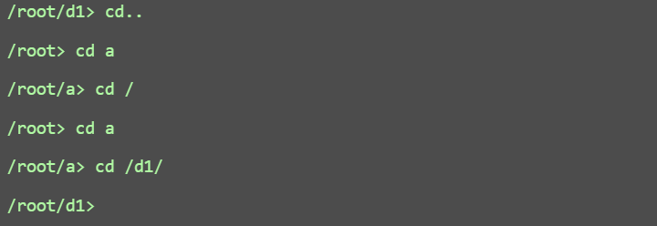

# 《操作系统课程设计》实验报告

[TOC]


------

## 课程设计题目

操作系统模拟程序的设计与实现。


## 课程设计目标和要求

### 目标

设计并实现一个具有操作系统基本功能的软件，具有操作系统的基本功能：

1.  进程管理功能。进程创建（new）、进程调度（scheduling）、进程阻塞（block）、 进程唤醒（wakeup）、进程同步（synchronous）等； 
2. 内存管理功能。进程存储空间的分配和回收，空闲空间的管理等；
3. 文件系统。目录/文件的创建和删除、空间分配和回收 ；
4. 设备管理。设备的申请、分配、使用、释放等；
5. UI界面；
6. 中断机制。

### 基本要求

要求完成的最小功能集合 ：

1. 进程管理和调度 ；
2. 内存管理（存储分配与回收，进程交换） ；
3. 时钟管理：timer ；
4. 中断处理：中断响应、中断处理 ；
5. GUI，图形界面展示多道程序并发执行的过程（系统快照）。


## 需求分析

### 引言

#### 编写目的

本需求分析文档旨在系统、准确地描述操作系统模拟程序的功能与运行需求，为后续的系统设计、开发、测试与维护提供明确依据。文档面向本项目的开发者、测试人员以及指导教师，作为课程设计过程中的重要技术参考材料，确保系统功能设计满足实验教学目标，系统行为与用户预期保持一致。

#### 项目背景

本项目以“操作系统模拟程序的设计与实现”为课题，模拟实现简化版操作系统内核功能，并通过前端图形界面进行动态展示和交互。系统以多进程调度为核心，集成内存管理、文件操作、设备请求与中断处理机制，帮助我们通过自己动手实践，以可视化方式深入理解操作系统的基本运行原理与模块协作机制。


### 总体描述

#### 系统目标

本项目旨在开发一个基于 Web 的操作系统模拟程序，集成进程管理、内存管理、文件操作、设备请求与中断处理机制等模块。系统通过模拟真实操作系统中的关键组件与行为，达成操作系统内核的仿真实现。

用户可以在浏览器进入操作系统界面，通过界面的Shell与操作系统进行交互，并实时展示系统快照。

操作系统提供丰富广泛的指令可供用户使用，容纳了各种文件操作，程序编写，程序并发执行，程序互斥读写文件，外设使用，内存分配，虚拟内存扩展等功能。

实现目标如下：

1. 功能完整：实现操作系统核心模块的功能，包括进程状态管理、逻辑地址映射等完整的操作系统功能。

2. 结构清晰：采用模块化架构，后端以 Spring Boot 框架搭建，前端以原生 JavaScript 实现，逻辑层次分明。

3. 交互直观：通过图形界面展示系统快照，包括内存、磁盘等实时状态，结合模拟终端进行指令输入与控制。

4. 模拟真实环境：支持多核并发执行等机制，尽可能还原真实操作系统的执行过程。

    

#### 用户特征

本系统面向计算机及相关专业的本科生与教师，主要用于操作系统功能的演示与学生自我实践。用户具有一定的编程基础，能够理解命令行操作、以及操作系统的基本原理。


#### 系统功能概要

系统划分为七个核心功能模块，分别为：

1. Shell交互功能：提供类 Unix 命令行界面，支持文件管理、目录切换、程序执行、进程终止等指令，通过终端与后端交互。
2. 进程管理模块：实现进程的创建、调度、阻塞、唤醒与终止；支持多种调度策略；支持多 CPU 并发模拟执行；支持用户更换调度策略或者更换处理器个数。
3. 内存管理模块：实现页式管理机制，支持逻辑地址到物理地址的转换、缺页中断、TLB缓存、页置换算法等。
4. 文件管理模块：支持目录树结构、文件读写与编辑、磁盘块分配与释放，文件内容映射为进程执行指令集。
5. 设备管理模块：模拟打印机、USB、扫描仪等设备，支持进程发起设备请求，设备完成后触发中断唤醒阻塞进程。
6. 中断管理模块：处理时钟中断、I/O中断、文件锁唤醒等事件，实现多进程抢占与异步事件响应。
7. 系统快照展示模块：自动采集系统状态，包括运行进程、内存分配、磁盘使用、目录结构、设备状态等，通过前端页面可视化展示。


#### 运行环境与约束

系统采用前后端分离架构，整体运行环境要求如下：

后端运行环境：

- Java 17，Spring Boot 3.4.4 框架
- 每次启动重置操作系统环境，不依赖数据库

前端环境：

- 原生 HTML + CSS + JavaScript
- 支持现代浏览器（Chrome、Edge）


### 详细功能需求

#### Shell交互功能

Shell 交互模块为用户提供统一的命令输入入口，用于操作系统核心功能的访问与控制。用户可通过模拟终端界面输入指令，与文件系统、进程调度器、内存管理器、设备管理器等模块进行交互。所有操作过程中的提示、反馈与系统状态变化均实时推送至前端终端输出区域。

Shell模块接收用户输入的字符串命令，对其进行语义解析和参数提取（实现一个简易Parser），根据命令类型，调用对应的模块进行功能执行。

Shell支持通过命令 `vi <filename>` 打开图形化文件编辑窗口，前端提供编辑界面，编辑完成后可提交保存。若文件不存在则新建文件且自动提示并创建，已存在文件直接载入编辑内容覆盖原本文件。用户可以通过命令 `vi <filename>` 编写自定义程序并通过 Shell 提交任务使其执行。

Shell支持根据当前所在目录动态更新终端提示符（如 `/root/dir1> instruction xxx`）。

以下是一个简单的顺序图，部分操作可能和实际实现有略微差异，该图仅用来理解数据流向与调用逻辑。


#### 进程管理功能

进程管理模块是操作系统模拟程序的核心，负责实现进程的五状态管理与调度控制。该模块协调多个 CPU、调度策略、时间片、状态转换与中断响应等机制，确保系统能稳定支持多道程序并发执行。

具体功能列表：

1. 进程创建

    1. 系统支持通过伪代码源文件创建进程。
    2. 每个进程分配一个唯一的进程标识符（PID），并初始化其进程控制块（PCB）。

2. 进程控制块（PCB）管理

    1. 系统为每个进程维护一个 PCB，记录进程的基本属性
    2. PCB 与内存页表、文件资源、设备请求等信息绑定。

3. 调度器策略

    1. 系统调度器支持多种经典调度算法，包括：

        1. FCFS（先来先服务）

        2. SJF（短作业优先）

        3. RR（时间片轮转）

        4. PRIORITY（优先级调度）

        5. 
            PRIORITY_PREEMPTIVE（抢占）

        6. MLFQ（多级反馈队列）

    2. 每种策略对应不同的就绪队列管理方式，用户可以在系统启动前切换调度策略。

4. 多核调度与执行
   1. 系统支持多个模拟 CPU 核心同时执行进程。
   2. 每个 CPU 为一个独立线程，持续从调度器拉取就绪进程并执行其指令。
   3. 指令支持模拟计算、内存访问、设备 I/O、文件读写、进程结束等操作。

5. 进程状态转换
   1. 系统支持标准五态模型：`NEW` → `READY` → `RUNNING` → `WAITING` / `TERMINATED`。
   2. 进程可因阻塞（如设备占用、锁等待）、时间片耗尽、中断等原因发生状态切换。

6. 进程终止与资源回收
   1. 当进程正常结束或被用户终止，系统自动回收资源。


#### 内存管理功能

内存管理模块是操作系统核心组成部分之一，负责为进程提供隔离、高效的主存使用环境。内存管理模块负责管理进程的内存分配、释放、读取和写入操作，它协调 CPU 执行过程中的地址转换与页表映射，支持分页、缺页中断与页面置换机制，并与进程管理、文件系统和中断机制紧密协作。

具体功能列表：

1. 分页内存管理
    1. 系统采用固定分区的页式管理方式，将内存划分为固定大小的页框（页帧），每页大小为 1024 字节。
    2. 系统总共支持 64 个物理内存页，物理页以数组方式管理，每页可供一个进程使用。
    3. 每个进程申请内存时，按页为单位进行分配，不支持跨页连续物理分配。

2. 虚拟内存支持
    1. 系统支持虚拟内存，通过逻辑页号访问用户地址空间，并由页表完成地址映射。
    2. 每个进程拥有独立虚拟地址空间，访问的逻辑地址不依赖于实际物理地址。
    3. 未在物理内存中的页将触发缺页中断。

3. 地址转换机制
    1.  MMU（内存管理单元）用于执行逻辑地址到物理地址的转换。
    2. 页未在内存中，将触发缺页中断，由缺页处理器调页。

4. 页表与页表项管理
    1. 系统为每个进程建立独立的页表，并存放在页表区域中以模拟内核空间中的页表寄存区。
    2. 每个页表包含若干个页表项，每个页表项记录该逻辑页的物理块号、有效位、访问位、修改位、磁盘块号等信息。
    3. 页表支持随进程运行动态增长与释放，进程终止时页表一并释放。

5. 快表 TLB 机制

    1. 加速虚拟地址到物理地址的映射。 

    1. 用Clock算法替换快表项。

6. 页面置换算法
    1. 使用二次机会算法选择牺牲页面。
2. 内存读写
    1. 系统支持跨页的逻辑地址访问，在读写过程中自动处理页边界，确保逻辑连续访问正确映射到多个物理块。
    2. 内存读写基于逻辑地址提供数据操作。
    3. 所有进程间的内存空间互相隔离，不支持跨进程访问。
3. 内存可视化支持
    1. 系统支持对所有物理内存页状态进行实时采集和展示，标明每个页所属进程及页号。
4. 内存释放机制
    1. 当进程终止时，系统自动释放其占用的所有物理页和页表。
    2. 所有调出的磁盘页面、页表项、缓存等信息均被清理，确保资源可重用。


#### 文件管理功能

文件管理模块负责模拟操作系统中的树状目录结构、磁盘存储模拟、块读写与分配释放管理、创建删除切换目录、文件创建编辑与读写、文件锁机制等关键功能。该模块与进程管理模块深度集成，支持文件驱动的程序执行，以及设备请求与文件资源同步控制。所有文件数据均存放在模拟磁盘中，通过对模拟磁盘读写进行文件读写，支持动态块分配、文件可视化、并发访问控制等操作。

具体功能列表：

1. 目录结构管理

    1. 支持目录树结构，具有根目录 `/root`。
    2. 支持目录的创建、删除、切换和展示。

2. 文件创建与删除

    1. 支持以给定名称和大小创建文件。
    2. 自动分配磁盘块，在磁盘中分配空间存储文件数据，支持非连续块索引。
    3. 支持删除单个文件或所在目录下所有内容，由操作系统回收空间。

3. 文件编辑与读写

    1. 支持通过图形化编辑界面修改文件内容。
    2. 自定义程序支持文件读写操作指令。
    3. 提供按名称查看文件内容、占用块等信息的功能。

4. 磁盘模拟与空间管理

    1. 提供了1MB的模拟磁盘空间可供使用，磁盘空间可真实存放数据。
    2. 由操作系统管理磁盘块分配状态。
    3. 每个文件由多个块组成，支持分配、回收与读取。
    4. 支持磁盘占用率查看，可视化磁盘块使用情况。

5. 文件锁管理

    | 类型 | 是否支持共享 | 是否互斥 | 优先级   |
    | ---- | ------------ | -------- | -------- |
    | 读锁 | 是           | 对写互斥 | 次于写锁 |
    | 写锁 | 否           | 是       | 高       |

    1. 申请读锁  若无写锁 → 立即持有，否则 → 进程阻塞 。
    2. 申请写锁 若无读写锁 → 立即持有，否则 → 进程阻塞 。
    3. 自动唤醒策略 ，优先唤醒等待写锁的进程，其次批量唤醒可并发执行的读锁进程 。
    4. 进程终止时释放其持有的所有锁 。


#### 设备管理功能

设备管理模块用于模拟操作系统对外围设备的控制，包括设备的创建、删除、分配、使用、释放、进程阻塞与中断唤醒等全过程管理。模块支持多设备、进程阻塞与设备调度，并与中断机制协同工作，实现设备使用过程的完整生命周期管理。

1. 设备增添与删除管理

    1. 系统支持多种自定义的模拟设备，包括 USB、打印机、扫描仪等。
    2. 每类设备支持多个编号实例（如 USB 0、USB 1），每个设备实例独立运行。
    3. 所有设备信息由设备管理器集中维护，支持运行时用户添加与删除设备。

2. 设备请求机制

    1. 进程在执行 I/O 指令时向设备管理器发起请求。
    2. 如果设备当前空闲，请求立即开始；否则进程被加入设备的等待队列。

3. 设备运行与阻塞管理

    1. 当设备正在服务某一进程时，该进程进入阻塞状态（`WAITING`），CPU 释放。
    2. 被阻塞进程在其设备请求完成后由中断处理器唤醒并返回就绪状态。

4. 设备队列调度与进程唤醒

    1. 每个设备维护一个先进先出（FIFO）等待队列。
    2. 当前设备完成任务后，从队首取出下一个等待请求并开始执行。
    3. 同时通过中断处理器将对应进程状态设为 `READY`，交由调度器重新调度。

5. 设备可视化状态展示

    1. 所有设备运行状态、当前服务进程、等待队列信息将推送至前端快照界面。
    2. 可视化面板展示每个设备实例。

    

#### 中断管理功能

中断管理模块负责协调处理操作系统运行过程中发生的异步事件，包括时钟中断、I/O设备完成中断和文件锁释放中断。通过中断机制，系统能够实现进程抢占、阻塞唤醒、资源释放等动态行为，从而保证多进程系统的实时性与响应性。

1. 中断类型支持

    1. 系统支持三种主要中断类型：

        时钟中断（Timer Interrupt）

        设备完成中断（I/O Interrupt）

        文件锁释放中断（File Lock Wakeup）

    2. 各类中断通过统一的中断处理器（`InterruptHandler`）进行分发与处理。

2. 时钟中断管理

    1. 每个 CPU 在每个时钟周期后自动触发时钟中断，模拟硬件定时器功能。
    2. 该机制保证了如 RR、MLFQ 等策略的时间片调度功能。

3. 设备完成中断

    1. 当进程发起 I/O 请求后，会被挂起并加入目标设备的等待队列。
    2. 设备服务进程运行完成后，自动调用 `InterruptHandler` 触发设备完成中断。
    3. 中断处理器将相关进程状态设置为 `READY`，并通知调度器将其加入就绪队列。

4. 文件锁释放中断

    1. 当某一文件锁（读锁/写锁）被释放后，文件锁管理器会通过中断机制通知中断处理器。
    2. 中断处理器根据等待队列状态，唤醒等待进程并按调度策略将其重新调度。

5. 中断处理流程统一化

    1. 所有中断请求通过 `InterruptHandler.handleInterrupt(InterruptType, params)` 接口处理，形成统一事件分发机制。
    2. 中断处理过程中自动同步更新 PCB 状态、系统日志与快照数据，确保各模块一致性。

6. 中断影响的状态转换

    - `RUNNING` → `READY`（时间片耗尽）
    - `WAITING` → `READY`（设备完成/锁释放）
    - `READY` → `RUNNING`（进程重新被调度执行）


#### 系统快照展示功能


## 开发环境

本操作系统模拟器项目基于 **Java 17 + Spring Boot 3.4.4** 构建，系统前后端分离。

### 后端环境

|                | 工具说明                                                     |
| -------------- | ------------------------------------------------------------ |
| **开发语言**   | Java 17                                                      |
| **框架**       | Spring Boot 3.4.4                                            |
| **构建工具**   | Maven（版本兼容 JDK 17）                                     |
| **主要依赖**   | spring-boot-starter-web、thymeleaf、lombok、javax.annotation |
| **开发工具**   | IntelliJ IDEA                                                |
| **日志输出**   | Server-Sent Events（SSE） 实时推送                           |
| **并发控制**   | 多线程 + BlockingQueue + 自定义调度器                        |
| **热部署支持** | Spring DevTools                                              |

### 前端环境

| 项目         | 配置 / 工具说明                                              |
| ------------ | ------------------------------------------------------------ |
| **页面结构** | HTML5 + 原生 JavaScript                                      |
| **样式框架** | CSS                                                          |
| **交互机制** | SSE（用于日志输出与快照更新）Fetch API（用于命令提交与 vi 编辑） |
| **调试工具** | Chrome 开发者工具、浏览器控制台                              |

### 项目目录结构

```
src/
├── main/
│   ├── java/
│   │   └── org.example.oscdspring/
│   │       ├── controller/         # 控制器
│   │       ├── device_management/
│   │       ├── file_disk_management/
│   │       ├── main/
│   │       ├── memory_management/
│   │       ├── process_management/
│   │       ├── interrupt_management/
│   │       ├── snapshot/           # 系统快照模块
│   │       └── util/               # 日志/快照服务等工具类
│   └── resources/
│       ├── static/                 # 前端 HTML/CSS/JS
│       └── application.properties
└── test/
```

```cmd
未完成未完成未完成未完成未完成未完成未完成未完成未完成未完成未完成未完成未完成未完成未完成未完成
```


## 总体设计


## 详细设计

### Shell交互实现

```cmd
未完成未完成未完成未完成未完成未完成未完成未完成未完成未完成未完成未完成未完成未完成未完成未完成
```

```cmd
mkdir <directory>		#创建目录
mkf <filename> <size>	#创建指定字节数的随机内容文本文件
cd <directory>		#切换目录（能够实现绝对路径解析）
cd..				#返回上一级
cat <filename>		#展示文件内容
ls					#展示当前目录下文件与目录
rm <filename>		#删除文件
rmdir <directory>		#删除空目录
rmrdir <directory>	#递归删除该目录下所有内容
shf <filename>		#查看该文件的磁盘块占用
vi <filename>		#编辑文件内容，若文件不存在则创建
exec <filename1> <priority1> [<filename2> <priority2> ...]	#运行指定文件并指定优先级
addevc <deviceName> <deviceId>				#增加外设
rmdevc <deviceName> <deviceId>				#删除外设
kill <pid>			#杀死进程
info dir			#查看目录树
info disk			#查看磁盘位图
Info memory			#查看内存
```


### 进程管理实现

```cmd
未完成未完成未完成未完成未完成未完成未完成未完成未完成未完成未完成未完成未完成未完成未完成未完成
```

```cmd
C <time> # 								#模拟占用CPU时间，单位ms
R/W <filename> <readtime> # 			#不会往里面写真实的内容，重点在于读写互斥性
D <deviceName> <deviceID> <IOtime> # 		#外设ID
M <byte> # 								#申请使用的内存大小
MW/MR <logicAddress> <Bytes> # 			#写入指定长度随机数据或者读取指定长度数据
Q # 									#进程结束，释放资源
```


### 内存管理实现


### 文件管理实现


### 设备管理实现


### 中断管理实现


### 系统快照展示实现


## 程序清单

### 代码结构描述

```cmd
未完成未完成未完成未完成未完成未完成未完成未完成未完成未完成未完成未完成未完成未完成未完成未完成
```

### 源代码

源代码见提交。


## 测试报告

### 测试环境

```cmd
未完成未完成未完成未完成未完成未完成未完成未完成未完成未完成未完成未完成未完成未完成未完成未完成
```

### 测试计划

```cmd
未完成未完成未完成未完成未完成未完成未完成未完成未完成未完成未完成未完成未完成未完成未完成未完成
```


### 三级标题：单元测试

这部分是针对某一模块的java代码的某些函数的测试，与整个系统无关，相当于给一个函数搭上脚手架。不需要覆盖很全，意思意思就行。可以让gpt随便跑点。

#### 四级标题：进程管理单元测试

描述被测试的函数，测试代码，执行结果。

#### 四级标题：内存管理单元测试

同上。

#### 四级标题：xxx单元测试……

同上。


### 三级标题：集成测试

####这部分是指在`StartupInitializer.java`中编写测试程序，并在网页运行，在前端观察结果是否符合预期，必要时需要截图，甚至作甘特图等图辅助说明。


#### Shell 测试（包含文件/目录系统测试）

##### 错误命令


能够提示报错，符合预期。


##### `mkdir`

创建目录前：


输入指令创建目录：


创建目录后：


出现名为a的文件夹。


重名目录会报错，符合预期。


##### `mkf`与`cat`

创建文件前：


创建文件：


创建文件后：


文件占用了10个块，符合预期。

创建另一个10字节文件并查看：


文件确实由10个随机的`char`构成，且显示正常。


创建过大文件会提示空间不足。


且磁盘块在创建过大文件失败时，保持原来大小不变，而不是占满。


##### `cd`与`cd..`



功能均正常。


输入错误路径会报错，符合预期。


##### `ls`

在根目录执行：


符合根目录下内容：


##### `rm`

删除b：


相应的回收其空间，符合预期：


这时如果再创建文件：


文件系统会遍历位图找到合适空间分配：


删除不存在的文件会报错，符合预期：


##### `rmdir`

删除空文件夹a：


a被删除：


##### `rmrdir`

递归删除文件夹d1：


空间被回收：


目录中全部内容被删除：


 

##### `shf`

创建一个40960字节的文件。


创建前磁盘情况：


创建后磁盘情况：


符合上面shf的输出结果。


##### `vi`

输入vi指令：


若文件不存在，系统会自动为我们新建：


输入文件内容：


查看文件内容与磁盘块占用，符合预期：


##### `exec`

创建一个文件，输入一段简易示例程序：


输入指令开始执行：


##### `addevc`与`rmdevc`


##### `kill`

```cmd
未完成未完成未完成未完成未完成未完成未完成未完成未完成未完成未完成未完成未完成未完成未完成未完成
```


##### `info`


#### 四级标题：进程管理集成测试

描述测试程序，展示截图/界面输出，分析正确性。

#### 四级标题：内存管理集成测试

同上。

#### 四级标题：xxx集成测试……

同上。

#### 四级标题：总体测试

可能需要复杂的涉及全模块功能的测试。逻辑和上面一样，只是程序写的复杂一些。准备等上面写好了再做这个。


## 个人总结与体会

### 任泽高


### 安轶东


### 董佳鑫


### 路遥


### 杨皓岚


### 张志鑫


